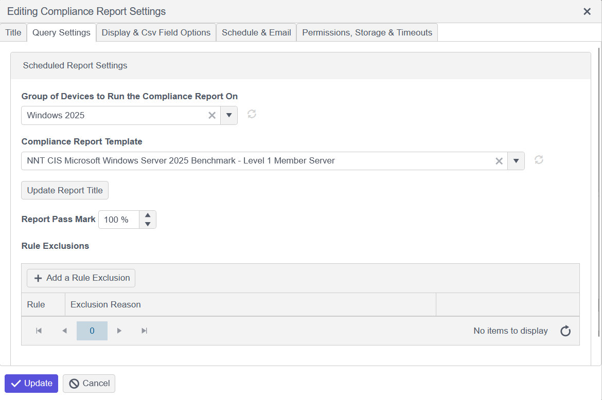
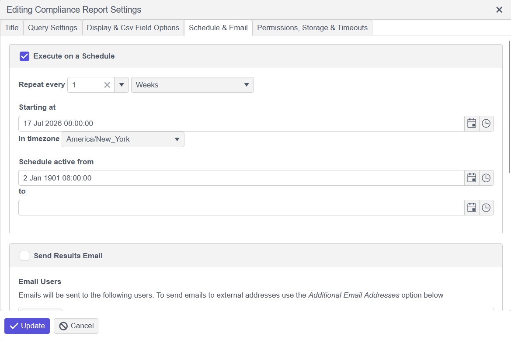

# Applying a Compliance Template to a Group for Automated Reporting

## Overview

A compliance template defines a hardened build standard that Netwrix Change Tracker uses to score devices for compliance. Applying a template to a device group lets you schedule automated compliance reports against that standard.

This article describes how to apply a compliance template to a device group and schedule automated reporting. Identify the template you want to apply and the group of devices you want to apply it to, then follow the steps below.

> **NOTE:** If you need to upload a template, refer to [Adding or Replacing Compliance Report Templates](./add-replace-compliance-report-templates.md).

## Instructions

1. Go to **Reports** > **Actions** > **Add Compliance Report**.
2. Click the **Query Settings** tab, then select the group and template within the drop down options.
3. Once selected, click the **Update Report Title** option to automatically update the title of this report.

4. Click the **Schedule & Email** tab to configure the start/end date and interval:

5. Once completed, click **Update** on the bottom to save this report configuration. This report will now run on its scheduled interval against the specified group of devices.
