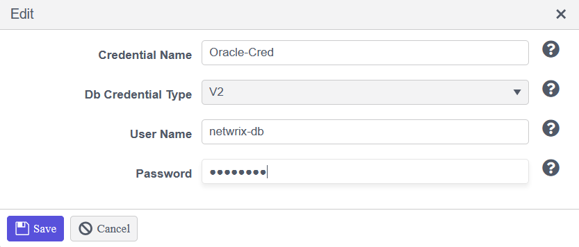
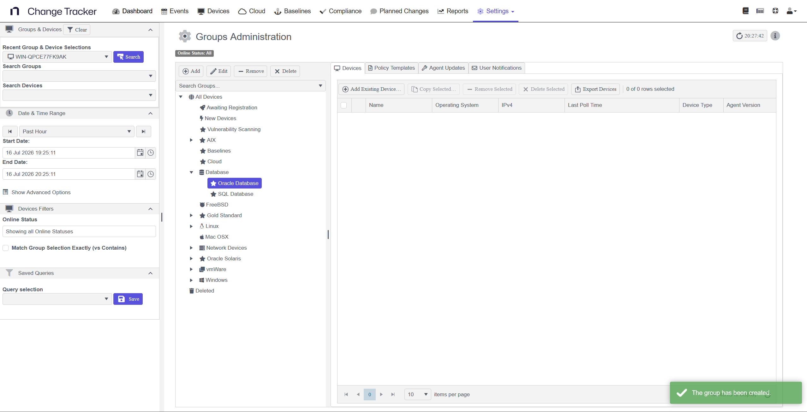
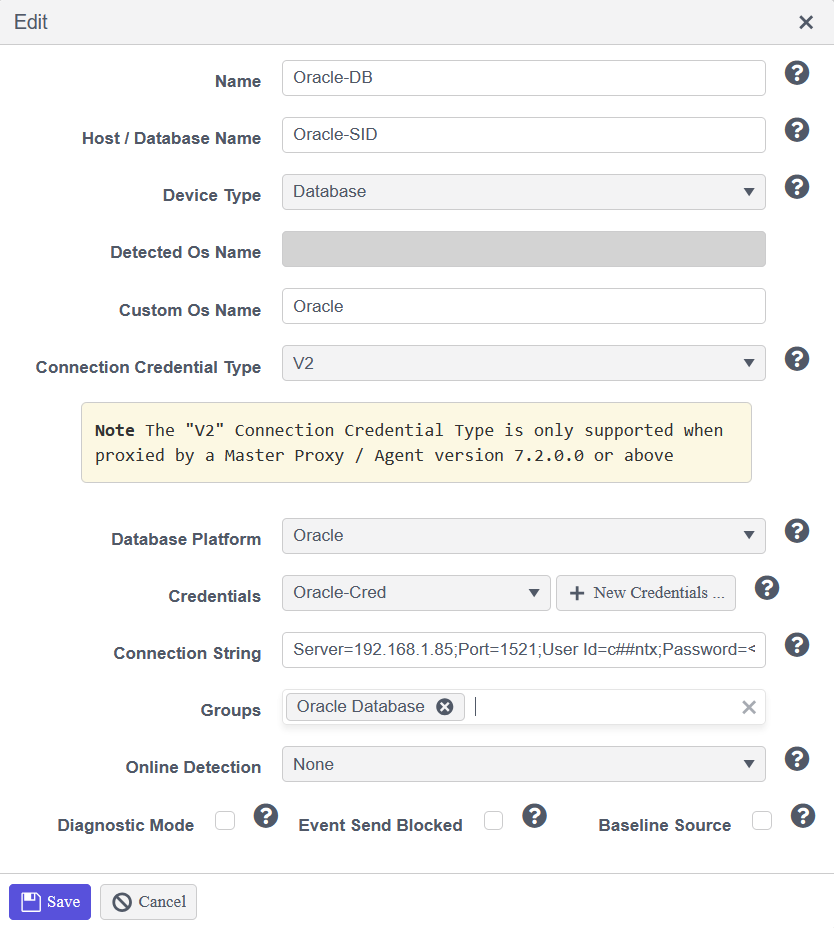
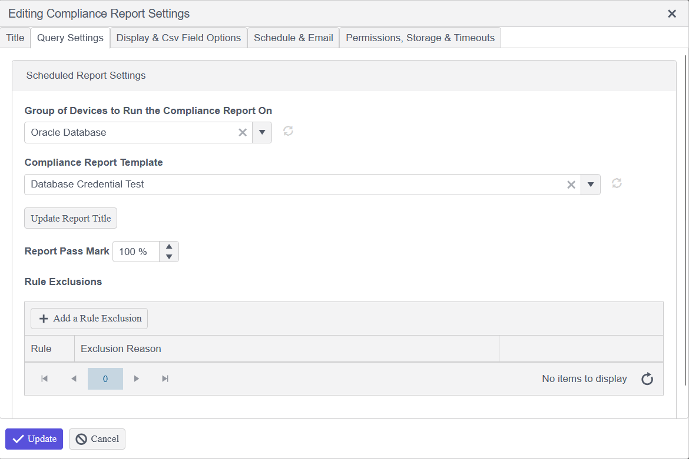

# Monitoring Oracle Databases Using Change Tracker

## Overview

This article describes how to configure Netwrix Change Tracker to monitor an Oracle database. It covers the required connection details, credential creation, proxy device setup, running test compliance reports, and troubleshooting common Oracle errors. If you need additional assistance, contact [Netwrix Support](https://www.netwrix.com/support.html).

To monitor a database successfully, obtain the required connection information described in the Prerequisites section.

## Prerequisites

Gather the following information before configuring monitoring:

- **Server**: The IP address of the server hosting the Oracle database.
- **Database name**: The name or SID of the database that you want to monitor.
- **Port**: The port the database uses to listen for a connection. The default port is `1521`. If the default does not work, find the port in the database's `listener.ora` file.
- **User Id**: The username that Netwrix Change Tracker uses to authenticate with the Oracle database. This user requires a specific set of roles, listed in a later section.
- **Password**: The password for the User Id.

## Instructions

### Step 1 — Identify the Database Name

To obtain the name of the database you wish to monitor, run a query against your Oracle database. You can do this using an application like Oracle SQL Developer or through the server itself using `sqlplus` on the command line. Examples:

- Using Oracle SQL Developer or another SQL client:
  - `select * from global_name;`
  - OR `select name from v$database;`
  - The results of the query show the name or names of the database that you can monitor.

### Step 2 — Identify the SID and Port

Identify an SID value. This is normally the same as the database name, but you can find this value, along with the port the database is using, by looking at the following file:

`/SERVER-NAME/app/oracle/product/VERSION-NUMBER/DATABASE-NAME/network/admin/listener.ora`

Example:

```bash
# cat /OracleSRV/app/oracle/product/11.2.0/xe/network/admin/listener.ora
# listener.ora Network Configuration File:
SID_LIST_LISTENER =
(SID_LIST =
(SID_DESC =
( SID_NAME = xe )
(ORACLE_HOME = /u01/app/oracle/product/11.2.0/xe)
(PROGRAM = extproc)
)
)
LISTENER =
(DESCRIPTION_LIST =
(DESCRIPTION =
(ADDRESS = (PROTOCOL = IPC)(KEY = EXTPROC_FOR_XE))
(ADDRESS = (PROTOCOL = TCP)(HOST = localhost.localdomain)( PORT = 1521 ))
)
)
DEFAULT_SERVICE_LISTENER = (XE)
```

You can also identify the `SID_NAME` by running the following command on the Oracle server:

```bash
[oracle@my-oracle-db ~]$ env | grep ORA
ORACLE_SID=oradb
ORACLE_BASE=/u01/app/oracle
ORACLE_HOME=/u01/app/oracle/product/19.0.0/db_1
```

### Step 3 — Create a Monitoring Account

1. Create an account for the databases being monitored.
2. Adjust the level of privilege depending on the monitoring requirement.

   > **NOTE:** The account requires enough privileges to access the information that Netwrix Change Tracker queries.

   For example, the following privileges for the `c##ntx` account have been used in previous engagements to monitor databases successfully:

   ```sql
   CREATE USER c##ntx IDENTIFIED BY <password>;
   GRANT SELECT_CATALOG_ROLE TO c##ntx;
   GRANT SELECT ANY TABLE TO c##ntx;
   GRANT EXECUTE ANY PROCEDURE TO c##ntx;
   GRANT CREATE ANY TRIGGER TO c##ntx;
   ALTER USER c##ntx DEFAULT ROLE ALL;
   GRANT SELECT ON DBA_USERS_WITH_DEFPWD TO c##ntx;
   GRANT CONNECT TO c##ntx;
   GRANT CONNECT, RESOURCE, DBA TO c##ntx;
   GRANT UNLIMITED TABLESPACE TO c##ntx;
   GRANT CREATE SESSION TO c##ntx WITH ADMIN OPTION;
   ```

### Step 4 — Create a Change Tracker Credential String

1. Create Change Tracker Credentials by navigating to **Settings > Credentials > Database Credentials > Add Database Credential**.
2. In the pop-up menu that appears, enter the following:

   - **Credential Name:** Oracle-Cred (this is personal preference).
   - **Database Credential Type:** V2
   - **Username:** netwrix-db
   - **Password:** Enter the password for the netwrix-db account.

   

3. Click **Update**.

### Step 5 — Create the Database Group and Proxied Device

1. To configure compliance reporting later, go to **Settings > Groups**, then select **All Devices**, and click **Add** to create a **Databases** group and the type of database group underneath.

   

2. Use the group to create a Netwrix Change Tracker Proxied Device. Specify the name of the database that you want to monitor on the Oracle server.
3. To configure the proxied device, go to **Settings > Agents & Devices**, highlight a device that can communicate with the database over the network (default port is 1521), then select **Add Proxied Device**.
4. In the pop-up menu that appears, enter the following:

   - **Name:** Oracle-DB (the display name of the database and how Netwrix Change Tracker presents it).
   - **Host/Database Name:** Oracle-SID (the name of the database or its SID name).
   - **Device Type:** Database.
   - **Operating System:** Oracle (personal preference).
   - **Connection Credential Type:** V2
   - **Database Platform:** Oracle
   - **Credentials:** Oracle-Cred (must match the name of the credentials you created previously).
   - **Connection String:** `Server=192.168.1.85;Port=1521;User Id=c##ntx;Password=<password>;Direct=True;`
   - **Groups:** Oracle Database (personal preference; no out-of-the-box group in Netwrix Change Tracker covers Oracle databases, so you may need to create your own).
   - **Online Detection:** None or Auto.
     - If set to **None**, Netwrix Change Tracker automatically assumes the device is online and attempts to communicate with it.
     - If set to **Auto**, Netwrix Change Tracker attempts to ping the device and waits for a response before showing the device as online.
     - Recommendation: set this option to **None**.
   - **Diagnostic Mode:** Yes or No.
     - If enabled, more verbose logging is available on the Netwrix Change Tracker web console for this device, which aids troubleshooting.
     - Recommendation: enable this option.

   

### Step 6 — Run a Test Compliance Report

Once you have configured the proxy, run a test report to validate the credentials:

1. Navigate to **Reports**.
2. Click **Actions > Add a Compliance Report**.
3. Skip the naming screen and go to **Query Settings**.
4. In **Query Settings**, choose the name of the group you created earlier (the group you will assign the database to during the proxied device configuration).
5. Choose **Database Credential Test**.
6. Click **Update Report Title** so the title updates with the group name and the report name.
7. Click **Update**.
8. Run the report to confirm the connection succeeds.



### Step 7 — Run Compliance Reports Against Your Database

Once configured, you can run a Netwrix Change Tracker Compliance Report against your database or databases to track data such as:

- **Number of tables within a database**
- **Names of tables within a database**
- **Number of columns within a specified table**
- **Names of columns within a specified table**

At this stage, contact [Netwrix Support](https://www.netwrix.com/support.html) for assistance. Support can help you build a Netwrix Change Tracker Compliance Report that meets your requirements and works for the database you want to monitor.

### Step 8 — Troubleshoot Oracle Connection Errors

If, after Netwrix Support has provided you with a compliance report, you receive error messages when running the report against your database, the following error messages and descriptions may help you diagnose the issue. If the error message you receive is not listed here, refer to [Oracle Database Error Messages · Oracle](https://docs.oracle.com/cd/B19306_01/server.102/b14219.pdf) for a full list of error messages provided by Oracle.

- **ORA-12541: TNS:no listener**
  **Cause**: The connection request could not be completed because the listener is not running.
  **Action**: Ensure that the supplied destination address matches one of the addresses used by the listener. Compare the `TNSNAMES.ORA` entry with the appropriate `LISTENER.ORA` file (or `TNSNAV.ORA` if the connection goes by way of an Interchange). Start the listener on the remote machine.

- **ORA-12543: TNS:destination host unreachable**
  **Cause**: Contact cannot be made with the remote party.
  **Action**: Confirm the network driver is functioning and the network is up.

- **ORA-12531: TNS:cannot allocate memory**
  **Cause**: Sufficient memory could not be allocated to perform the desired activity.
  **Action**: Either free some resource for TNS or add more memory to the machine. For further details, turn on tracing and rerun the operation.

If you require more information or assistance with the setup of your Oracle database, contact [Netwrix Support](https://www.netwrix.com/support.html).
