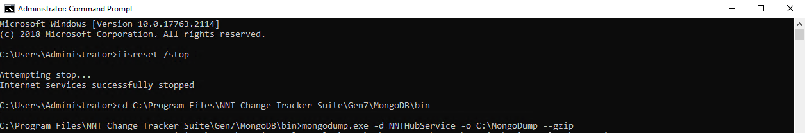
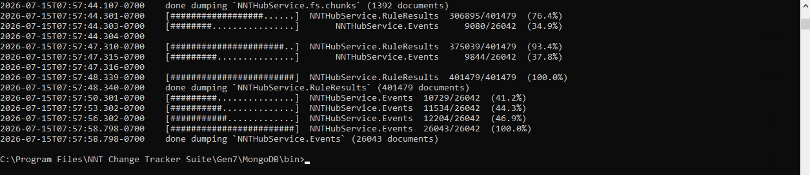
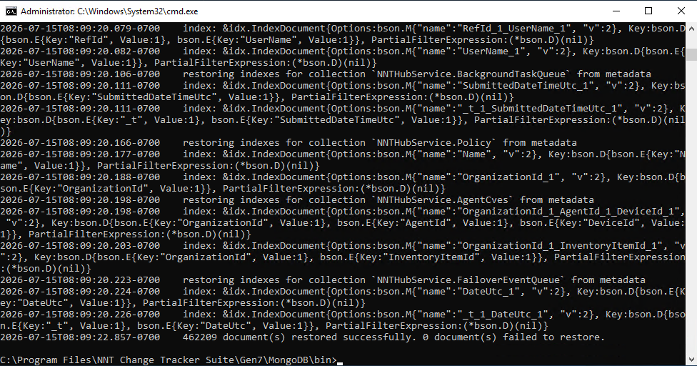
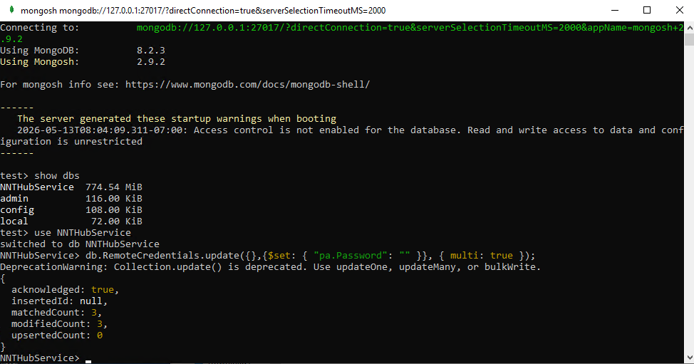
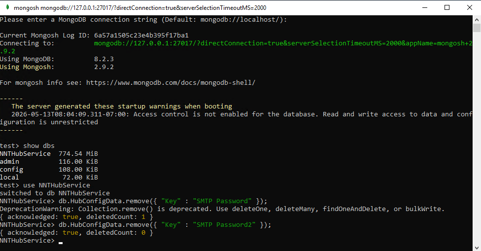

# Backing Up, Restoring, or Moving Your MongoDB Database

## Overview

This article describes how to back up MongoDB, restore MongoDB, or set up a new server to host your Netwrix Change Tracker software while retaining all previous data, such as events, agents, configuration, etc.

> **IMPORTANT:** Verify that the MongoDB versions match on your current and target servers. For additional Netwrix Change Tracker installation prerequisites, refer to the [Requirements](pathname:///docs/changetracker/8_2/requirements/overview) article.

## Instructions

### Prerequisites

1. Download the [MongoDB Shell Tool](https://www.mongodb.com/try/download/shell).
2. Download the [MongoDB Command Line Tools](https://www.mongodb.com/try/download/database-tools).
3. Extract each of these into the MongoDB Bin folder `C:\Program Files\NNT Change Tracker Suite\Gen7\MongoDB\bin`.

### Step 1 — Back Up the MongoDB Database

1. Connect to the server that hosts your Netwrix Change Tracker software via RDP.
2. Open a **Command Prompt** and run it as an **Administrator**.
3. Enter the following commands in order:
   - `iisreset /stop`
   - `cd C:\Program Files\NNT Change Tracker Suite\Gen7\MongoDB\bin`
   - `mongodump.exe -d NNTHubService -o C:\MongoDump --gzip`





Copy the following folders and transfer them to the new server:

- `C:\MongoDump`
- `C:\inetpub\wwwroot\Change Tracker Generation 7 (NetCore) Hub\Configs\DPKeys`
- `C:\ProgramData\Change Tracker Generation 7 (NetCore)\MongoDB\db`

### Step 2 — Prepare the New Server

1. Connect to the server where Netwrix Change Tracker will be installed via RDP.
2. Run the **Change Tracker** installer and install the same version that you used on the old server.

### Step 3 — Restore the MongoDB Database

These steps apply whether you are restoring to an existing server or moving to a new server:

1. Open a **Command Prompt** and run it as an **Administrator**.
2. Enter the following commands in order:
   - `iisreset /stop`
   - `sc stop MongoDB`
   - `cd C:\ProgramData\Change Tracker Generation 7 (NetCore)\MongoDB`
   - `rmdir db /s` (enter `Y` and **Enter** when prompted)
   - `mkdir db`
   - `cd C:\Program Files\NNT Change Tracker Suite\Gen7\MongoDB\bin`
   - `sc start MongoDB`
   - `mongorestore.exe C:\MongoDump\NNTHubService -d NNTHubService --gzip`



### Step 4 — Finish the Restore

Allow time for the database to re-index. Once the re-index completes, the word **done** appears in the Command Prompt window.

1. Enter the following command: `iisreset /start`.
2. Close the Command Prompt window.
3. Confirm that you can log in to **Netwrix Change Tracker** and open the **Settings** page.

## Troubleshooting

If you see the following error on the **Settings** screen, follow the troubleshooting steps.

```text
    Error: Key not valid in specified state
```

### Reset the Remote Credentials Password

1. Open a **Command Prompt** and run it as an **Administrator**.
2. Enter the following commands in order:
   - `iisreset /stop`
   - `cd C:\Program Files\NNT Change Tracker Suite\Gen7\MongoDB\bin`
   - `mongo.exe`
   - `show dbs`
   - `use NNTHubService`
   - `db.RemoteCredentials.update({},{$set: { "pa.Password": "" }}, { multi: true });`
   - `exit`
   - `iisreset /start`
3. Close the Command Prompt window.
4. Confirm that you can log in to Netwrix Change Tracker.



> **NOTE:** If you changed the admin user's password on the old server, that password still works.

### Clear the SMTP Password Entries

If this does not resolve the issue and you still see the `Key not valid in specified state` error, try the following steps:

1. Open a **Command Prompt** and run it as an **Administrator**.
2. Enter the following commands in order:
   - `iisreset /stop`
   - `cd C:\Program Files\NNT Change Tracker Suite\Gen7\MongoDB\bin`
   - `mongo.exe`
   - `show dbs`
   - `use NNTHubService`
   - `db.HubConfigData.remove({ "Key" : "SMTP Password" });`
   - `db.HubConfigData.remove({ "Key" : "SMTP Password2" });`
   - `exit`
   - `iisreset /start`
3. Close the Command Prompt window.



