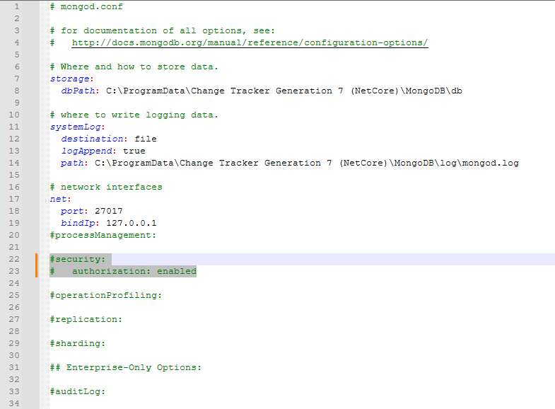
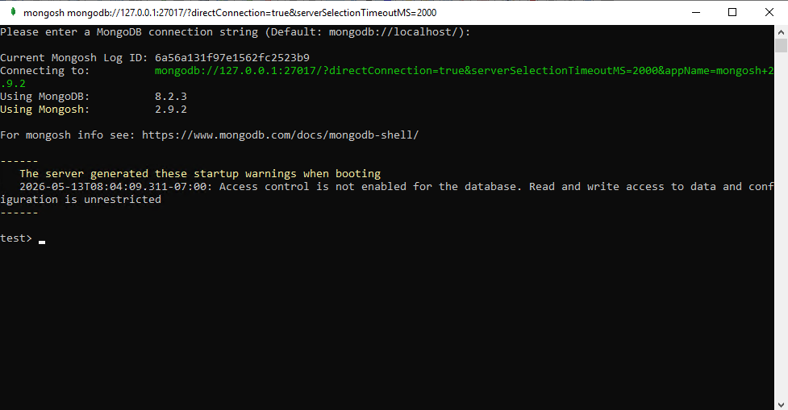
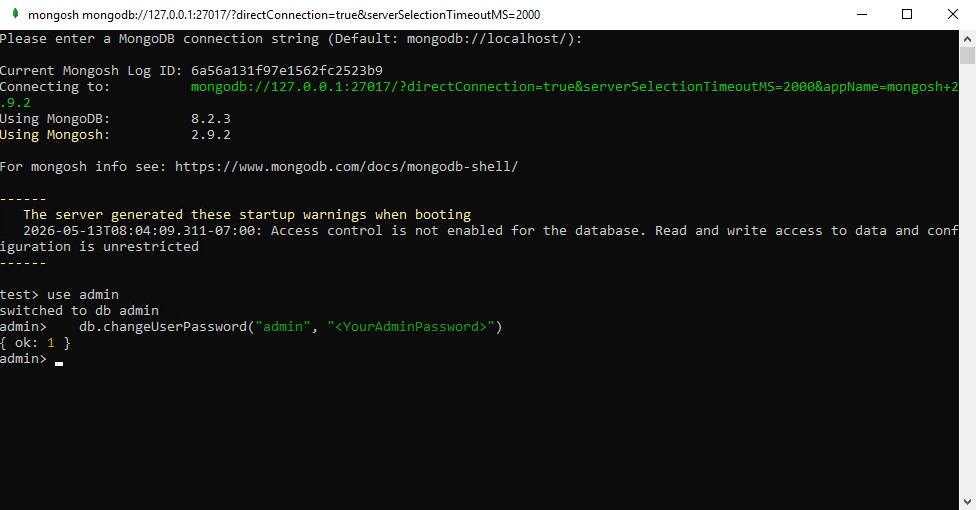
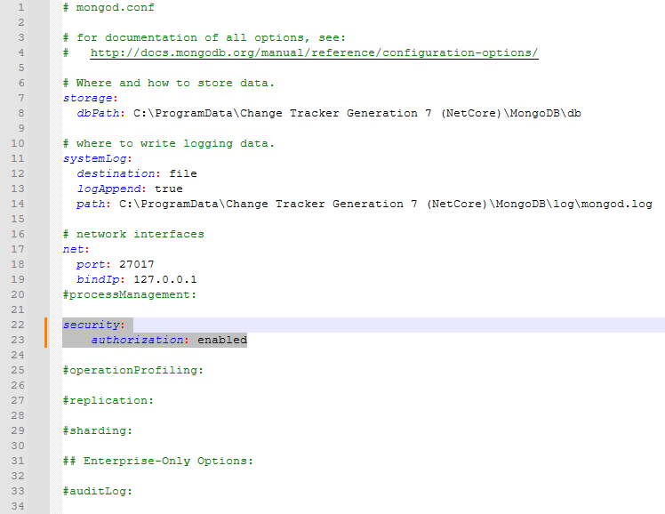

# Changing the Admin Password for MongoDB

## Overview

If authentication is enabled in MongoDB and the admin password is lost, use this procedure to reset it.

> **IMPORTANT:** You must log on to the server hosting MongoDB to complete this procedure.

## Instructions

1. Stop the MongoDB service using `services.msc` or `sc stop MongoDB`.

2. Disable MongoDB authentication:
   - Navigate to `C:\Program Files\NNT Change Tracker Suite\Gen7\MongoDB\bin`.
   - Edit the `mongod.cfg` file.
   - Comment each line out using the `#` symbol except for `logpath`, `dbpath`, `net`, `port`, `bindIp`, and `storageEngine`.

   

3. Start the MongoDB service using `services.msc` or `sc start MongoDB`.

4. Open the **Mongo shell** by running the following program: `C:\Program Files\NNT Change Tracker Suite\Gen7\MongoDB\bin\mongosh.exe`.

   

5. Enter the following commands in the Mongo shell, in order:

   ```bash
   use admin
   db.changeUserPassword("admin", "<YourAdminPassword>")
   ```

   > **NOTE:** Replace `<YourAdminPassword>` with the new password you wish to use.

   Changing the password returns you to a new line without an output.

   

6. Close the `mongosh.exe` window and stop the MongoDB service in Task Manager.

7. Re-enable MongoDB authentication:
   - Navigate to `C:\Program Files\NNT Change Tracker Suite\Gen7\MongoDB\bin`.
   - In the `mongod.cfg` file, remove all `#` symbols from each of the lines. Save the changes.

      

8. Start the MongoDB service using `services.msc` or `sc start MongoDB`.

9. Open Command Prompt and verify your Mongo logon using your authentication command. The following is an example:

    ```bash
    "C:\Program Files\NNT Change Tracker Suite\Gen7\MongoDB\bin\mongosh.exe" --ssl --sslCAFile C:\mongo.crt --host 192.168.1.X --port 27017 -u admin -p <YourAdminPassword> --authenticationDatabase admin --sslAllowInvalidCertificates
    ```

    > **NOTE:** The IP address and password parameters must reflect the IP of the server hosting MongoDB and the new password entered in the preceding command.
