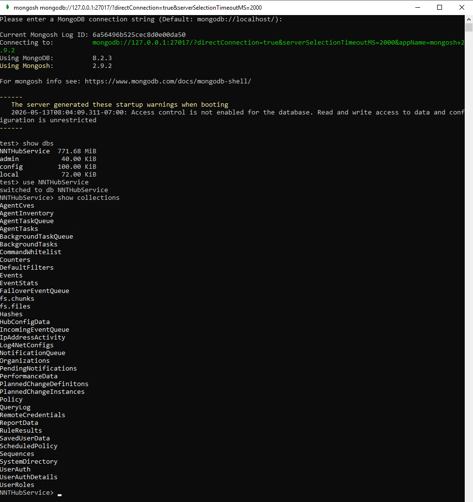
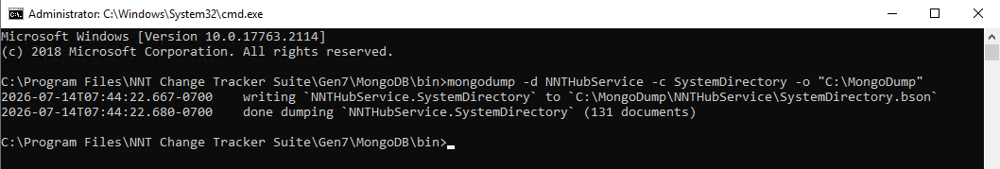

# Exporting a Collection from MongoDB

## Overview

This article explains how to export or back up specific collections from MongoDB. Exporting a collection is useful when you need to send data to Development after you determine a problem lies within MongoDB (for example, when troubleshooting Netwrix Change Tracker).

## Instructions

1. Download the [MongoDB Shell Tool](https://www.mongodb.com/try/download/shell).
2. Download the [MongoDB Command Line Database Tools](https://www.mongodb.com/try/download/database-tools).
3. Access the Hub machine and determine where MongoDB is installed. The default location is:
   - `C:\Program Files\NNT Change Tracker Suite\Gen7\MongoDB\bin`
4. Open each of the downloaded MongoDB Tool ZIP files and extract all files within their dedicated `bin` folder into the default location above.
5. Open **Command Prompt** as Administrator.
6. Enter the following commands in order to open the **Mongo shell**:
   - `cd C:\Program Files\NNT Change Tracker Suite\Gen7\MongoDB\bin` (if you need to change drives first, enter `X:`, replacing `X` with your drive letter)
   - `.\mongosh.exe`
7. In the **Mongo shell**, enter the following commands in order:
   - `show dbs`
   - `use NNTHubService`
   - `show collections` (all collections located in MongoDB appear in the output)

    

   - `exit`
8. To export a collection, run the following command from Command Prompt (edit the placeholders as needed):
   - `mongodump -d NNTHubService -c ENTER-COLLECTION-NAME -o "C:\ENTER PATH HERE"`
9. In the `ENTER-COLLECTION-NAME` field, enter the collection you wish to export.
10. In the `C:\ENTER PATH HERE` field, enter the path you wish to export to.

    

> **NOTE:** The following are all collections in MongoDB.

```
AgentCves             FailoverEventQueue         QueryLog
AgentInventory        IncomingEventQueue         RemoteCredentials
AgentTaskQueue        IpAddressActivity          ReportData
AgentTasks            Log4NetConfigs             RuleResults
BackgroundTaskQueue   NotificationQueue          SavedUserData
BackgroundTasks       Organizations              ScheduledPolicy
CommandWhitelist      PendingNotifications       Sequences
Counters              PerformanceData            SystemDirectory
DefaultFilters        PlannedChangeDefinitions    UserAuth
Events                PlannedChangeInstances     UserAuthDetails
EventStats            Policy                     UserRoles
```
