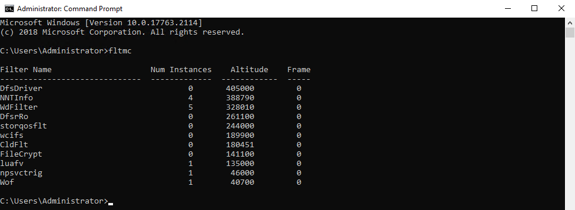
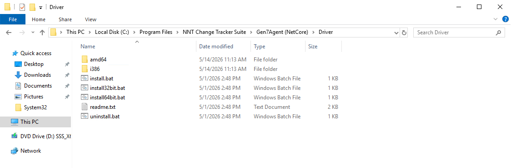

# Fixing the "Check Log for Details" Message in the Event Details

## Overview

This message usually occurs when the "Who made the change" driver, called the `NNTInfo` driver, is not running. This article describes how to verify the driver status and reinstall it if necessary.

## Instructions

### Verify the Driver

1. Open an elevated **Command Prompt** (run as **Administrator**).
2. Type `fltmc` and press **Enter**.
3. Look for `NNTInfo` in the listed items. If the driver is running, it appears in the output.

The following screenshot shows `NNTInfo` in the `fltmc` output:

### If the Driver Is Not Running

If `NNTInfo` does not appear in the `fltmc` output, reinstall the driver from the agent driver folder:

1. Go to the appropriate agent driver folder:
   - Gen7 Agent: `C:\Program Files\NNT Change Tracker Suite\Gen7Agent\Driver`
   - Gen7 Agent (NetCore): `C:\Program Files\NNT Change Tracker Suite\Gen7Agent (NetCore)\Driver`
2. Right-click the `Install` file and select **Run as administrator**.

Screenshot of the driver folder and Install file:

> **NOTE:** In some cases, the NNTInfo driver is running but you experience intermittent interruption of "who made the change" information.
>
> - This mainly occurs on extremely busy and noisy systems with a large volume of changes.
> - The kernel buffer used to capture the "who made the change" information may overflow, so the agent may be unable to capture the information in this case.
> - Because the agent is a kernel-level agent, excluding events in Netwrix Change Tracker stops the reporting of those events, but the events are still generated at the kernel level. The agent sees them but may choose not to report them to the hub server based on the predefined exclusion.
> - Large volumes of changes impact the agent's ability to capture "who made the change" information depending on the volume.

If you continue to experience issues after reinstalling the driver and confirming the driver appears in `fltmc`, evaluate the event volume on the system and adjust exclusions or system design to reduce the risk of kernel buffer overflow.
