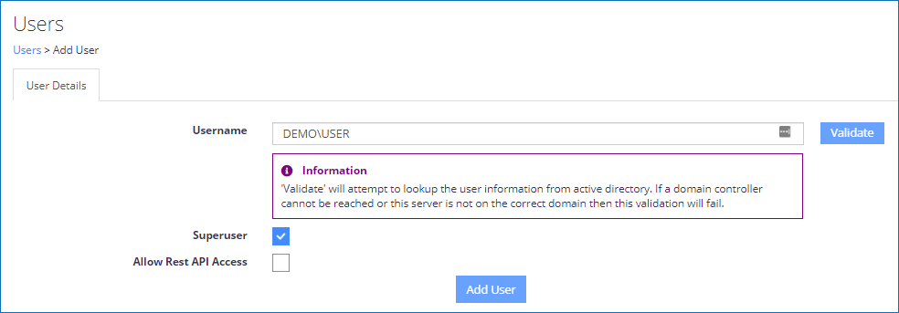
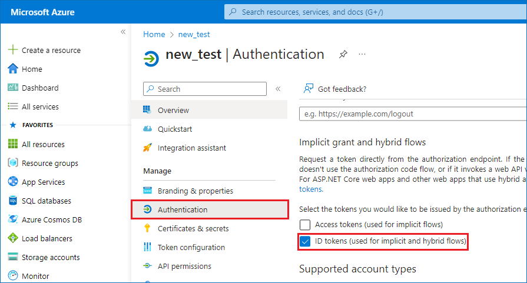

# How to Set Up Single Sign-On via Microsoft Entra ID Authentication

## Question

How can you set up single sign-on (SSO) for Netwrix Data Classification (NDC) via Microsoft Entra ID authentication (formerly Azure AD)?

> **IMPORTANT:** The Netwrix Data Classification and Netwrix Auditor integration (NDC Provider) currently does not support single sign-on (SSO). SSO needs to be disabled in Netwrix Data Classification for the account used by the NDC Provider to authenticate. For up-to-date information on the NDC Provider integration, refer to the following documentation article: https://docs.netwrix.com/docs/auditor/10_8 Data Discovery — Permissions for Integration with Netwrix Data Classification · v10.6).

## Answer

### Register Netwrix Data Classification (NDC) in the Azure Portal

1. Assign a certificate to the default website where NDC is hosted.
2. Make sure that the NDC Administration Console is accessible in your browser (for example, `https://classification.contoso.com/NDC`).
3. Add your Microsoft Entra account as a Superuser:
   1. On the main NDC screen, select **Settings**.
   2. Select the **Users** tab, and click **Add user**.

   > **NOTE:** Make sure to check the **Superuser** checkbox.

   

4. Visit the App registrations menu in your Microsoft Azure Portal to register an application: https://portal.azure.com/#view/Microsoft_AAD_IAM/ActiveDirectoryMenuBlade/~/RegisteredApps

   1. In the upper navigation bar, click **New registration**.
   2. In the **Redirect URI** section, select **Web** in the dropdown menu and enter the Administration Console URL in the corresponding field (for example, `https://classification.contoso.com/NDC`).
   3. Click **Register** to save your changes.
   4. Copy the **Application (Client) ID** of the newly created application.
   5. Select your application and open the **Authentication** tab in the left pane.

   

   6. Check the **ID tokens (used for implicit and hybrid flows)** checkbox and click **Save**.

5. Back up the `web.config` file in the NDC IIS folder (located in `C:\inetpub\wwwroot\NDC` by default). You can check your actual NDC IIS folder path by right-clicking the **NDC** node under **Default Web Site** in IIS and selecting **Explore**.
6. Edit the original `web.config` file from the NDC IIS folder to add the following lines to the `<appSettings>` node:

```xml
<add key="ida:AzureClientId" value="Application (Client) ID"/>
<add key="ida:AzureAuthority" value="https://login.windows.net/tenantname.onmicrosoft.com"/>
<add key="ida:AzureTenant" value="tenantname.onmicrosoft.com"/>
```


> **NOTE:** Replace the **Application (Client) ID** with the one copied previously and the `tenantname.onmicrosoft.com` with your tenant's name.

7. Close all your browser windows and then open the NDC Administration Console (for example, `https://classification.contoso.com/NDC`).
8. **NOTE:** In a DQS environment, steps 5 and 6 must be completed on each server NDC is installed on before proceeding to step 7.

> **NOTE:** If you have previously configured the application to use ADFS, refer to the following steps:
>
> 1. On the main NDC screen, select **Settings**.
> 2. Select the **Users** tab, select all users, and select **Delete**.
> 3. Open the `web.config` file (located in `C:\inetpub\wwwroot\NDC` by default) and remove `appSettings` entries specific to ADFS:
>
> ```
> ida:ADFSMetadata
> ida:Wtrealm
> ```

### Make a REST API call using Bearer Auth

When using NDC REST APIs with Microsoft Entra authentication, the first step is to retrieve a bearer token. Each API call should include the bearer token as its method of authentication. The code snippet provided below (C#) uses RestSharp to connect to Microsoft Entra ID and retrieve a bearer token to be used with REST APIs:

```csharp
var tenancy = "conceptsearching.com";
var clientId = "NewAzureADClientID (GUID)";
var clientSecret = "";
var username = "developer%40conceptsearching.com";
var password = "";
     
var client = new RestClient($"https://login.microsoftonline.com/{tenancy}/oauth2/token");
var request = new RestRequest(Method.POST);
request.AddHeader("Cache-Control", "no-cache");
request.AddHeader("Content-Type", "application/x-www-form-urlencoded");
request.AddParameter("undefined", $"grant_type=password&username={username}&password={password}&client_id={clientId}&resource={clientId}&client_secret={clientSecret}", ParameterType.RequestBody);
IRestResponse response = client.Execute(request);
```

The `access_token` value from the response should be included in each subsequent request via REST APIs as a header variable in the following format:

Key: `Authorization`  
Value: `Bearer YOURTOKEN`

## Related Articles

- My Dashboard — App Registrations · Entra ID: https://portal.azure.com/#view/Microsoft_AAD_IAM/ActiveDirectoryMenuBlade/~/RegisteredApps
