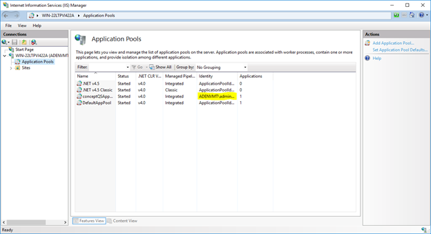

# Service Account Password Reset for Netwrix Data Classification

## Overview

After you reset the service account password for Netwrix Data Classification, update the password in several locations within the product and IIS. This article shows where to supply the new password.

## Services

Update the **Logon As** value for each service shown in the screenshot to reflect the password change.

## ConceptConfig

Navigate to each of the following locations. These locations control the SQL database connection and the account used to make that connection. Update the account credentials for all three locations.

1. `C:\Program Files\ConceptSearching\Services\ConceptCollectorService\conceptConfig.exe`
2. `C:\inetpub\wwwroot\conceptQS\bin\conceptConfig.exe`
3. `C:\Program Files\ConceptSearching\Services\conceptIndexer\conceptConfig.exe`

## IIS

Open IIS and click **Application Pools** on the left-hand pane. Right-click on the **conceptQSAppPool** and click **Advanced Settings**.

Find the **Identity** and enter the new account password, then restart the application pool.

## Taxonomy Global Settings

Navigate to `http://hostname/conceptQS/Taxonomies/GlobalSettings` and confirm the status of each taxonomy. Find the faulting termsets and update the credentials for each.
