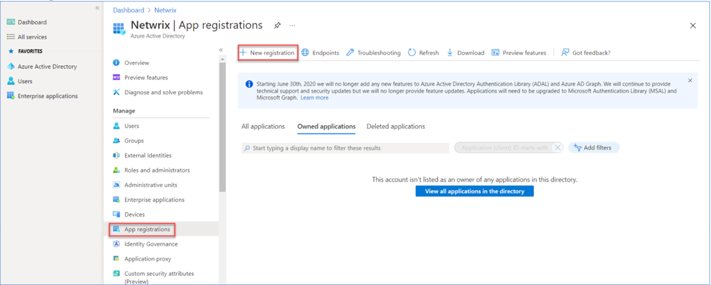
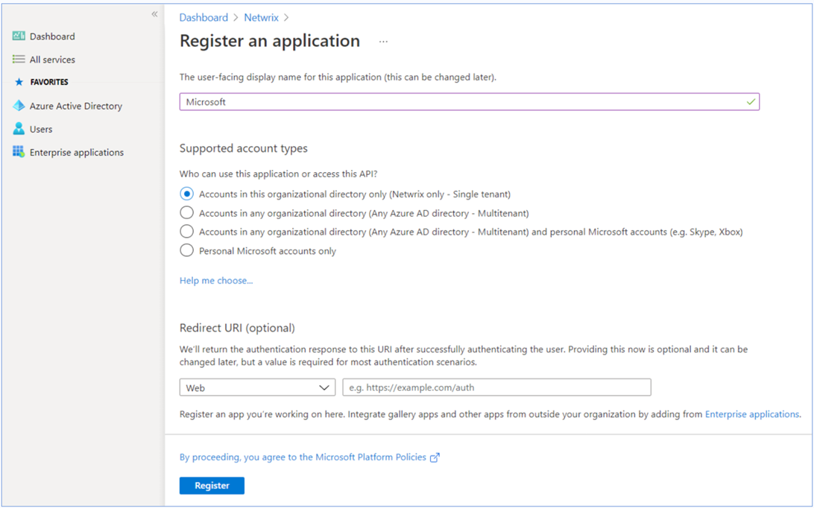

# Using Sharepoint Modern Authentication

## Step 1: Preparing an Application Certificate

Prepare the application certificate as follows:

1. Create (or load) an IIS certificate on NDC Server (recommended).  
   **NOTE**: This certificate should be installed for the local machine so that it can be accessed by Netwrix Data Classification and other services.
2. Export the certificate (`.CER` file):
   1. Open the certificate in IIS management console.
   2. Go to the Details tab.
   3. Select Copy to File.  
      **NOTE**: Do not export private key.
   4. Set file type to DER-encoded `CER`.

## Step 2: Creating and Registering a New App in Microsoft Entra ID (formerly Azure AD)

To register a new application, do the following:

1. Sign into the **Microsoft 365 Admin Center** (with your Global Administrator, Application Administrator or Cloud Application Administrator account).
2. Search for and select the **Microsoft Entra admin center**.
3. Under the Azure Directory select the **App registrations** section.
4. Select **New registration**.  
   
5. In the **Name** field, enter the application name.
6. In the **Supported account types** select who can use this application – use the **Accounts in this organizational directory only** option.
7. Click the **Register** button.  
     
   **NOTE**: Application redirect URL is optional; you can leave it blank on this step.
8. Copy your application ID from the **Overview** section to a safe location.

## Step 3: Granting Required Permissions

Next, you need to grant your new application the required API permissions. Azure AD applications can be assigned *Delegated* or *Application* permissions:

- Delegated permissions require a signed-in user present who consents to the permissions every time an API call is sent.
- Application permissions are consented by an administrator once granted.

For the newly created app, you should use *Application* permissions.  
**NOTE**: By default, a new application is granted one delegated permission for **Microsoft Graph API – User.Read.** It is not required and can be removed.

Do the following: When found, click on the entry and proceed with adding the necessary permissions. The steps from here on remain the same, so in most cases you would need the Application permissions entry, and the relevant set of permissions therein.

1. Select the relevant entries, then click **Add permissions**.
2. On the **Request API permissions → Microsoft APIs** pane, scroll down and select **SharePoint**.
3. Select **Application Permissions**.
4. Apply the following permissions:
   1. Graph – Application permissions (With admin consent granted)
      - `Sites.FullControl.All` (Crawling)
   2. SharePoint – Application permissions (With admin consent granted)
      - `Sites.FullControl.All` (Crawling)
      - `TermStore.ReadWrite.All` (Term Set access)  
        **NOTE**: For taxonomy manager to fully operate you must also make the user `app@sharepoint` a taxonomy admin (or group admin)  
        
5. Click **Add permissions**.

## Step 4: Configuring Certificates & Secrets

Having configured the app, you can upload its application certificate.

1. In the app settings, click **Certificates & secrets** and select **Upload certificate**.
2. Upload the `.CER` file you prepared in Step 1: Preparing an Application Certificate (see https://docs.netwrix.com/docs/dataclassification/5_7).
3. Copy the certificate thumbprint to a safe location.

## Step 5: Obtaining Tenant ID

1. Open **Microsoft Entra admin center**.
2. Select **Azure Active Directory > Overview** section for the required Exchange Online organization.
3. Locate the **Tenant ID** and copy it to a safe location.
