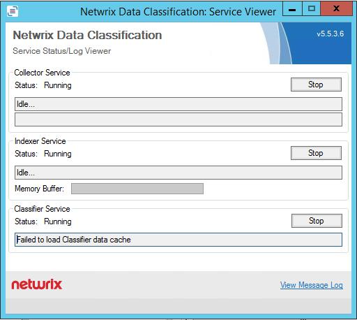

# Error: "Failed to load Classifier data cache"

## Scenario

The Netwrix Data Classification: Service Viewer displays the following error message for the Classifier Service:

`Failed-to-load-Classifier-data-cache`

## Solution

1. Open `http://hostname/conceptQS/Taxonomies/GlobalSettings`.
2. Confirm the status of each taxonomy. This error will be caused by a failed connection to a SharePoint termset.
3. Find the faulting termset and update the credentials and/or confirm account permissions for that termset.
4. Restart the classifier service. After restarting, the service should immediately begin processing documents pending classifications.
