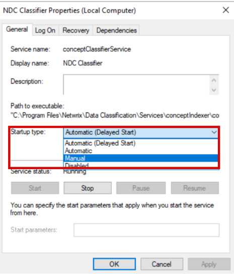
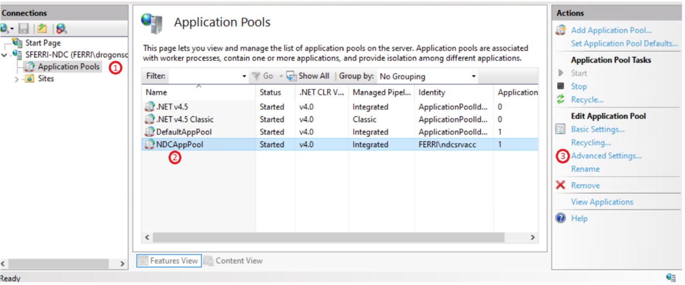
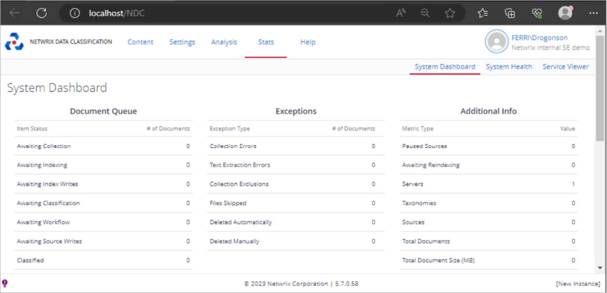
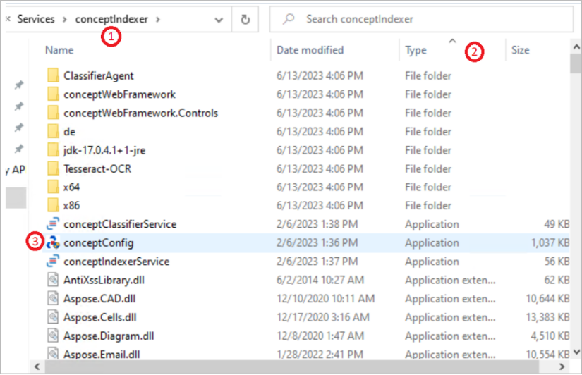

# How to Update Service Account Password

## Before You Start

> IMPORTANT: this article is made for versions **5.6** and **5.7.** Variation in the service name is very likely as between these two major versions they were changed. If you previously had 5.6 and upgraded to 5.7, you will retain old service names; if a fresh install, you get new service names. Keep it in mind if setting up Distributed Query Server (DQS) where one server was set up before the others in your environment (read more about applying DQS mode in Configuring NDC Servers Cluster and Load Balancing with DQS Mode ・ v 5.7: https://docs.netwrix.com/docs/dataclassification/5_7).

### Check Your Netwrix Data Classification Version

Check for the current Netwrix Data Classification version on any of the Netwrix Data Classification pages.

### Check Service Names

| 5.7 but upgraded from 5.6.x.x | Fresh install of 5.7.x.x |
|---|---|
| ConceptCollector | NDC Collector |
| ConceptIndexer | NDC Indexer |
| ConceptClassifier | NDC Classifier |

## Instructions

1. Login to your Netwrix Data Classification server(s).

2. Stop the services:
   1. Press WIN + R on the keyboard.
   2. Enter `services.msc.` and click **OK**.  
      Result: the **Services** window appears.
   3. Right click a service with the **Running** status and select **Stop**.

   > TIP: you can change startup type to **Manual**, so then they don’t startup on their own:  
   > 

3. In the **Services** window, scroll down to find the following services:
   - NDC Classifier
   - NDC Collector
   - NDC Indexer

4. For each service, do the following:  
   
   1. Right click a service name, select **Properties** and go to the **Log on** tab.
   2. Enter new password.
   3. Click on **Apply**.

5. Launch the Internet Information Services / Internet Information Services Manager (IIS) and do the following:
   1. Expand the server and head into **Application Pools**.
   2. Look for your corresponding application.

      > NOTE: there is a variation in name between versions:
      >
      > **V5.7 but upgraded from 5.6.x.x**: ConceptQSAppPool  
      > **Fresh install of v5.7.x.x**: NDCAppPool

   3. Click on the application and then on the right pane, click on **Advanced Settings**.  
      

6. Once you are in the **Advanced Settings**, go to **Process Model** > **Identity** > **...**  
   

7. In the **Application Pool Identity** window do the following:
   1. Click on **Set**.
   2. Enter new credentials (always enter your domain before the user as not doing so can cause problems later).
   3. Click on **OK**.  
      

8. Since you are in the IIS, head into your Netwrix Data Classification webpage by doing the following:
   1. Expand the **Sites** folder.
   2. Expand **Default Web Site** then click on **NDC2** or **ConceptQS**.
   3. Click on **Browse** on the right pane.  
        
      Result: the Netwrix Data Classification's **System Dashboard** section appears:
      

   > IMPORTANT: follow the steps below if only you have setup the same Service Account for more than just the services such as SQL Access or SQL Server Instance Services

9. Go to your Netwrix Data Classification installation directory. The default directory varies depending on the version:
   - **V5.7 but upgraded from 5.6.x.x**: `c:\Program Files\conceptsearching`
   - **Fresh install of 5.7.x.x**: `c:\Program Files\Netwrix\Data Classification`

10. Go to the **Services** folder and do the following:
    1. Open the `conceptindexer` folder.
    2. To sort documents, click **Type** once.
    3. Open the `ConceptConfig.exe` file.  
       

11. In the **Netwrix Data Classification: Database Configuration** window, proceed as follows:
    1. Change user password.
    2. Click on **Test Connection** to have Netwrix Data Classification try to connect with your new credentials.  
         
       Result: a dialog window with the **Connection Test Succeeded** message appears.

12. Repeat for the other service folder.

13. Go to `c:\inetpub\wwwroot\NDC` (or ConceptQS) and repeat the same process as above (classify by type and launch `ConceptConfig.exe`).
