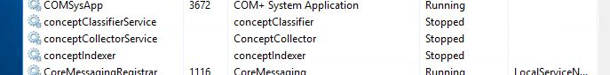

# Migrating Netwrix Data Classification to Another Server

## Overview

This article describes how to change or replace the server on which Netwrix Data Classification (NDC) is running.

## Instructions

1. Stop and disable **all NDC services** on the application server (`conceptClassifier`, `conceptIndexer`, `conceptCollector`).

   

   > **NOTE:** You can also disable the NDC services using the **Service Viewer** located at: `C:\Program Files\ConceptSearching\ServiceViewer` (by default).

2. Back up the **NDC database** and the files in the **NDC Index** at `C:\Program Files\ConceptSearching\ConceptDB` (by default).

3. Before installation, ensure the necessary software [prerequisites](https://docs.netwrix.com/docs/dataclassification/5_7) are in place.

4. Install the same version of NDC on the new server, pointing to the original database location with the same service account. The installer should detect an existing NDC schema. (See [Install Netwrix Data Classification](pathname:///docs/dataclassification/5_7/introduction/install/overview) for installation instructions.)

   > **NOTE:** The account being used for the installation of NDC should ideally be the same service account used to connect with the SQL database, and this account will need local admin rights on the new server.

5. During the install, select the checkbox to stop services on application start.

6. Copy the **backed-up Index files** from the old server to the new server's index location (`C:\Program Files\ConceptSearching\ConceptDB` by default).

7. Start **all services** on the new server, and collection resumes as normal. The `conceptCollector`, `conceptIndexer`, and `conceptClassifier` services must stay disabled on the **old server** to prevent re-connecting to the database. NDC can be uninstalled once the migration is successful.
