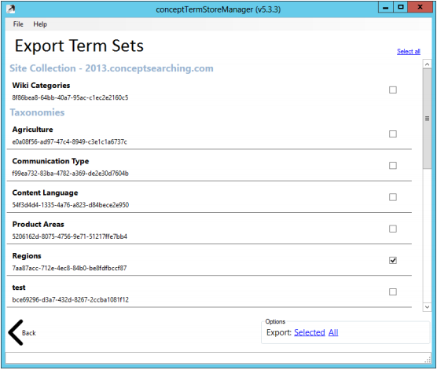

# Export Term Sets to an XML File using conceptTermStoreManager

Export a term set structure to an XML file via the conceptTermStoreManager using the steps listed in this article.

## Steps

1. Navigate to `C:\inetpub\wwwroot\conceptQS\bin\conceptTermStoreManager.exe`
2. Run the `conceptTermStoreManager.exe` and observe the following screen:

   

3. Click the **Export** box to export a term set structure to an XML file.
4. On the **Export Term Sets** page, enter the details of the site collection where the Term Store can be accessed using the credentials supplied.

   

5. Click **Next**.
6. Select the term sets you wish to export by using the checkboxes on the right-hand side.

   

7. Click either the **Selected** button to export the checked items or the **All** button to export all term sets found in the term store.
8. Name and save the XML file when the **Save As** window appears.

The resulting XML file will contain the entire Term Set structure, including all custom properties, in the proprietary conceptSearching XML format. This file can be used to load the term set into another term store using the Import facility.
