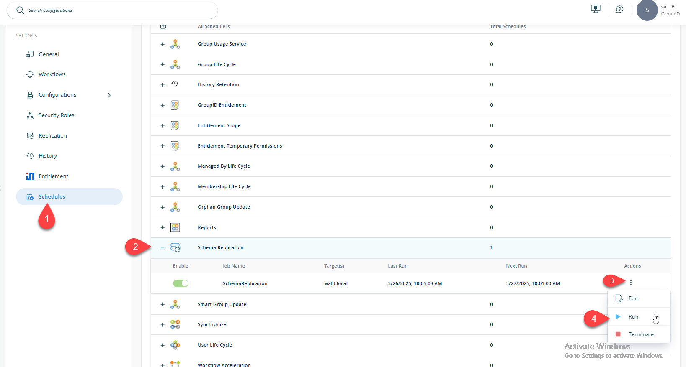
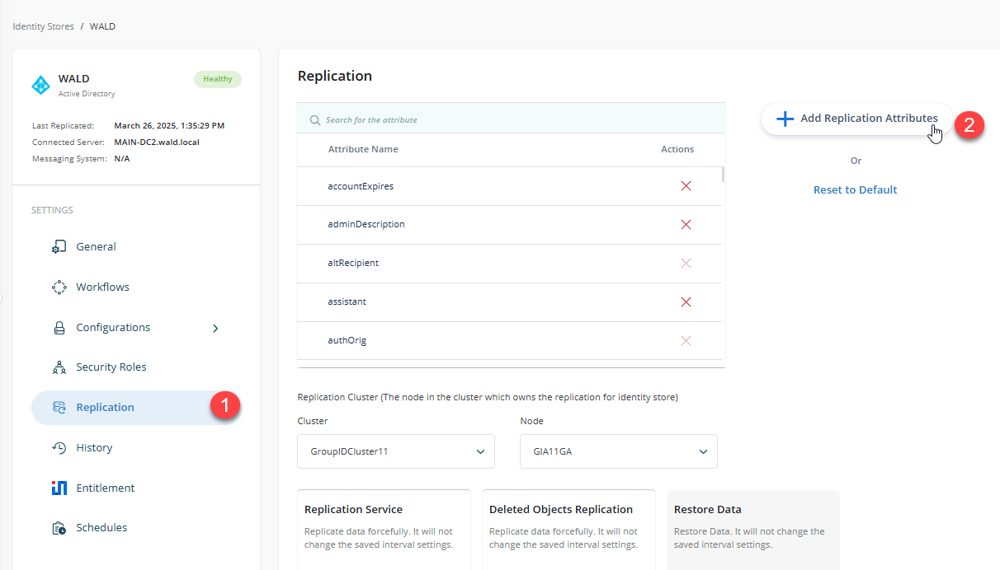
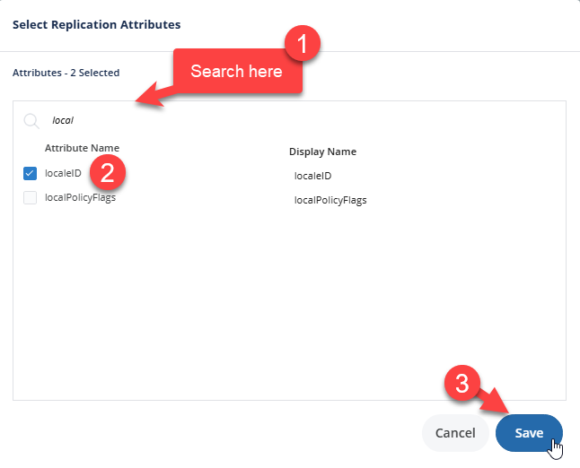

---
description: >-
  Add new or custom Active Directory (AD) attributes to the Netwrix Directory
  Manager replication schema so they are included in replication to the
  Elasticsearch repository.
keywords:
  - directory manager
  - replication schema
  - active directory
  - attributes
  - Elasticsearch
  - schema replication
  - identity store
  - Smart Group
  - replication attributes
products:
  - directory-manager
sidebar_label: Add Active Directory Attribute to Replication Sche
tags:
  - configuration-and-integration
title: "Add Active Directory Attribute to Replication Sche"
knowledge_article_id: kA0Qk0000002EdBKAU
---

# Add Active Directory Attribute to Replication Sche

## Applies To

Netwrix Directory Manager 11

## Overview

Add new or custom Active Directory (AD) attributes to the Netwrix Directory Manager (formerly GroupID) replication schema so they are included in replication to the Elasticsearch repository.

## Instructions

### When to Add a New Attribute

- You have defined a new custom attribute in AD and want to use it with Netwrix Directory Manager.
- An attribute does not appear in the Smart Group criteria, roles, or filters.

### Steps to Add a New AD Attribute to the Replication Schema

1. Identify the custom or existing AD attribute that is missing from roles, filters, or Smart Group criteria in Netwrix Directory Manager.
2. Log in to the Netwrix Directory Manager Admin Centre.
3. In the navigation pane, select the **Identity Stores** tab. Click the three-dot icon next to the required identity store, and select **Edit**.  
   
4. In the **Settings** pane, locate **Schedules**. Find the **Schema Replication** schedule, click the three-dot icon and select **Run**.  
   
5. Wait five to ten minutes for the schema replication to complete.
6. In the **Settings** pane, select the **Replication** tab. Click **Add Replication Attributes**.  
   
7. In the prompt, search for the new or missing attribute, select it, and click **Save**.  
   
