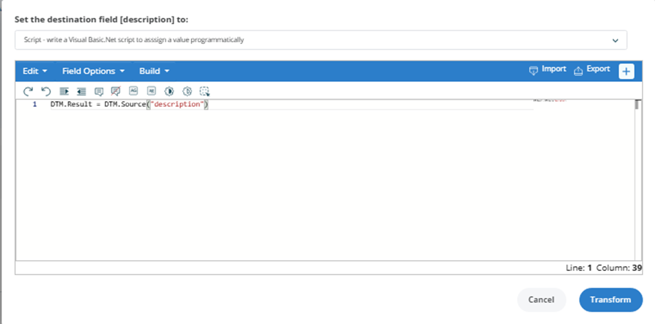

---
description: >-
  This article explains how to automatically add a future date to the Description field of a user account in Netwrix Directory Manager, streamlining offboarding and account management processes.
keywords:
  - future date
  - Description field
  - Netwrix Directory Manager
sidebar_label: Add Future Date to Description Field
tags:
  - configuration-and-integration
title: "Add a Future Date in a Description Field"
knowledge_article_id: kA0Qk0000002bJdKAI
products:
  - directory-manager
---

# Add a Future Date in a Description Field

## Related Queries

- "Add a future date in a Description field."
- "Is it possible to add the following text and a future date to the Description field: 'User Terminated – Delete On '"

## Overview

This article explains how to automatically add a future date to the **Description** field of a user account in **Netwrix Directory Manager** (formerly GroupID) Synchronize. This is useful for marking when a terminated employee's account should be deleted, streamlining offboarding and account management processes.

## Instructions

1. Open the **Synchronize** portal and click **All Jobs** in the left pane.
2. Select the Synchronize job you want to edit and click **Edit**.
3. On the **Map Fields** page, click the **Transform** button for the **Description** field.

   

4. In the **Transform** dialog box, select **Script** from the dropdown menu.

   

5. Copy and paste the following script into the Script Editor:

   ```vbnet
   Dim newDate As DateTime = DateTime.Now.AddDays(30)
   DTM.Result = "User Terminated – Delete On " & newDate.ToString("yyyy-MM-dd")
   ```

6. Click the **Build** button at the top of the Script Editor to test the script. In the dialog box, click **Run Script** to verify the output.
7. Save your changes to the Synchronize job.

> **NOTE:** You can adjust the number of days by changing the value in `AddDays(30)` to any desired period.