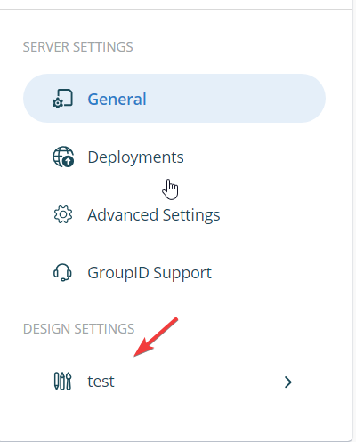

---
description: >-
  This article explains how to allow unauthenticated users to send email to a distribution list in Netwrix Directory Manager by exposing the msExchRequireAuthToSendTo attribute.
keywords:
  - unauthenticated users
  - distribution list
  - msExchRequireAuthToSendTo
sidebar_label: Allow Unauthenticated Users to Send Email
tags:
  - configuration-and-integration
title: "Allow Unauthenticated Users to Send Email to a Distribution List"
knowledge_article_id: kA0Qk0000002Rs9KAE
products:
  - directory-manager
---

# Allow Unauthenticated Users to Send Email to a Distribution List

## Overview

By default, Netwrix Directory Manager (formerly GroupID) and Active Directory require that only authenticated users can send email to a distribution group. However, you can allow unauthenticated users to send email by exposing the **msExchRequireAuthToSendTo** attribute as a checkbox in the New Group wizard or group properties in the User portal. Clearing this checkbox allows unauthenticated users to send email to the group.

## Instructions

### Expose the msExchRequireAuthToSendTo Attribute in the User Portal

1. In the Admin Center, select **Applications**.
2. Under **Directory Manager Portal**, click the three-dot icon for your portal and select **Settings**.

   

3. On the **Server Settings** tab, select your portal under **Design Settings**.

   

4. Select **Create Object**. From **Select Directory Object**, select **Group** and click the **+** icon.

   

5. Give a name to the new category and select a visibility role for it.

   

6. Click **Add Field** and select the **msExchRequireAuthToSendTo** attribute in the **Field** list. Specify a display name for the field, such as *Requires that all senders are authenticated*. From the **Display Type** list, select **Check**.

   

7. Click **Advanced Options** and select the **Default value is checked** and **is Required** checkboxes.

   

8. Click **OK** and save the configuration.

### Test the Configuration

1. Launch the User portal and create a distribution group.
2. You will see a new page in the wizard with the *Requires that all senders are authenticated* checkbox.
3. Clear this checkbox to allow unauthenticated users to send email to the distribution group.

   