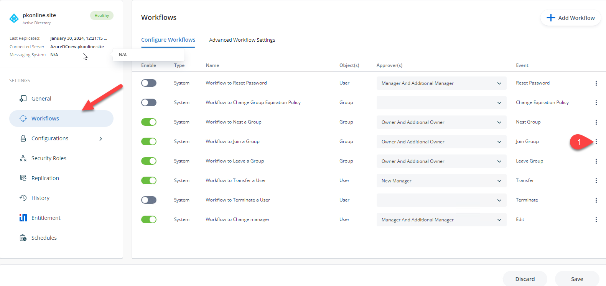
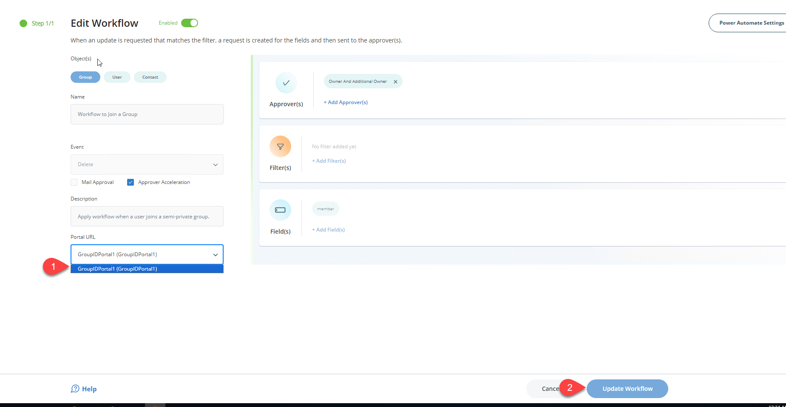

---
description: >-
  If you change the hostname for the Netwrix Directory Manager Self-Service
  portal, update the portal URL in each workflow so workflow email notifications
  include the correct address.
keywords:
  - Netwrix Directory Manager
  - self-service portal
  - workflow
  - email notifications
  - portal URL
  - group owners
  - membership requests
products:
  - directory-manager
sidebar_label: Change Self-Service Portal URL in Workflow Email N
tags:
  - configuration-and-integration
title: "Change Self-Service Portal URL in Workflow Email Notifications"
knowledge_article_id: kA0Qk0000002ElFKAU
---

# Change Self-Service Portal URL in Workflow Email Notifications

## Applies To

Netwrix Directory Manager 11

## Overview

If you change the hostname for the Netwrix Directory Manager (formerly GroupID) Self-Service portal, workflow email notifications may still include the old portal URL. Update the portal URL in each workflow to ensure notifications direct users to the correct address.

## Instructions

### Change the Self-Service Portal URL in Workflow Email Notifications

1. In the Netwrix Directory Manager Admin portal, click the **Identity Stores** tab.
2. On the **Identity Stores** tab, click the three-dot icon next to the relevant identity store and select **Edit**.
3. Click the **Workflows** tab. Select the workflow for which you want to change the portal URL and click **Edit**.  
   To change the URL in email notifications that alert group owners to approve or deny membership requests, select **Workflow to Join a Group**.  
   
4. In the **Portal URL** box, select the portal URL you want to use.  
   
5. Click **Update Workflow** and save your changes. The email notifications for this workflow will now include the specified portal URL. Repeat these steps for each workflow as needed.
