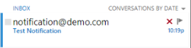

---
description: >-
  Learn how to configure email notifications for an identity store in Netwrix
  Directory Manager, including SMTP settings, recipient options, lifecycle
  notifications, and testing.
keywords:
  - email notifications
  - identity store
  - SMTP
  - notification settings
  - Netwrix Directory Manager
  - group membership
  - password portal
  - membership lifecycle
  - Managed By
  - test email
products:
  - directory-manager
sidebar_label: Configure Email Notifications for an Identity Stor
tags:
  - configuration-and-integration
title: "Configure Email Notifications for an Identity Store"
knowledge_article_id: kA0Qk0000002JmXKAU
---

# Configure Email Notifications for an Identity Store

## Overview

Email notifications in Netwrix Directory Manager (formerly GroupID) inform users, group owners, and managers when changes are made to directory objects, such as group membership updates or user profile modifications. To ensure notifications are generated and sent to the correct recipients, specific configurations must be set for the identity store. This article provides step-by-step instructions for configuring notifications.

## Instructions

1. In the **Netwrix Directory Manager Management Console**, click the **Identity Stores** node.  
2. On the **Identity Stores** tab, double-click the required identity store to open its properties.  
3. Select the **Configurations** tab, then click **Notification** in the left pane.

4. Configure the following notification settings:

- **SMTP server:** Enter the IP address or FQDN of the SMTP server that will route notifications.  
- **From email address:** Enter the sender address for notification emails (for example, `no-reply@domain.com` or `notification@demo.com`).  
    
- **Port:** Enter the port number for the SMTP server.  
- **Test:** After entering the email address and port, click **Test** to verify the server settings. Enter a destination address to send a test notification. If successful, a confirmation message appears and a test email is sent.  
- **Use SMTP User Authentication:** By default, the credentials of the logged-in user are used. To use a different account, select **Use SMTP User Authentication** and enter the **Username** and **Password** for an authorized account.  
- **SSL Enabled:** Select this check box if the SMTP server requires SSL.  
- **Recipients - To and CC:** Enter the email addresses of recipients in the **To** and **CC** fields.

5. Configure notification options as needed:

- **Notify logged-in users about changes being made to objects:** Select to notify the logged-in user about changes they make to directory objects. Applies only to mail-enabled users.  
- **Notify owner/manager:** Select to notify the primary owner and additional owners (for groups), and the manager (for users/contacts) about changes to their objects.  
- **Notify object being modified:** Select to notify objects (group, user, contact) when they are modified. For groups, members are notified; for users or contacts, the individual is notified.  
- **Notify public group owner of membership change:** Select to notify primary and additional owners of a public group when membership changes. Owners are notified whenever someone joins or leaves.  
- **Notify newly added group members on addition:** Select to notify objects when they are added to a group.  
- **Notify removed group member on removal:** Select to notify objects when they are removed from a group.  
- **Password Portal URL:** Enter the URL of a Password Center portal. This URL is included in password expiry warning emails.  
- **Membership Lifecycle Notification Options:** Membership lifecycle notifications are sent when the Membership Life Cycle job adds or removes users temporarily from a group. In the **Membership Lifecycle Notification Options** area, select your desired options:
  - **User joins the group:** Notify users when they temporarily join a group.  
  - **User leaves the group:** Notify users when they temporarily leave a group.  
  - **X days before user leaves the group:** Select and specify the number of days (e.g., `2`) to notify users before they are removed from group membership.
- **Managed By Notification Options:** Set up notifications for objects when the Managed By lifecycle job adds or removes them as temporary additional owners for groups or managers for users. When a group is set or removed as a temporary additional owner, all its members are notified. In the **Managed By Notification Options** area, select your desired options:
  - **Make options same as membership lifecycle:** Apply the membership lifecycle notification settings to the managed by lifecycle and disable the settings in the Managed By Notification Options area.  
  - **Object is added as additional owner/manager:** Notify when the Managed By lifecycle job adds an object as a temporary additional owner of a group or manager of a user. The primary owner or manager is also notified.  
  - **Object is removed as additional owner/manager:** Notify when the Managed By lifecycle job removes an object as a temporary additional owner of a group or manager of a user. The primary owner or manager is also notified.  
  - **X days before object is removed as additional owner/manager:** Select and specify the number of days (e.g., `2`) to notify temporary additional managers/owners before removal.

6. Click **Apply** and then **OK** to save your changes.
