---
description: >-
  Step-by-step instructions to configure Entra Tenant Application Proxy for use
  with Netwrix Directory Manager, including installing the outbound connector,
  configuring the application proxy, updating URLs, and managing SSL
  certificates.
keywords:
  - EntraID
  - Application Proxy
  - Netwrix Directory Manager
  - outbound connector
  - SSL certificate
  - svc.client
  - web.config
  - internal URL
  - external URL
  - App Registration
products:
  - directory-manager
visibility: public
sidebar_label: EntraID Application Proxy Configuration
tags:
  - configuration-and-integration
title: "EntraID Application Proxy Configuration"
knowledge_article_id: kA0Qk00000015gnKAA
---

# EntraID Application Proxy Configuration

## Overview

This article provides step-by-step instructions for configuring Entra Tenant Application Proxy for use with Netwrix Directory Manager. The process includes installing the outbound connector, configuring the application proxy, updating URLs, and managing SSL certificates.

## Instructions

### Configure Entra Tenant Application Proxy

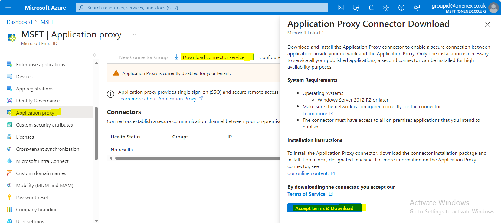

### Install Outbound Connector on Directory Manager Machine

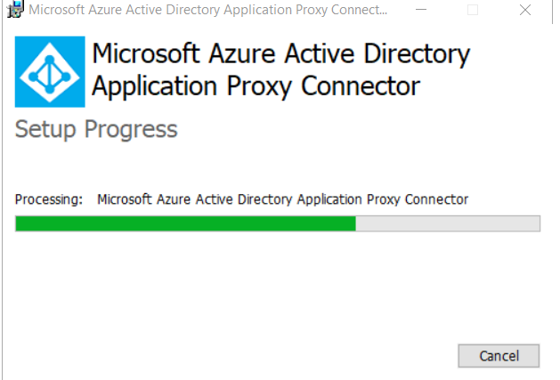

### Configure Outbound Proxy

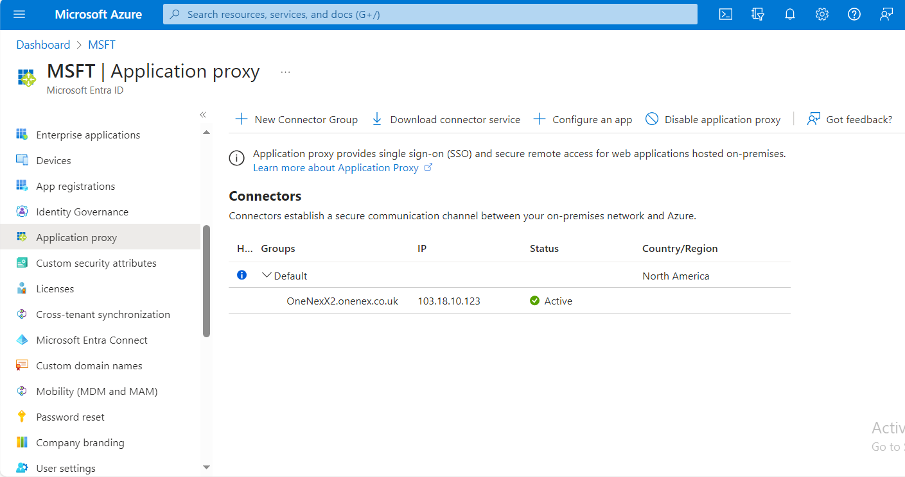

### Configure the Application

1. Click **Configure an App**.
2. Provide a suitable name for the application.
3. Copy the external application URL:

   - Visible URL (as shown in the portal): `https://GroupID10SSP-5l607h.msappproxy.net/GroupID/`
   - HREF (link target provided by the portal): `https://GroupID10SSP-5l607h.msappproxy.net/Directory Manager/`

4. Add the internal URL in the Application Proxy configuration:

   - Internal URL: `https://onenexx2:4443/`  
   - Link: https://onenexx2:4443/

   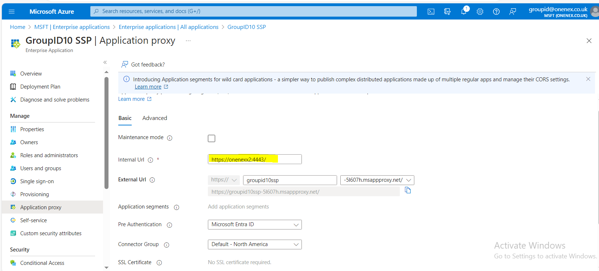

### Register the Application and Assign Users

1. Go to **App Registration** and open **All Applications**.

   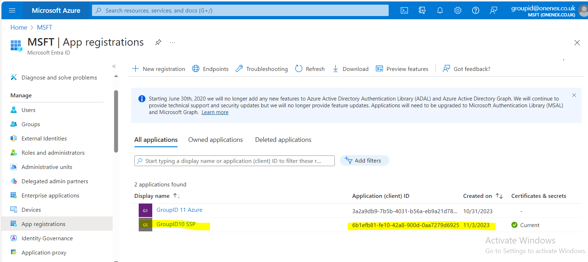

2. Assign users to this application.

   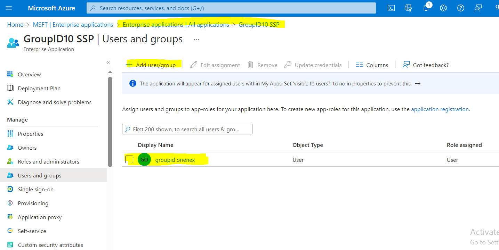

### Create and Upload an SSL Certificate

1. Create an SSL certificate.

   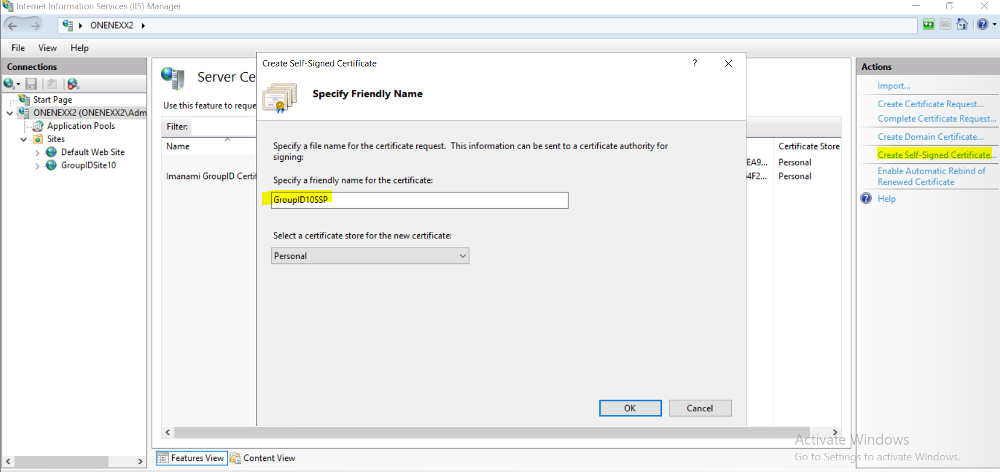

   

   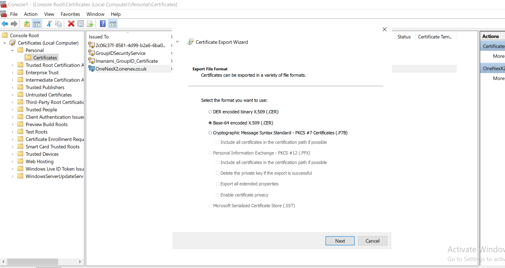

2. Upload the certificate.

   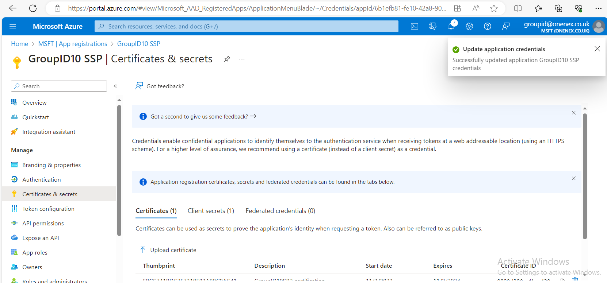

> **NOTE:** Self-signed certificates will not work. Add a public certificate instead. You can turn off SSL in the application proxy to test the configuration.

### Update Portal URLs with External URLs (Application Proxy)

1. Change the portal URLs to use the external URLs provided by the application proxy.

   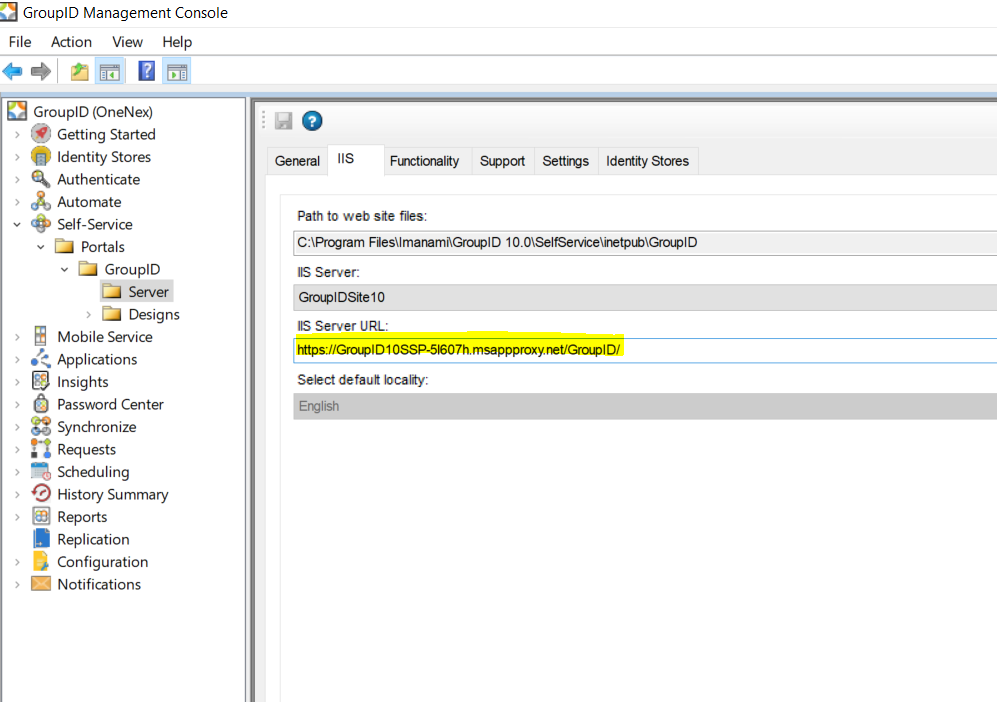

2. Verify that the changes are reflected in the `svc.client` table and `web.config` file.

   The following `web.config` changes are required:

   - External URL (visible): `https://GroupID10SSP-5l607h.msappproxy.net/GroupID/`
   - External URL (HREF/target provided by portal): `https://GroupID10SSP-5l607h.msappproxy.net/Directory Manager/`

   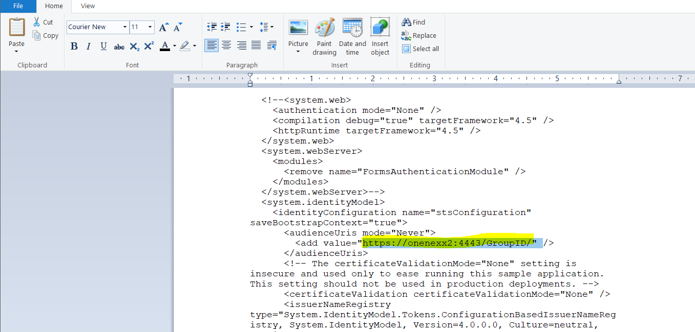

3. Edit the **Issuer** and **Realm** URLs as needed:

   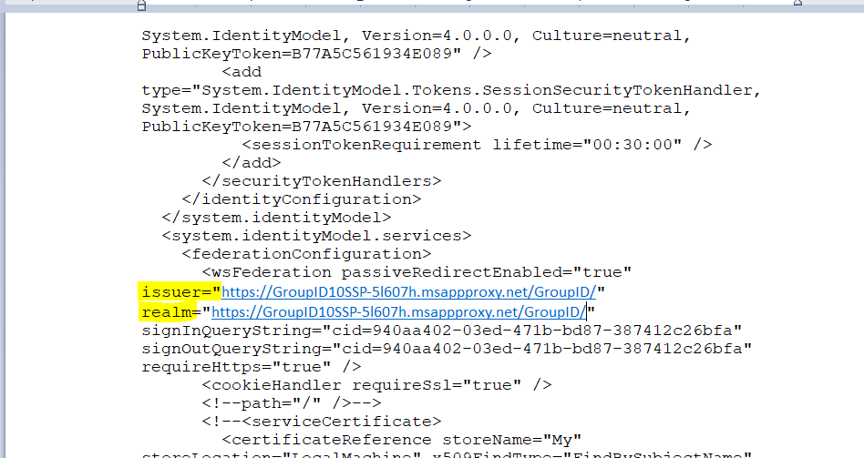

4. Update the `svc.client` table in the database with the return, error, and realm URLs.

> **NOTE:** Paste all URLs with a forward slash at the end. For example: `https://groupid10ssp-5l607h.msappproxy.net/Directory Manager/`

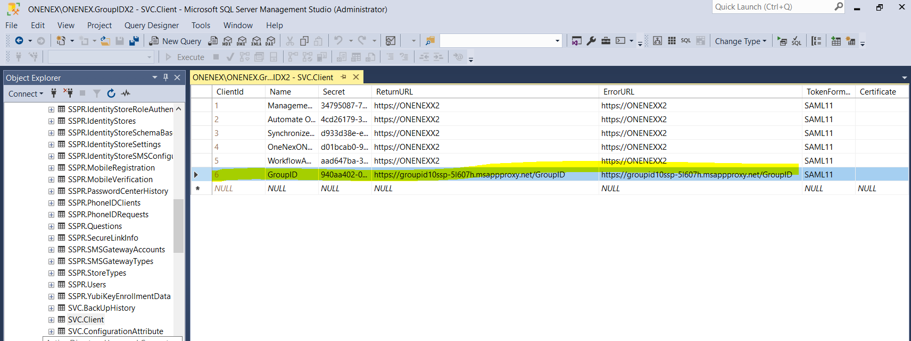

## Related Links

- [External Application URL for Directory Manager](https://GroupID10SSP-5l607h.msappproxy.net/GroupID/)
- [Internal URL for Application Proxy](https://onenexx2:4443/)
- [Issuer and Realm URL Example](https://groupid10ssp-5l607h.msappproxy.net/GroupID/)
