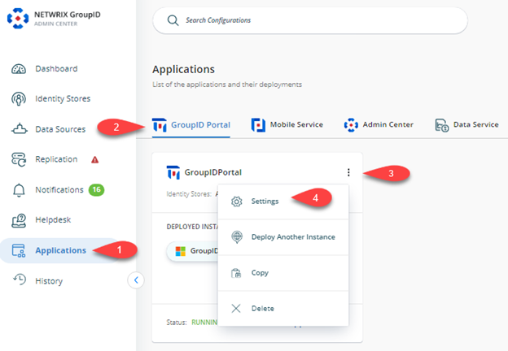
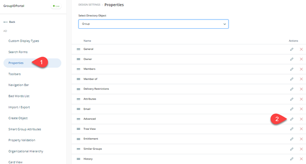
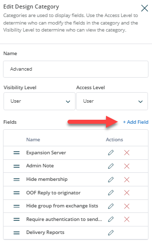
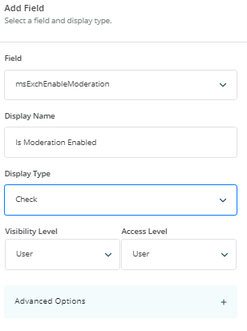
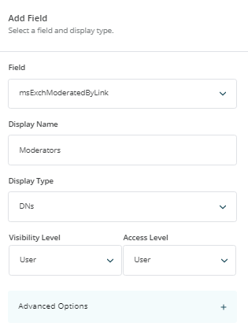
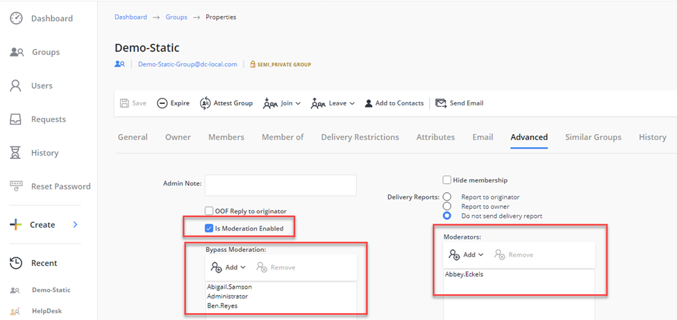

---
description: >-
  Shows how to customize the Netwrix Directory Manager portal to display message
  approvers (moderators) for distribution lists by using Exchange message
  moderation attributes in Active Directory.
keywords:
  - message approvers
  - distribution list
  - message moderation
  - Exchange
  - msExchEnableModeration
  - mxExchModeratedByLink
  - Netwrix Directory Manager
  - portal customization
products:
  - directory-manager
sidebar_label: 'How To Add Message Approvers in Group Properties in Netwrix Directory Manager Portal'
tags:
  - configuration-and-integration
title: >-
  How To Add Message Approvers in Group Properties in Netwrix Directory Manager
  Portal
knowledge_article_id: kA0Qk0000000HyXKAU
---

# How To Add Message Approvers in Group Properties in Netwrix Directory Manager Portal

## Applies To:

Netwrix Directory Manager 11

## Business Scenario:

We have set up message approvers/moderators for various distribution lists in our Microsoft Exchange and we would like to view these settings in our Netwrix Directory Manager portal. Is there a way to customize the Netwrix Directory Manager portal to show such settings?

## Solution:

To enable Netwrix Directory Manager portal customization for displaying Message Approvers for Distribution Lists using Microsoft Exchange-based Active Directory attributes, you can utilize the following Active Directory attributes associated with Message Moderation for On-Premises MS Exchange:

- **msExchEnableModeration**
  This attribute is used in Microsoft Exchange to enable or disable message moderation for a specific distribution group. When this attribute is set to true, it indicates that messages sent to the distribution group will be subject to moderation, which means they will need approval from a moderator before being delivered to the group members.

- **msExchModeratedByLink**
  This attribute is used to associate a distribution list or security group that contains the list of moderators for a moderated recipient. When this attribute is configured, it links the moderated recipient to the specified distribution list or security group, allowing the members of that group to act as moderators for the recipient.

- **msExchBypassModerationLink**
  This attribute is used to associate a distribution list or security group that contains the list of senders who can bypass the moderation process for a moderated recipient. When this attribute is set, it links the moderated recipient to the specified distribution list or security group, allowing the members of that group to send messages that bypass the moderation process.

By leveraging these attributes, you can create a customized view in the Netwrix Directory Manager portal that shows the appropriate Message Approvers for the Distribution Lists. This customization enables you to manage message moderation effectively and efficiently within your organization's Exchange environment.

## Steps:

Follow the below-provided instructions to customize the portal:

1. In the **Netwrix Directory Manager Admin Center Portal**, select **Self-Service** **GroupID Portals** **[required portal]** **Triple Dot button** **Settings**.

   

2. Under the **Design Settings** tab, select the **Identity Store** you want to customize in the portal.

3. On the **Properties** tab, select **Group** from the **Select Directory Object** list.

4. Select **Advanced** in the **Name** list and click **Edit**.

   

5. On the **Edit Design Category** dialog box, click **Add Field**.

   

6. Select the `mxExchEnableModeration` attribute in the **Field** list, enter the display name as **Is Moderator Enabled** and set the display type to **Check**.

   

7. Click **Add** on the dialog boxes and then click **Add Field** again on the **Edit Design Category**.

8. Select the `mxExchModeratedByLink` attribute in the **Field** list, enter the display name as **Moderators**, and set the display type to **DNs**.

   

9. Click **Add** on the dialog boxes and then click **Add Fields** again on the **Edit Design Category**.

10. Select the `mxExchBypassModerationLink` attribute in the **Field** list, enter the display name as **Bypass Moderators**, and set the display type to **DNs**.

    

11. Click **Add** on the dialog boxes and then click the **Save** button to save the settings.

12. Launch the **Netwrix Directory Manager** portal. You should be able to see the newly added attributes in the **Group’s Properties** under the **Advanced** tab.

    

## Related Articles:

- [Customize Properties Pages](https://docs.netwrix.com/docs/directorymanager/11_0/signin/service/mobileservice/design/objectproperties)
-  [Walkthrough Search Policy - Define Scope and Filter Results](/docs/kb/directorymanager/security-permissions-and-access-control/walkthrough-search-policy-define-scope-and-filter-results)

- [How To Enforce Users to Create Groups in a Specific OU](/docs/kb/directorymanager/security-permissions-and-access-control/how-to-enforce-users-to-create-groups-in-a-specific-ou)

- [How To Import Members to a Group Using Self-Service Import Wizard](/docs/kb/directorymanager/workflows-automation-and-lifecycle-management/how-to-import-members-to-a-group-using-self-service-import-wizard)

- [How to Trigger a workflow When a User Сreates a Group](/docs/kb/directorymanager/workflows-automation-and-lifecycle-management/how_to_trigger_a_workflow_when_a_user_сreates_a_group)

- [Best Practices for Controlling Changes to Group Membership](https://docs.netwrix.com/docs/kb/directorymanager/reporting-export-and-data-management/best-practices-for-controlling-changes-to-group-membership#netwrix-directory-manager-best-practices)

- [Best Practices for Preventing Accidental Data Leakage](/docs/kb/directorymanager/security-permissions-and-access-control/best-practices-for-preventing-accidental-data-leakage)
