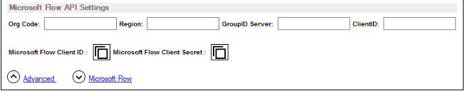

---
description: >-
  Show how to trigger operations in Netwrix Directory Manager from Microsoft
  Flow by creating a custom connector, retrieving client credentials, and
  importing the GroupIDConnector.swagger.json file.
keywords:
  - Netwrix Directory Manager
  - Microsoft Flow
  - custom connector
  - GroupIDConnector.swagger.json
  - client id
  - client secret
  - identity store
  - automation
products:
  - directory-manager
visibility: public
sidebar_label: Linking Directory Manager Processes with Microsoft
tags:
  - configuration-and-integration
title: "Linking Directory Manager Processes with Microsoft"
knowledge_article_id: kA0Qk00000015k1KAA
---

# Linking Directory Manager Processes with Microsoft

## Overview

This article explains how you can trigger operations in Netwrix Directory Manager from Microsoft Flow (MS Flow). By linking Directory Manager operations to MS Flow, you can automate tasks and simplify business functions, ensuring they execute in a set order without manual intervention.

Netwrix Directory Manager supports moving groups between organizational units (OUs) or domains within the identity store. By linking the **Disable_User_Accounts** flow in MS Flow to the **Move a Group to a Different Container** function in Directory Manager, groups with disabled owners can be automatically moved to a specified container when the flow runs.

To achieve this, define a custom connector in MS Flow and use it within the **Disable_User_Accounts** flow. This connector enables the following operations in Directory Manager:

- Create a user
- Create a group
- Expire a group
- Update a Smart Group or Dynasty
- Move a group to a different container
- Renew a group

Once linked, the configured operation triggers automatically when the flow runs.

## Instructions

### Step 1: Create a Custom Connector in Microsoft Flow

Refer to the official Microsoft documentation to create a custom connector in MS Flow: [Create a Custom Connector from Scratch ⸱ Microsoft](https://docs.microsoft.com/en-us/connectors/custom-connectors/define-blank).

During setup, you must enter the **Client ID** and **Client Secret** and import the `GroupIDConnector.swagger.json` file.

### Step 2: Retrieve the Client ID, Secret, and Swagger File

1. In Directory Manager Management Console, click the **Identity Stores** node.
2. On the **Identity Stores** tab, double-click the identity store you want to link to MS Flow.
3. On the **Workflow** tab in identity store properties, click the **MS Flow** link.

4. Click the copy button next to **MS Flow Client ID** to copy the client ID to the clipboard, then paste the ID in the **Client ID** box in MS Flow.
5. Click the copy button next to **MS Flow Client Secret** to copy the client secret (password) to the clipboard, then paste this password in the **Client Secret** box in MS Flow.
6. In addition, import the `GroupIDConnector.swagger.json` file from the Directory Manager installation directory, located at:

   ` [Directory Manager installation directory]\Imanami\GroupID 11.0\Automate\GroupIDConnector\`

   > **NOTE:** The default path is `C:\Program Files\Imanami\GroupID 11.0\Automate\GroupIDConnector\`. This path may vary depending on your environment.

7. Complete the process to create the connector in MS Flow.
