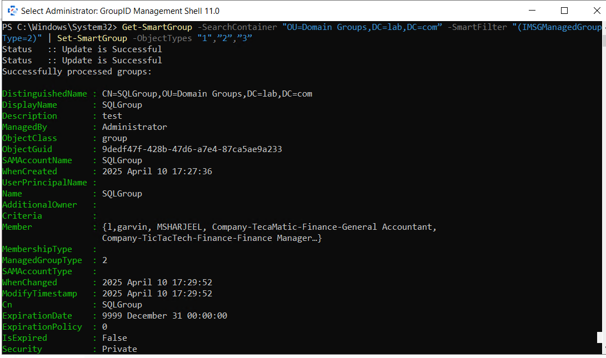

---
description: >-
  Use the Directory Manager Management Shell in Netwrix Directory Manager to
  bulk update Smart Group object types for multiple Smart Groups in an OU.
  Includes the exact PowerShell cmdlet and a mapping table for object type
  values.
keywords:
  - smart group
  - object types
  - Set-SmartGroup
  - Get-SmartGroup
  - PowerShell
  - OU
  - IMSGManagedGroupType
  - Netwrix Directory Manager
products:
  - directory-manager
sidebar_label: Bulk Update Smart Group Object Types
tags:
  - group-management-and-operations
title: "Bulk Update Smart Group Object Types"
knowledge_article_id: kA0Qk0000002JZdKAM
---

# Bulk Update Smart Group Object Types

## Overview

Use the Directory Manager Management Shell in Netwrix Directory Manager to bulk update the object types for multiple Smart Groups within a specific Organizational Unit (OU). This is useful when your business requirements change and you need to update membership criteria for many Smart Groups at once.

## Instructions

1. Launch the Directory Manager Management Shell.  
2. Log in using your service account.  
3. Run the following command to update object types for all Smart Groups in the specified OU:

```powershell
Get-SmartGroup -SearchContainer "Distinguished Name of Organizational Unit" -SmartFilter "(IMSGManagedGroupType=2)" | Set-SmartGroup -ObjectTypes "1","2","3"
```



4. This command updates all Smart Groups in the specified OU to include the following object types:
   - Users with Mailboxes
   - Users with External Email Addresses
   - Contacts with External Email Addresses

5. If your requirements differ, use the table below to identify the correct object type values.

> **NOTE:** The cmdlet may take time to execute depending on the number of Smart Groups in the OU. It is recommended to first test it on a smaller OU to validate results before applying it in a production environment.

## Object type values

| Object Type                         | Value |
|-------------------------------------|:-----:|
| Users with Mailboxes                | `1`   |
| Users with External Email Addresses | `2`   |
| Contacts with External Email Addresses | `3` |
| Mail-Enabled Groups                 | `4`   |
| Mail-Enabled Public Folders         | `5`   |
| Users                               | `6`   |
| Contacts                            | `7`   |
| Groups                              | `8`   |
| Workstations                        | `9`   |
| Servers                             | `10`  |
| Domain Controllers                  | `11`  |
