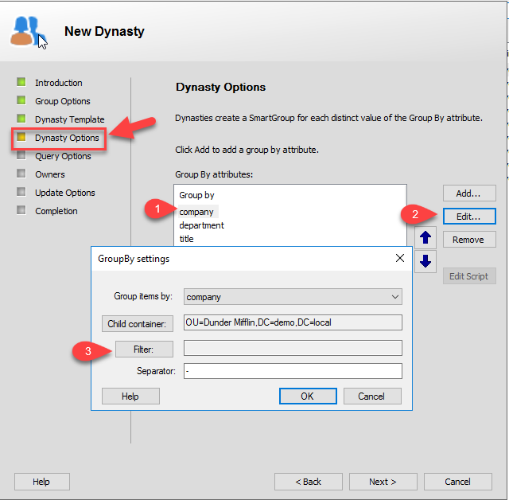
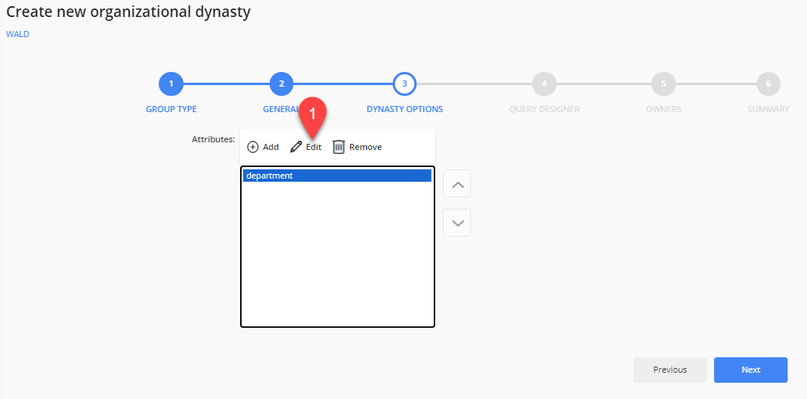
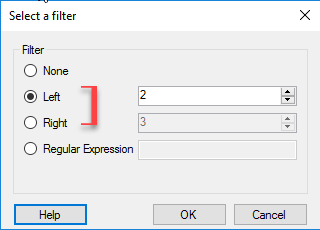
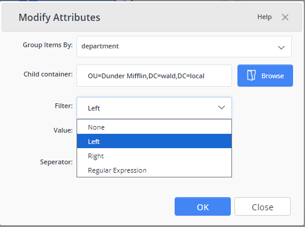
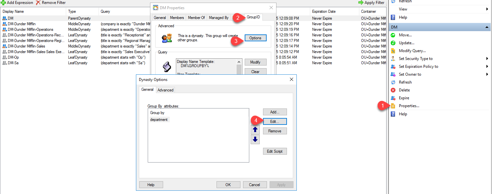
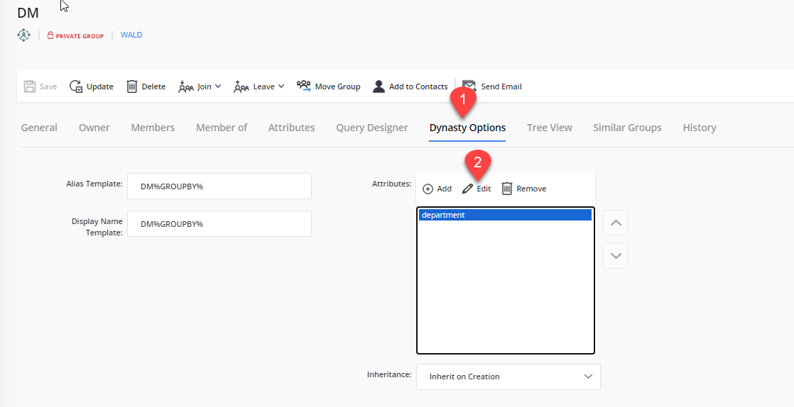
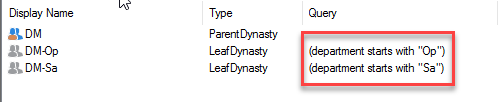

---
description: >-
  Explains how to change the default Dynasty grouping operator in Netwrix
  Directory Manager so you can use Starts with or Ends with filters to group
  users by partial Title values.
keywords:
  - dynasty
  - grouping
  - Netwrix Directory Manager
  - starts with
  - ends with
  - Group-By
  - custom attribute
  - titles
products:
  - directory-manager
sidebar_label: Change the Default Dynasty Operator
tags:
  - group-management-and-operations
title: "Change the Default Dynasty Operator"
knowledge_article_id: kA0Qk0000001qW1KAI
---

# Change the Default Dynasty Operator

## Applies To

Netwrix Directory Manager 10 Automate and Netwrix Directory Manager 11 Group Management

## Overview

In some organizations, the **Title** field may include multiple abbreviations (such as A1, B2, or C1) or a full job title with tiers (such as Systems and Network Engineer). In these cases, using the default **Is Exactly** operator when creating Dynasties may not produce the desired group structure.

Instead, you can use the **Starts with** or **Ends with** operator to better match partial title values and group users accordingly.

### Example: Using a Custom Attribute

If the **Title** and **Tier** are separated—such as placing the title in **Custom Attribute 1**—you can group by that attribute to simplify results.

**Attribute value:** `Custom Attribute 1 = SOC Analyst`

**Sample group created:** Everyone who is SOC Analyst

### Example: Using the Full Title Field

If the **Title** field includes both the title and tier (e.g., SOC Analyst I, SOC Analyst II), Netwrix Directory Manager will create a group for each unique value.

**Attribute values:**
- **Title** = `SOC Analyst I`
- **Title** = `SOC Analyst II`

**Sample groups created:**
- Everyone who is SOC Analyst I
- Everyone who is SOC Analyst II

To avoid excessive group creation, use the **Group-By** filter to focus only on the desired portion of the value—for example, everyone who is **SOC Analyst**.

## Instructions

You can update the default Dynasty grouping behavior when creating a new Dynasty or editing an existing parent Dynasty. Follow the steps below based on your scenario.

### Creating a New Dynasty

1. When creating a new Dynasty, continue through the wizard until you reach the **Dynasty Options** window.
2. Select the attribute you want to group by and click **Edit**. In the **GroupBy settings** dialog, click **Filter**.

   

   

3. To change the default operator, choose **Left** and enter the desired number of characters if using **Starts with**. Choose **Right** to switch to **Ends with**.

   

   

4. After saving your changes, the Dynasty will reflect the updated grouping behavior.

### Editing an Existing Dynasty

1. To configure an existing Dynasty using the same filter method, open the parent Dynasty’s properties.
2. Navigate to the **Netwrix Directory Manager** tab and click **Options**.
3. Follow steps 2 and 3 in the **Creating a New Dynasty** section above to configure and apply the GroupBy filter.

   

   

4. After saving your changes, the Dynasty will reflect the updated grouping behavior.

   
