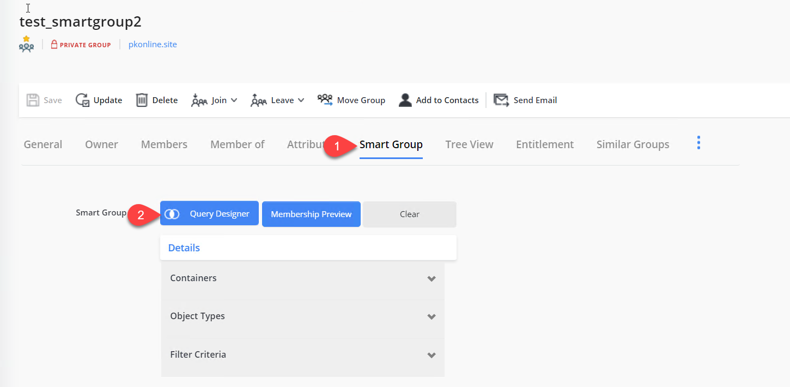
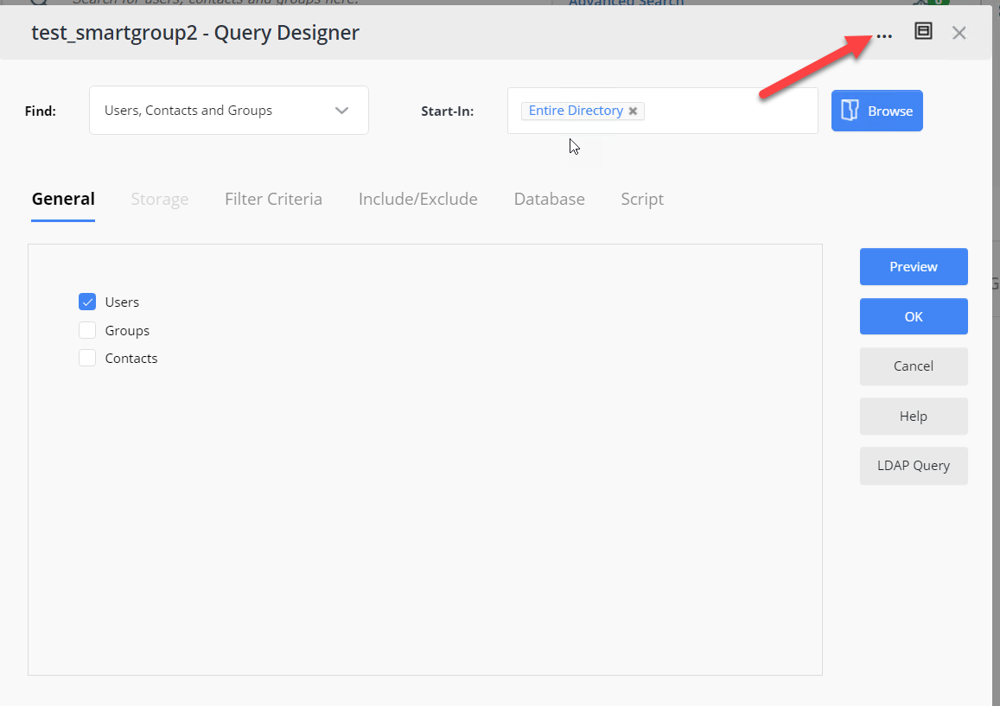

---
description: >-
  Shows how to export and import Smart Group query definitions in JSON format
  using the Query Designer so you can copy complex criteria between Smart Groups
  in Netwrix Directory Manager.
keywords:
  - smart group
  - query
  - JSON
  - export
  - import
  - Netwrix Directory Manager
  - Query Designer
  - group management
products:
  - directory-manager
sidebar_label: Copy Smart Group Query Criteria Using Import and E
tags:
  - group-management-and-operations
title: "Copy Smart Group Query Criteria Using Import and Export"
knowledge_article_id: kA0Qk0000002ILpKAM
---

# Copy Smart Group Query Criteria Using Import and Export

## Applies To
Netwrix Directory Manager 11

## Overview
Netwrix Directory Manager supports exporting and importing Smart Group query definitions in JSON format through the Query Designer. This functionality allows you to replicate complex query criteria across multiple Smart Groups, ensuring consistency and reducing manual configuration.

## Instructions

### Copy Smart Group Query Criteria Using Import and Export

1. In the application portal of Netwrix Directory Manager, click **Groups > All Groups > Smart Groups**.
2. Open the properties of the Smart Group whose criteria you want to copy.
3. Navigate to the **Smart Group** tab and open **Query Designer**.
4. In the Query Designer window, click the three-dot icon and select **Export query**. The JSON file will be downloaded to your default download location.  
   
5. Open the properties of the Smart Group where you want to apply the copied criteria.
6. Navigate to the **Smart Group** tab and open **Query Designer**.
7. In the Query Designer window, click the three-dot icon and select **Import query** to upload the previously exported JSON file.  
   
8. Click **Preview** to confirm that the query returns the expected results.
9. Complete the remaining steps of the Smart Group wizard to save your changes.
