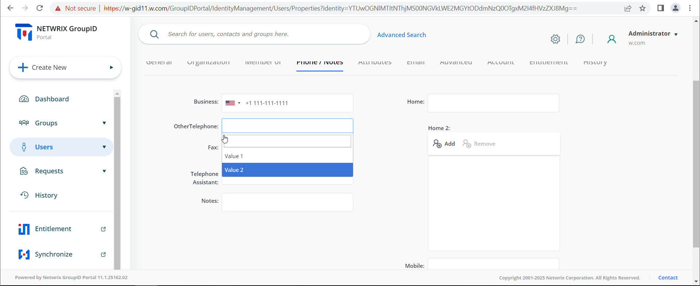

---
description: >-
  This article explains how to create and use a Multi-Valued Control custom display type in Netwrix Directory Manager, allowing users to select multiple predefined values for Active Directory attributes.
keywords:
  - Multi-Valued Control
  - Directory Manager
  - Active Directory
sidebar_label: Multi-Valued Control Custom Display Type
tags:
  - group-management-and-operations
title: "Create and Use a Multi-Valued Control Custom Display Type"
knowledge_article_id: kA0Qk0000002sM5KAI
products:
  - directory-manager
---

# Create and Use a Multi-Valued Control Custom Display Type

## Applies To

Directory Manager 11

## Overview

This article explains how to use the **Multi-Valued Control** custom display type in Netwrix Directory Manager (formerly GroupID). This control lets users select multiple predefined values for multi-valued Active Directory attributes, such as `otherTelephone`. It is designed for scenarios like assigning official contact numbers (for example, IT Helpdesk, HR, or Finance) to user profiles. The attribute you bind to this control must be multi-valued; single-valued attributes are not supported.

## Instructions

### Define a Multi-Valued Control Display Type

1. In the Admin Center, select **Applications** from the left pane. On the **Directory Manager Portal** tab, locate the portal card.
2. Click the three-dot icon for a portal and select **Settings**.

   

3. Under **Design Settings**, select an identity store to define a custom display type. Each portal can have different identity store designs.

   

4. Click **Custom Display Types** in the left pane.
5. On the **Custom Display Types** page, click the **+** icon.

   

6. In the **New Display Type** pane, enter a name for the display type and select **Multi-Valued Control** in the **Type** drop-down list.  
   You cannot change the name after creation.

   

7. In the **Values** area, configure the options for the multi-valued drop-down list:
   - Click **Add Value**.
   - Enter a *Value* and a *Display Text*. The value is stored in the directory or database, while the display text appears in the portal.
   - Use the **Visibility** drop-down list to specify which security roles can see the value.
   - Use the **Accessibility** drop-down list to specify which roles can select the value. Users without access see the value greyed out.
   - Click **OK** to add the value to the list.

   

8. Repeat step 7 to add more values. You can also edit or delete values as needed.

   

9. Optional: Select one or more values in the **Default Selection** list to set them as default.
10. Optional: In **Custom Value Edit Roles**, allow specific roles to enter new values directly in the portal.
11. Click **OK**, then **Save** on the **Custom Display Types** page.

### Attach the Multi-Valued Control to an Attribute

1. In the Admin Center, select **Applications** from the left pane.
2. Click the three-dot icon for a portal and select **Settings**.
3. Select an identity store under **Design Settings**.
4. Click **Properties** in the left pane.
5. On the **Properties** page, select **User** in the **Select Directory Object** list.

   

6. On the **User Properties** page, click **Edit** for the **Phone/Notes** tab.
7. On the **Edit Design Category** pane, edit the `otherTelephone` field. Under **Display Type**, select your custom multi-valued control.

   

8. Click **OK** to close the panes, then click **Save** on the **Custom Display Types** page.

Users will now see a drop-down list for the `otherTelephone` field, allowing them to select multiple values that update in Active Directory.

