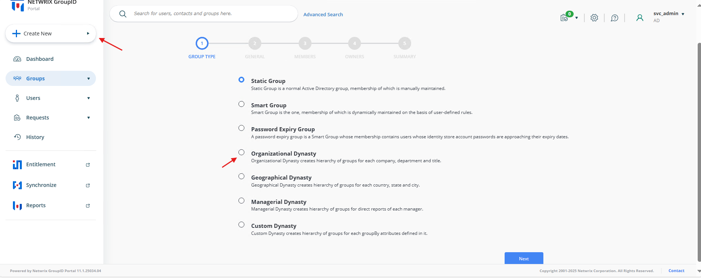
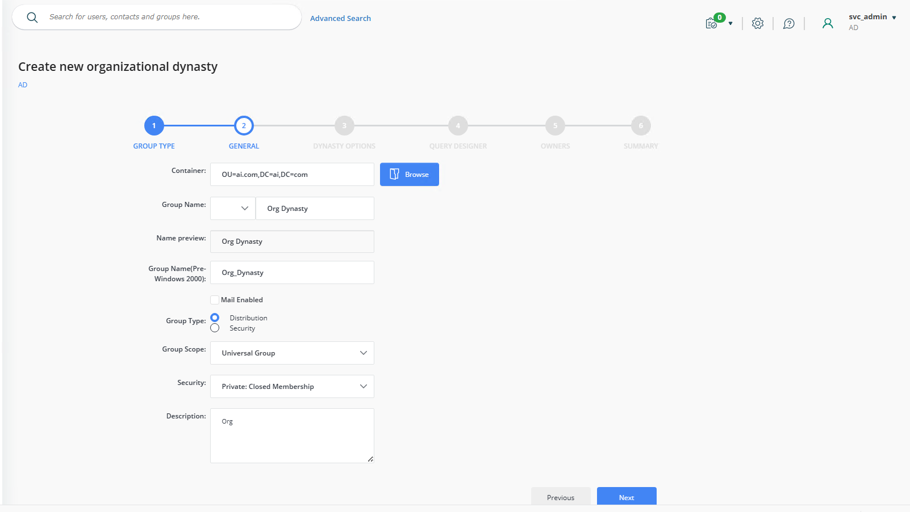
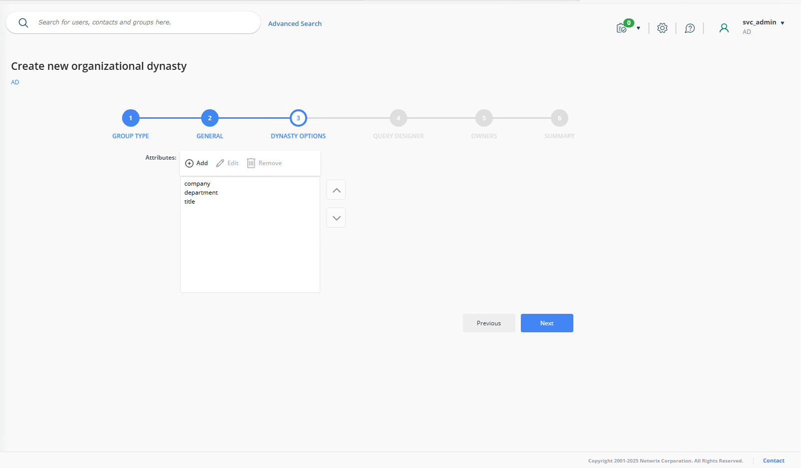
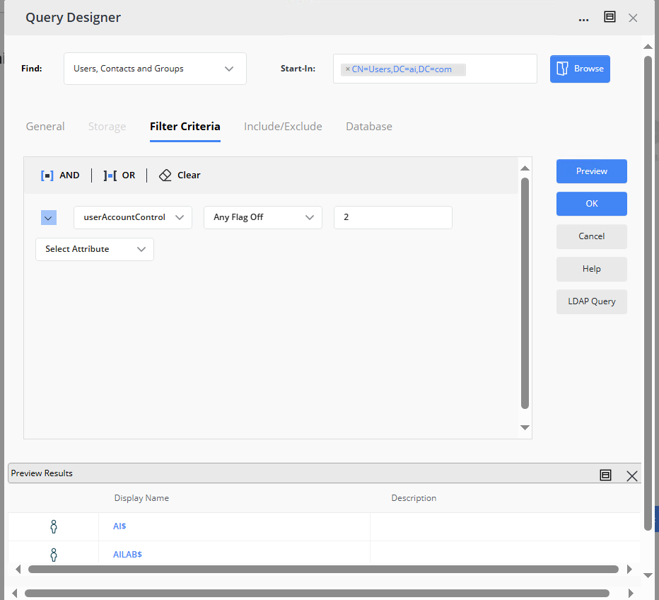
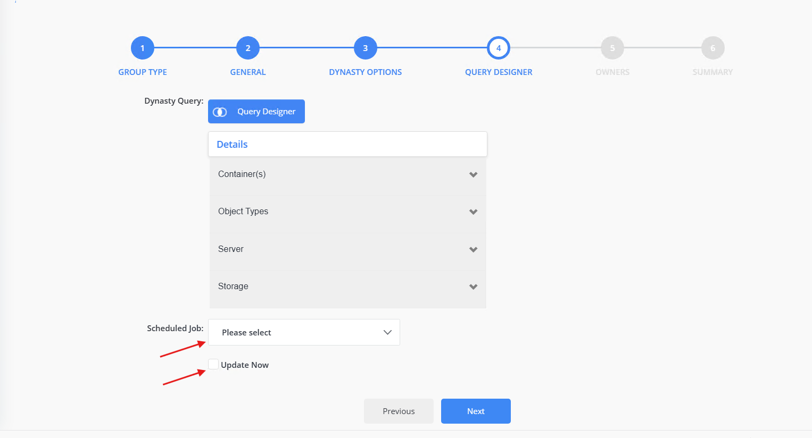
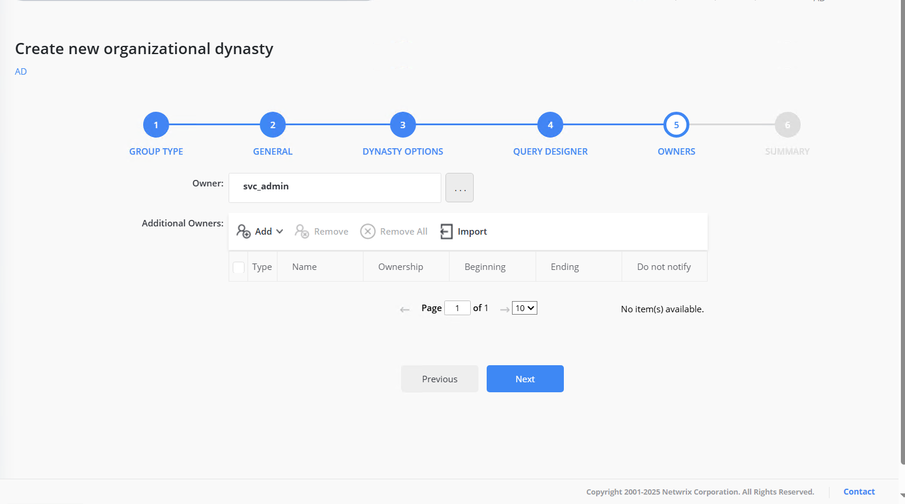

---
description: >-
  Describes how to create and manage Dynasties—sets of groups automatically
  created and managed based on Active Directory attributes—using Netwrix
  Directory Manager.
keywords:
  - dynasty
  - groups
  - Netwrix Directory Manager
  - Active Directory
  - group automation
  - dynasty templates
  - Organizational Dynasty
  - Query Designer
products:
  - directory-manager
sidebar_label: Creating and Managing Dynasties
tags:
  - group-management-and-operations
title: "Creating and Managing Dynasties"
knowledge_article_id: kA0Qk0000002BQnKAM
---

# Creating and Managing Dynasties

## Applies To

Netwrix Directory Manager 11

## Overview

A Dynasty is a set of groups automatically created and managed in Netwrix Directory Manager based on unique values of a selected Active Directory attribute (the **Group By** attribute). For example, if you group by **Department**, Netwrix Directory Manager creates a group for each department and adds users to the appropriate group according to their department value.

You can also create nested Dynasties by grouping on multiple attributes, such as **Country** and **City**. In this case, city groups are nested within their respective country groups.

Child groups are standard security groups or distribution lists. Netwrix Directory Manager Automate keeps group membership up to date: when a user’s attribute changes (for example, their department), they are automatically moved to the correct group. New groups are created as needed, and groups with no members can be deleted automatically (if configured).

Child groups inherit properties from their parent Dynasty, including group type, security settings, expiry policy, owner, delivery restrictions, and message size limits. This automation saves significant time compared to manually creating and managing groups and their settings.

#### Dynasty Templates

Netwrix Directory Manager offers three types of Dynasty templates to help you get started:

- **Organizational Dynasty:** Creates a child group for each Company, Department, and Title.
- **Geographical Dynasty:** Creates a child group for each Country, State, and City.
- **Managerial Dynasty:** Creates a child group for the direct reports of each manager, including subordinates of the manager's direct reports.
- **Custom:** Creates a Dynasty by AD attributes of your choice.

The three templates are configurable, whereas the custom Dynasty can fulfill numerous other requirements.

## Instructions

### Creating an Organizational Dynasty

1. In Netwrix Directory Manager Portal, select **Create New** > **Organizational Dynasty** template and click **Next**.  
   
2. On the **Group Options** page, enter the group name, select the container where the group will be created, and specify the group type, scope, and security settings.  
   
3. On the **Dynasty Options** page, review and modify the attributes that will be used to create child groups. For example, you can remove *Title* and add *Office* as needed.  
   
4. On the **Query Options** page, review the current configuration of your Dynasty. You can click **Query Designer** to launch the Query Designer, where you can modify the query to filter the objects for group membership. For example, you may filter out disabled users or get a specific employee type.  
   
5. Once your query is complete, proceed to the **Update Options** page. The Dynasty can be updated manually or via an automated schedule.  
   
6. On the **Owners** page, you can specify additional owners for the group. By default, Netwrix Directory Manager sets the logged-in user as the primary owner. The primary owner will be inherited by all child groups. You can add additional owners by clicking the **Add** button. Users, contacts, and even security groups can be set as additional owners.  
   
7. The **Completion** page gives a summary of the selected settings. Click **Finish**.
8. If you selected **Now** for your update options, a parent Dynasty will be created with the name provided on the **Group Options** page, and child groups will be created according to the configured template.

> **NOTE:** The Dynasty created in this article is just an example; you can customize the naming template, separator, inheritance, and much more.
