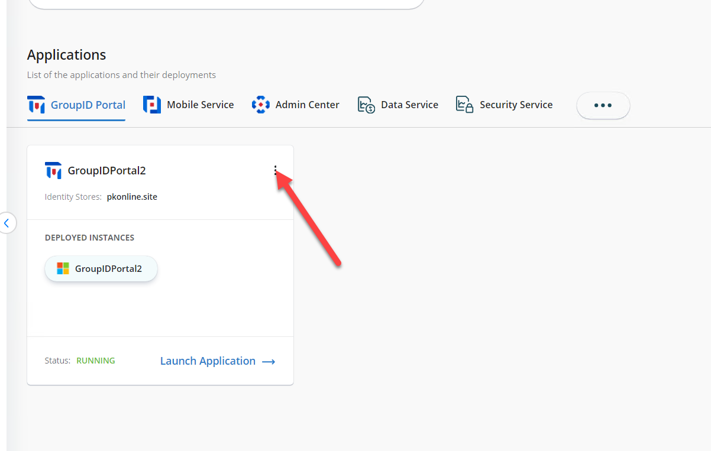
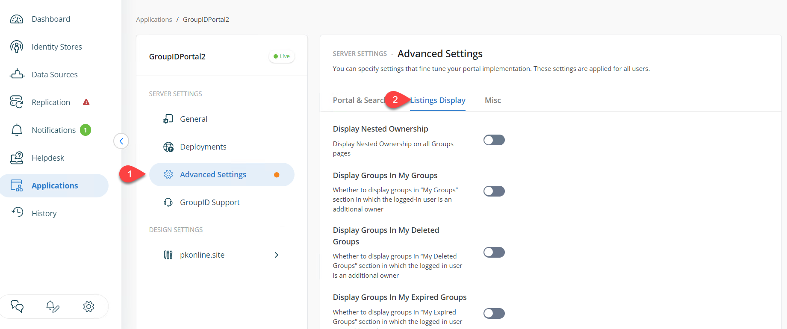
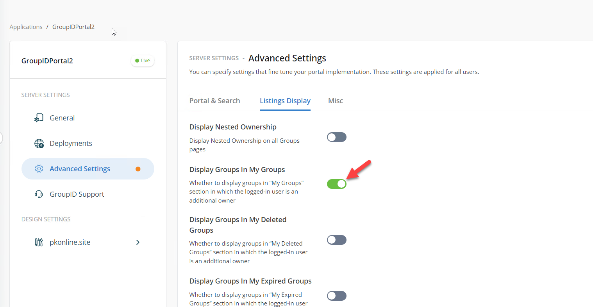
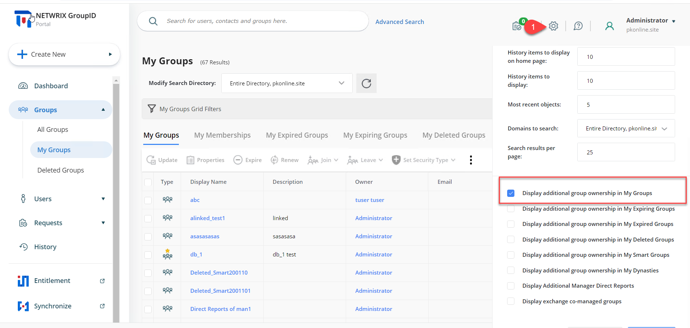

---
description: >-
  Enable displaying groups where you are an additional owner in the My Groups
  tab of Netwrix Directory Manager; an administrator can enable this globally,
  or you can adjust it per account in the application portal.
keywords:
  - Netwrix Directory Manager
  - My Groups
  - additional owner
  - group ownership
  - application portal
  - listing displays
  - admin settings
products:
  - directory-manager
sidebar_label: Display Groups with Additional Ownership in the My
tags:
  - group-management-and-operations
title: "Display Groups with Additional Ownership in the My Groups Tab"
knowledge_article_id: kA0Qk0000002JL7KAM
---

# Display Groups with Additional Ownership in the My Groups Tab

## Overview

Use these steps to configure the **My Groups** tab in Netwrix Directory Manager to display groups where the logged-in user is listed as an additional owner, in addition to groups where the user is the primary owner. An administrator can enable this behavior globally, or you can adjust it yourself in the application portal.

## Instructions

1. From the Admin portal, navigate to **Applications** > **your application portal**.  
2. Click the three-dot icon and select **Settings**.  

   
3. In the settings menu, go to **Advanced Settings** > **Listing Displays**.  

   
4. Find the option for **Display Groups in My Groups** and toggle it to include groups where the user is an additional owner.  

   
5. Click **Save** and then **OK** to apply the changes.
6. Log in to the application portal. The **My Groups** page will now display groups for which the logged-in user is an additional owner.
7. Individual users can adjust their own settings in the application portal to view groups they own as both primary and additional owner. After changing this setting, remember to click **Save**.

   
