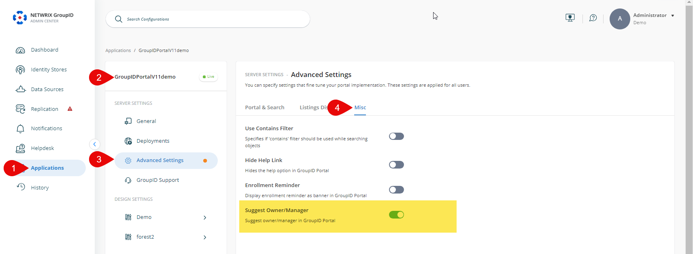
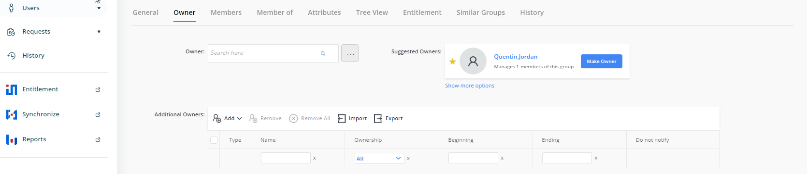

---
description: >-
  Shows how to enable and use the Group Owner Suggestion feature in Netwrix
  Directory Manager to detect orphan groups and recommend owners based on group
  membership.
keywords:
  - orphan groups
  - owner suggestion
  - group owner
  - Netwrix Directory Manager
  - identity store
  - self-service portal
  - Admin Console
products:
  - directory-manager
sidebar_label: Enable Group Owner Suggestion for Orphan Groups
tags:
  - group-management-and-operations
title: "Enable Group Owner Suggestion for Orphan Groups"
knowledge_article_id: kA0Qk0000002I7JKAU
---

# Enable Group Owner Suggestion for Orphan Groups

## Applies To
Netwrix Directory Manager 11

## Overview
Orphaned groups are directory groups that do not have an assigned owner. Over time, these groups can accumulate and complicate directory management. Manually identifying and assigning owners to orphaned groups is inefficient and prone to error, especially in dynamic environments. Netwrix Directory Manager provides automated functionality to detect orphaned groups and recommend suitable owners based on group membership data. This article describes how to configure and use the Group Owner Suggestion feature.

## Instructions
There are two ways to address Orphan Groups:

- **Orphan Group Update Job:** Define and schedule an Orphan Group Update job for an identity store. This job scans for orphan groups and automatically assigns an owner to each group. Configure this job in **Admin Console > Identity Store Properties > Schedules**.
- **Group Owner Suggestion:** Enable the Owner Suggestion feature in the Netwrix Directory Manager portal to dynamically suggest an owner for an orphan group. Unlike the Orphan Group Update job, this feature allows users to choose an owner from a list of suggested users, ranked by relevance based on group membership.

## Configure Group Owner Suggestion
1. In the Netwrix Directory Manager Admin Console, select **Application > Directory Manager Portals > [required portal]**.  
2. Click the three-dot icon and go to **Settings > Advanced Settings > Misc**.  
3. Scroll down and enable the **Suggest Owner/Manager** setting. This setting enables the Self-Service portal to suggest owners for orphan groups and managers for users without managers.  
4. Netwrix Directory Manager will suggest a primary owner for an orphan group on the **Owner** tab in group properties. The suggestion is based on group membership. Netwrix Directory Manager checks the managers of group members and suggests the user who appears most frequently as a manager, even if that user is not a group member.  
5. Click the **Save** icon on the toolbar.

## Use Owner Suggestion in the Portal
1. Log in to the Netwrix Directory Manager portal.  
2. Go to the properties page of an orphan group and click the **Owner** tab.

3. Netwrix Directory Manager will display a suggested owner for the group.  
4. Click **Make Owner** to set the suggested user as the group's primary owner.  
5. To view more options before setting an owner, click **Show more options** to see a list of suggested owners.  
6. After making your selection, click **Save** to apply the changes.
