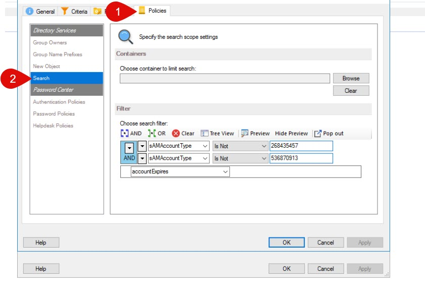

---
description: >-
  Learn how to prevent end users from viewing distribution lists in the Netwrix
  Directory Manager self-service portal by excluding specific sAMAccountType
  values in the user security role LDAP filter.
keywords:
  - distribution lists
  - sAMAccountType
  - LDAP filter
  - Netwrix Directory Manager
  - security role
  - portal
  - distribution groups
  - Active Directory
products:
  - directory-manager
sidebar_label: Hide Distribution Lists from End Users in Portal
tags:
  - group-management-and-operations
title: "Hide Distribution Lists from End Users in Portal"
knowledge_article_id: kA0Qk0000002IDlKAM
---

# Hide Distribution Lists from End Users in Portal

## Applies To
Netwrix Directory Manager 10 and above

## Overview
In some environments, it may be necessary to prevent end users from viewing distribution lists in the Netwrix Directory Manager self-service portal. This can be accomplished by configuring LDAP filter criteria in the user security role. By excluding specific `sAMAccountType` values associated with distribution groups, you can ensure that these groups are not displayed to users in the portal.

## Instructions

### Hide Distribution Lists from End Users
1. In the Netwrix Directory Manager Management Console, open the properties of your identity store.  
2. Click the **Security Roles** tab and edit the **User** security role.  
3. Click the **Policies** tab then navigate to **Search**.  
4. In the LDAP filter, apply the criteria below to exclude distribution lists. Use the **AND** operator between these two criteria.
   - `sAMAccountType is Not 536870913`
   - `sAMAccountType is Not 268435457`

5. Save the settings in the security roles.  
6. Sign out of the Netwrix Directory Manager portal and sign in again with an account that is part of the user security role to verify the change.

> **NOTE:** For Universal and Global distribution groups, the `sAMAccountType` value is **268435457**. For Domain local distribution groups, the value is **536870913**.
