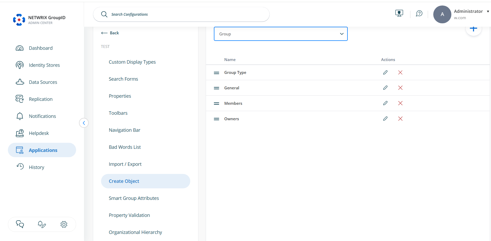
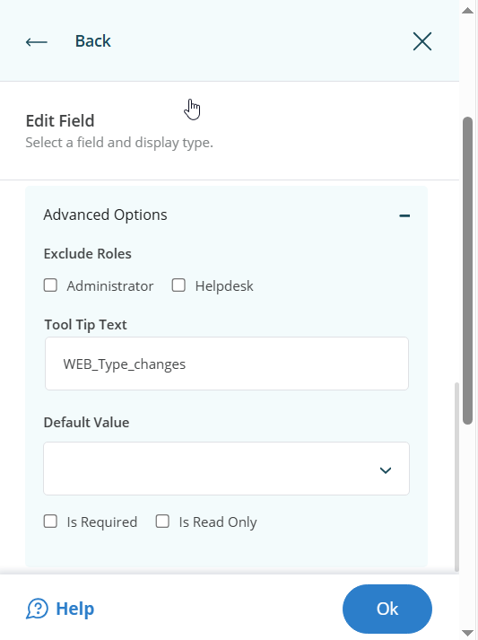
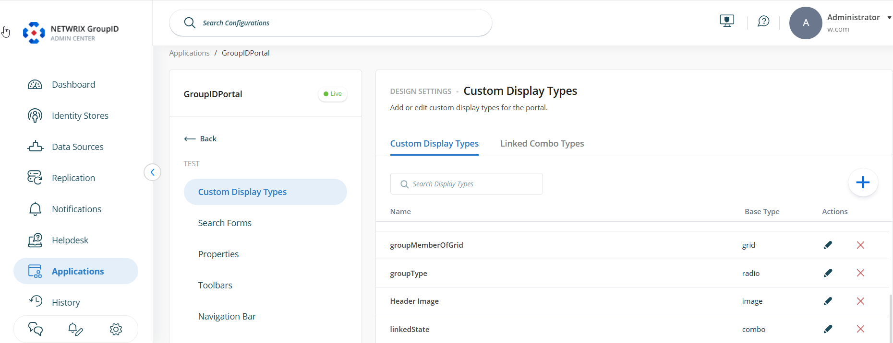
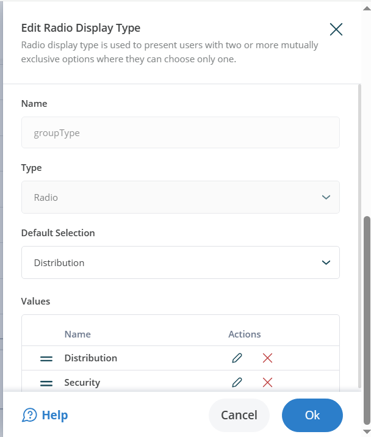

---
description: >-
  Shows how to configure the Netwrix Directory Manager portal so end users can
  only create distribution groups while administrators can create both
  distribution and security groups.
keywords:
  - group creation
  - distribution groups
  - security groups
  - Netwrix Directory Manager
  - NDM Admin Center
  - portal settings
  - custom display types
products:
  - directory-manager
sidebar_label: How To Allow users to only create distribution gro
tags:
  - group-management-and-operations
title: "How To Allow users to only create distribution groups"
knowledge_article_id: kA0Qk0000002Z3JKAU
---

# How To Allow users to only create distribution groups

## Applies To:
**Netwrix Directory Manager 11**

## Business Use Case:
You want end users to be able to create distribution groups only, and not be able to create security groups.

## More Information:
By default, users can create both distribution and security groups using the Netwrix Directory Manager (NDM) portal. In this article, you will configure the portal so end users can only create distribution groups, while people in the **Administrator** role can still create both distribution and security groups.

## Steps:
1. In the NDM Admin Center, select **Applications >** Under **Netwrix Directory Manager Portal**, select the **three dots** button on your portal > Click **Settings**.  
   

2. On the **Server Settings** tab, under **Design Settings**, select your identity store.

3. Click the **Create Object** tab > Under **Select Directory Object**, select **Group**. In the **Name** list, select **General** and click **Edit**.  
   

4. On the **Edit Category** dialog box, select **Group Type** in the **Fields** area and click **Edit**.  
   

5. On the **Edit Field** dialog box, click **Advanced options**.

6. Make sure that under **Default Value**, nothing is selected. If there is already a value, clear it out.  
   

7. Also, make sure that the checkbox named **Is Read Only** is unchecked / not selected > Click **OK** > Scroll down and **Save** your changes.

8. Again, in the NDM Admin Center, select **Applications >** Under **Netwrix Directory Manager Portal**, select the **three dots** button on your portal > Click **Settings**.

9. On the **Server Settings** tab, under **Design Settings**, select your portal.

10. Select **Custom Display Types** > Then under **Custom Display Types**, select **groupType** from the list and click the **Edit** button.  
    

11. A new dialog box named **Edit Radio Display Type** will open.  
    

12. Under the **Edit Radio Display Type** dialog box, edit the option named **Security** > Change its **Visibility** to **Administrator** > Then edit the option named **Distribution** and make sure its **Visibility** is set to **User** (this will be the default value here).  
    

13. If you see any other option in this mini window besides **Security** and **Distribution**, edit them and set their **Visibility** to **Never**. Scroll down and **Save** your changes.

## Expected Results:
After these changes, when an end user tries to create a new group, they will only be able to create a distribution group. When an administrator tries to create a group, they will be able to create both distribution and security groups.
