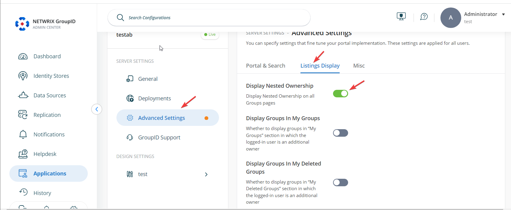
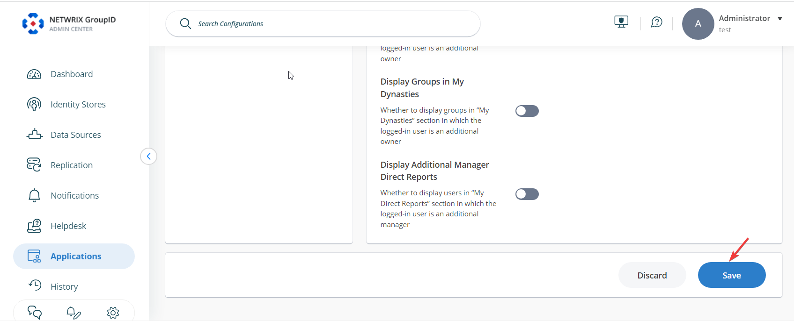

---
description: >-
  Show how to enable nested (transitive) group ownership on the My Groups page
  in Netwrix Directory Manager 11 so members of owner groups see owned groups
  via nested membership.
keywords:
  - nested group ownership
  - My Groups
  - Self-Service Portal
  - transitive ownership
  - Netwrix Directory Manager
  - Active Directory
  - Admin Center
  - Advanced Settings
  - Display Nested Ownership
products:
  - directory-manager
sidebar_label: How to Display Nested Group Ownership in the My Gr
tags:
  - group-management-and-operations
title: "How to Display Nested Group Ownership in the My Groups Page"
knowledge_article_id: kA0Qk0000002EN3KAM
---

# How to Display Nested Group Ownership in the My Groups Page

## Applies To
Netwrix Directory Manager 11

## Overview
This article explains how to display nested (transitive) group ownership on the **My Groups** page in Netwrix Directory Manager 11. By default, nested ownership is not shown in the Self-Service Portal, but you can enable this feature using an advanced setting.

Some groups in Active Directory are owned by a security group. You may want members of the owner group to see their owned groups on the **My Groups** page. For example, if User A is a member of Group A, and Group A is the owner of Group B, then User A is considered the owner of Group B through nested (transitive) ownership.

## Instructions
1. In the Directory Manager Admin Center, select **Applications**. Under **Directory Manager Portal**, select the **three dots** button for your portal, then click **Settings**.

   

2. On the **Server Settings** tab, click **Advanced Settings**. Select **Listings Display**, then enable the **Display Nested Ownership** option.

   

3. Scroll to the bottom of the page and click **Save** to apply your changes.

   
