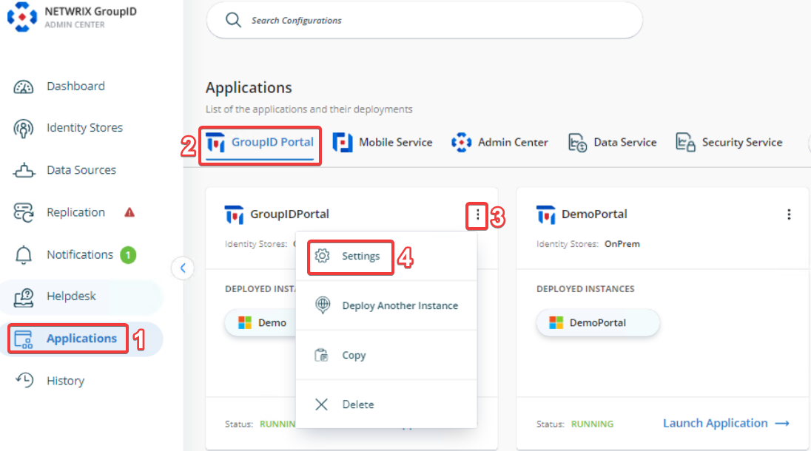

---
description: >-
  Shows how you can enforce the Group Type as `Distribution` in the Self-Service
  portal of Netwrix Directory Manager by customizing the Create Group wizard and
  field visibility settings.
keywords:
  - directory-manager
  - group type
  - distribution group
  - self-service portal
  - create wizard
  - visibility role
  - Admin Center
  - portal settings
products:
  - directory-manager
sidebar_label: How to Enforce Group Type as Distribution or Secur
tags:
  - group-management-and-operations
title: "How to Enforce Group Type as Distribution or Security v10"
knowledge_article_id: kA0Qk00000015vJKAQ
---

# How to Enforce Group Type as Distribution or Security v10

## Applies To
- Netwrix Directory Manager 10

## Overview
This article explains how you can enforce the Group Type as `Distribution` in the Self-Service portal of Netwrix Directory Manager. Netwrix Directory Manager allows you to configure object creation settings, including customizing the Create wizard, defining default values, and setting visibility rules based on user roles. By customizing the Create Group wizard, you can restrict users to creating only distribution groups, ensuring consistent group types across the directory.

## Instructions
1. In the Directory Manager Admin Center, go to **Applications** > **Directory Manager Portals** and locate the required portal.  
2. Once you have chosen the required portal, click the three-dot icon on the portal then click **Settings**.  
   
3. Under **Application Settings**, select an identity store from the **Design Settings** section.  
   
4. Click the **Create Object** tab.
5. In the **Select Directory Object** list, choose **Group**.
6. In the **Name** list, select **General** and click **Edit**.
7. In the **Edit Category** dialog box, select **Group Type** from the Fields list and click **Edit**.
8. In the **Edit Field** dialog box, click **Advanced Options**.
9. From the **Default Value** dropdown, select `Distribution`.
10. To restrict changes to this setting, do one of the following:
    - Select the **Is Read Only** checkbox.
    - Or set the **Visibility Role** to `Never`.
11. To enforce the setting for a specific role (for example, `Role C`), set the visibility level to a role with a higher priority than `Role C`. Roles with equal or lower priority will not be able to change the group type.
12. Click **OK** to close the dialog boxes and save your changes.

After saving your changes, the Group Type field will default to `Distribution` in the Self-Service portal, and users will not be able to change it. This ensures that all newly created groups are distribution lists only.
