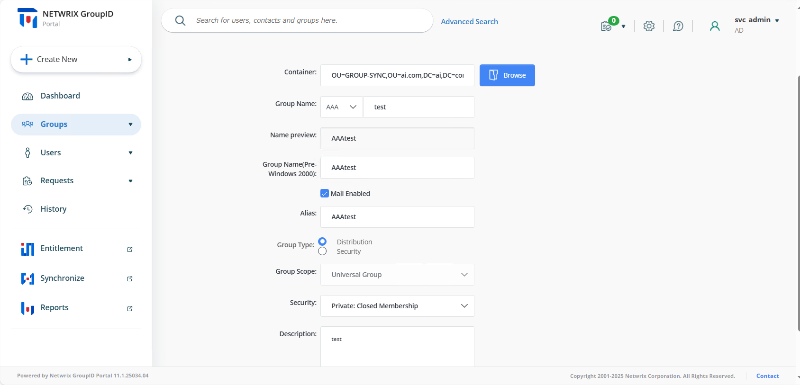

---
description: >-
  Use Netwrix Directory Manager to force the Create Group wizard to set the
  Group Type to `Distribution`, ensuring users can create distribution lists
  only. This article shows how to customize the Create Object form, set a
  default value, and restrict editing by role.
keywords:
  - directory manager
  - group type
  - distribution
  - create group
  - self-service portal
  - design settings
  - role visibility
  - read only
products:
  - directory-manager
sidebar_label: How to Enforce Group Type as Distribution or Secur
tags:
  - group-management-and-operations
title: "How to Enforce Group Type as Distribution or Security v11"
knowledge_article_id: kA0Qk0000002CQ5KAM
---

# How to Enforce Group Type as Distribution or Security v11

## Applies To
Netwrix Directory Manager 11

## Overview
This article explains how to restrict users to creating distribution groups only in the Self-Service portal of Netwrix Directory Manager. By customizing the Create Group wizard, you can enforce the group type as **Group Type** = `Distribution`, ensuring that all new groups are created as distribution lists.

Netwrix Directory Manager allows you to customize the Create wizard for directory objects, including which fields are displayed, which are required, and which are editable. You can also set default values and control field visibility based on user roles.

## Instructions
1. Access the **Directory Manager Admin Center** at https://Servername/AdminCenter/dashboard.
2. Go to **Applications**, select your **Portal Name**, then click **Settings > Design Settings**.
3. Select the identity store you want to customize.
4. Click the **Create Object** tab.
5. In the **Select Directory Object** list, select *Group*.
6. In the **Name** list, select *General* and click **Edit**.
7. In the **Edit Category** dialog box, select **Group Type** in the **Fields** area and click **Edit**.
8. In the **Edit Field** dialog box, click **Advanced Options**.
9. In the **Default Value** list, select `Distribution` to set it as the default group type.
10. To prevent users from changing the default selection, do one of the following:
   - Select the **Is Read Only** checkbox.
   - Or set the **Visibility Role** to `Never`.

   

11. To enforce the `Distribution` group type for a specific role (for example, Role C), set the visibility level to a role with a higher priority than Role C. Only users with the selected role or higher can modify the group type. Users with Role C or lower will not be able to change the default selection.
12. Click **OK** to close the dialog boxes and save your changes.

## Expected Results
In the Create Group wizard in the Directory Manager portal, the **Group Type** field will be set to `Distribution` by default. Users will not be able to change the group type, so all new groups will be created as distribution lists only.

