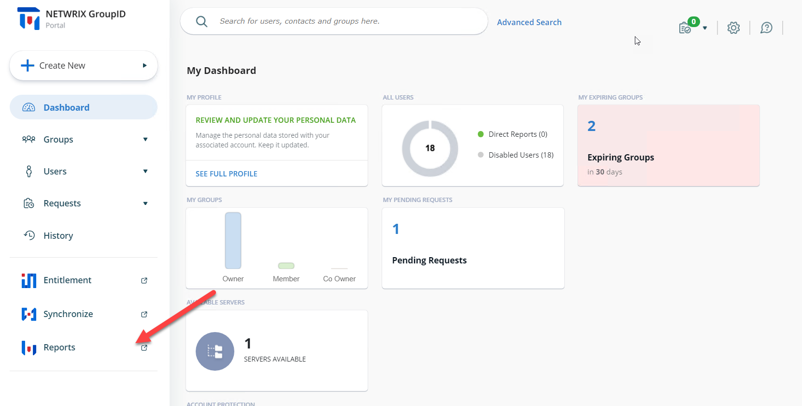
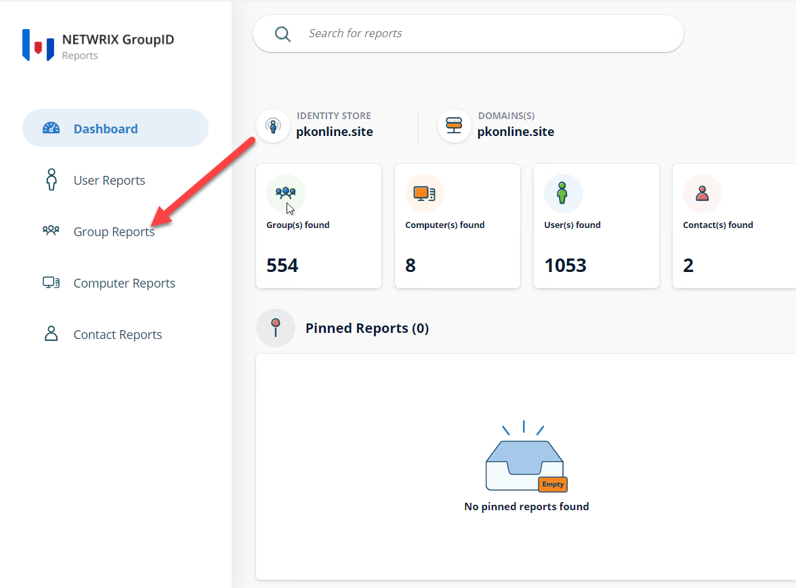
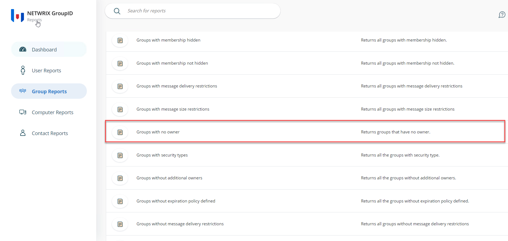
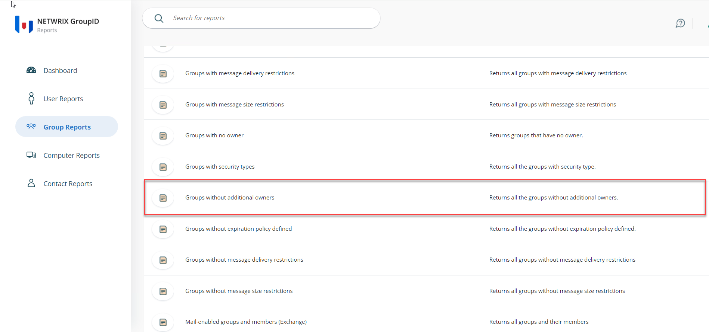
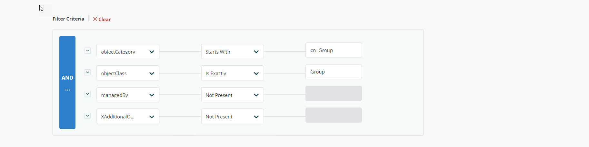

---
description: >-
  This article shows how to use the Reports module in Netwrix Directory Manager
  11 to identify groups that lack a primary owner, additional owners, or any
  owners.
keywords:
  - Netwrix Directory Manager
  - groups
  - owners
  - reports
  - LDAP
  - Group Reports
  - Groups with no owner
  - Groups without additional owners
products:
  - directory-manager
sidebar_label: How to Identify Groups Without Owners
tags:
  - group-management-and-operations
title: "How to Identify Groups Without Owners"
knowledge_article_id: kA0Qk0000002CjRKAU
---

# How to Identify Groups Without Owners

## Overview

This article shows how to use the Reports module in Netwrix Directory Manager 11 to identify groups that lack a primary owner, additional owners, or any owners.

## Instructions

1. In the Directory Manager application portal, click the **Reports** tab on the left side of the dashboard page.

   

2. When the Reports module opens, click the **Group Reports** tab on the left side of the page.

   

3. To find groups without a primary owner, run the report titled **Groups with no owner**.

   

4. To find groups without additional owners, run the report titled **Groups without additional owners**.

   

5. To find groups without both primary and additional owners, run either of the above reports. In the **Report Generation** wizard, replace the LDAP query with your custom query as needed.

   

6. Complete the wizard. The generated report will show groups that do not have a primary owner or additional owners.
