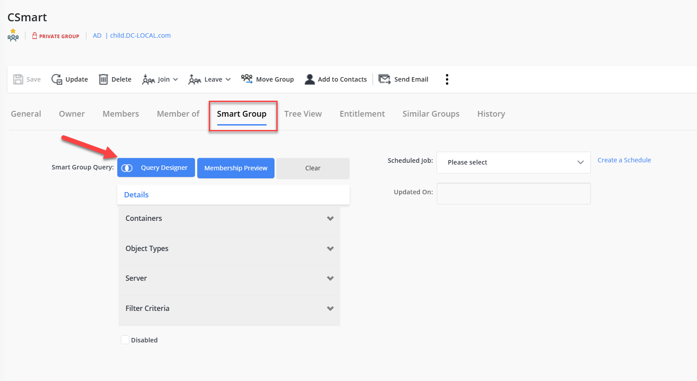
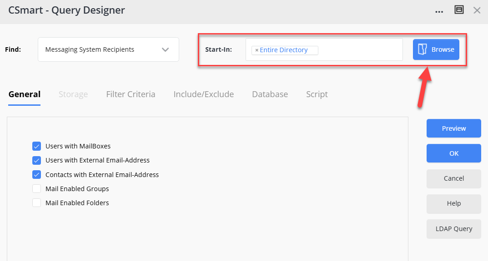

---
description: >-
  This article explains how to limit the scope of a SmartGroup query to specific organizational units (OUs) in Netwrix Directory Manager.
keywords:
  - SmartGroup
  - Directory Manager
  - organizational units
sidebar_label: Limit SmartGroup Query Scope
tags:
  - group-management-and-operations
title: "How to Limit the Scope of a SmartGroup Query to Specific OUs"
knowledge_article_id: kA0Qk0000002bbNKAQ
products:
  - directory-manager
---

# How to Limit the Scope of a SmartGroup Query to Specific OUs

## Overview

This article explains how to limit the scope of a SmartGroup query to specific organizational units (OUs) in Netwrix Directory Manager (formerly GroupID). You can use the **Start in** option in the SmartGroup query designer to restrict the search scope to selected OUs.

## Instructions

1. Log in to the **Directory Manager Portal** with an account that has administrative rights.
2. Click **Groups** and then **All Groups**.
3. Click the **SmartGroups** tab and open the SmartGroup properties for which you want to restrict the query scope.

   

4. In the SmartGroup Properties, click the **SmartGroup** tab.
5. Click **Query Designer**. The Query Designer window will appear.

   

6. Click the **Browse** button for **Start in**. A new window with the list of all OUs in Active Directory will appear.

   

7. Select the desired OUs to which you want to limit the scope of the query.

   

8. Click **OK** after selecting the desired OUs.
9. Click **Preview** to verify the results.
10. After verifying that **Preview** provides the correct result, click **OK**.
11. Click **Save**.