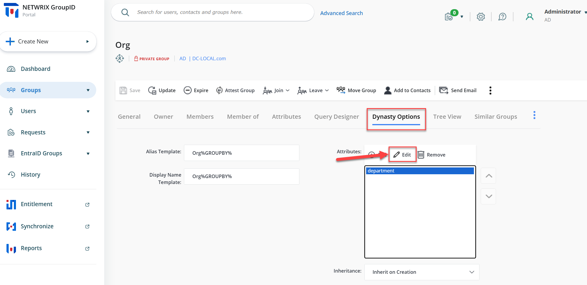
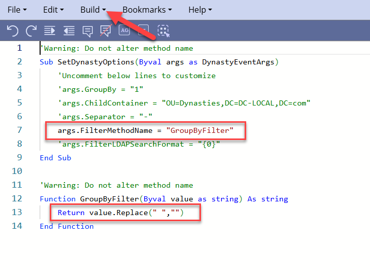

---
description: >-
  This article provides step-by-step instructions on how to remove spaces from attributes when creating dynasties in Netwrix Directory Manager.
keywords:
  - Netwrix Directory Manager
  - remove spaces
  - custom script
sidebar_label: Remove Spaces from Attributes
tags:
  - group-management-and-operations
title: "How to Remove Spaces from Attributes When Creating Dynasties"
knowledge_article_id: kA0Qk0000002bgDKAQ
products:
  - directory-manager
---

# How to Remove Spaces from Attributes When Creating Dynasties

## Applies To

Directory Manager 11

## Overview

You can remove spaces (or other special characters) from group names when creating dynasties in **Netwrix Directory Manager** (formerly GroupID) by using a custom script for the relevant attribute (such as **Department**). This ensures that leaf dynasty names do not include spaces from the source attribute.

> **NOTE:** Before making any changes to your environment, create a backup, snapshot, or checkpoint of the Directory Manager server.

## Instructions

1. Log in to the **Directory Manager Portal** and navigate to the **Parent Dynasty Properties** for which you want to make the changes.
2. Once the Parent Dynasty properties are open, click the **Dynasty Options** tab.
3. In the **Attributes** field, select the attribute for which you want to omit the spaces.
4. Click the **Edit** button. A new window will appear.  
   
5. Click the **Edit Script** button. The script editor will open.  
   
6. Edit the script as shown in the picture below and click **Build**.  
   
7. Manually update the Parent Dynasty and verify the changes in the group names.