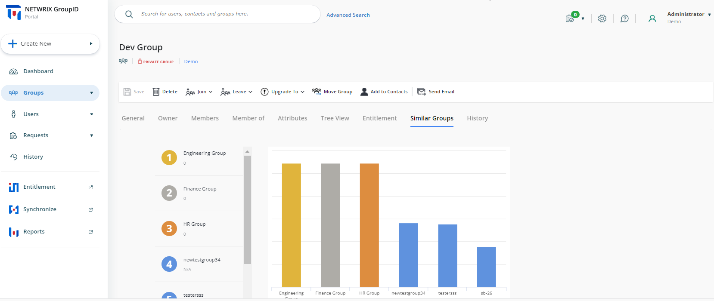
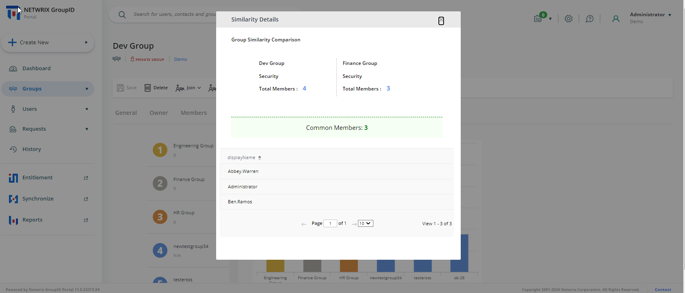

---
description: >-
  Learn how to find and view groups that are similar or duplicate in Netwrix
  Directory Manager by comparing group type and membership. The article explains
  how to use the product UI to view similarity details and interpret similarity
  rankings.
keywords:
  - Netwrix Directory Manager
  - similar groups
  - duplicate groups
  - group membership
  - group type
  - self-service portal
  - directory cleanup
products:
  - directory-manager
visibility: public
sidebar_label: Identify Similar Groups in the Directory
tags:
  - group-management-and-operations
title: "Identify Similar Groups in the Directory"
knowledge_article_id: kA0Qk0000002DlxKAE
---

# Identify Similar Groups in the Directory

## Applies To
Netwrix Directory Manager 11

## Overview
As your organization grows, your directory may contain multiple groups that serve the same or similar purposes. These duplicate or overlapping groups can create unnecessary complexity and make directory management more difficult. Identifying similar groups helps you reduce redundancy and maintain a clean, well-organized directory.

## Instructions
Netwrix Directory Manager enables you to compare groups for similarity based on the following criteria:

- Group type
- Membership

For example, if you have a distribution group (Group A) with three members (A1, A2, and A3), Directory Manager compares the membership of all distribution groups in the directory to find those with the same members as Group A. The Self-Service portal displays these similar groups. The more members two groups share, the stronger the similarity match.

### Steps to View Similar Groups
1. Log in to the Directory Manager application.  
2. Click **Groups** in the left pane.  
3. On the **My Groups** page, click the display name of a group to view which groups in the directory are similar to it.  
4. On the group properties page, click the **Similar Groups** tab.  
5. Directory Manager displays up to six groups that are most similar to the selected group. Similarity is determined by both **group type** and **membership**.

> **NOTE:** Netwrix Directory Manager only displays up to six similar groups, even if more exist in the directory. The similarity ranking is based on group type and the number of shared members.

6. Click a bar for a group to view similarity details.  
7. The **Similarity Details** dialog box displays the common type and common members that both groups have.

