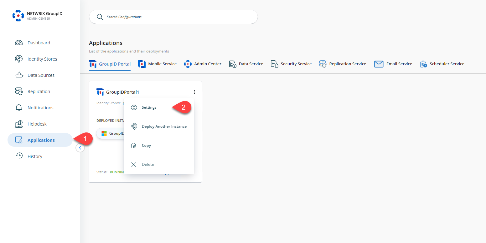
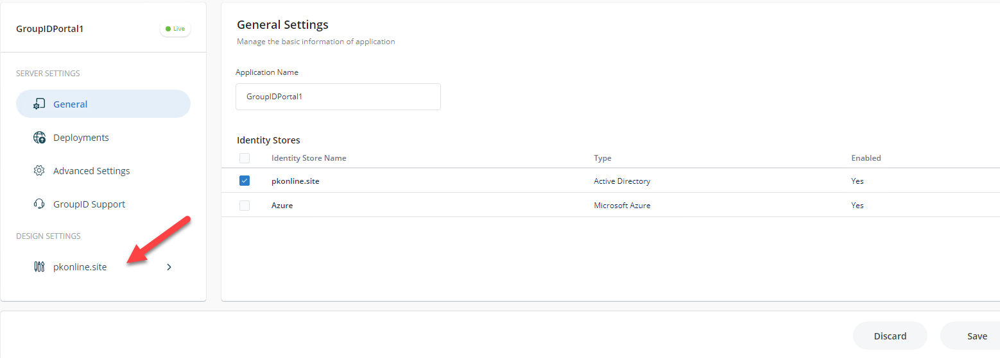
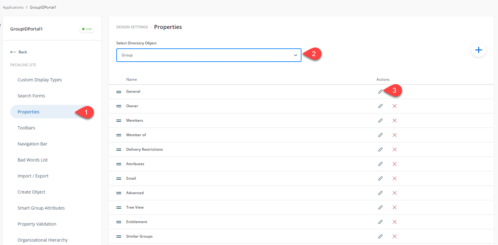
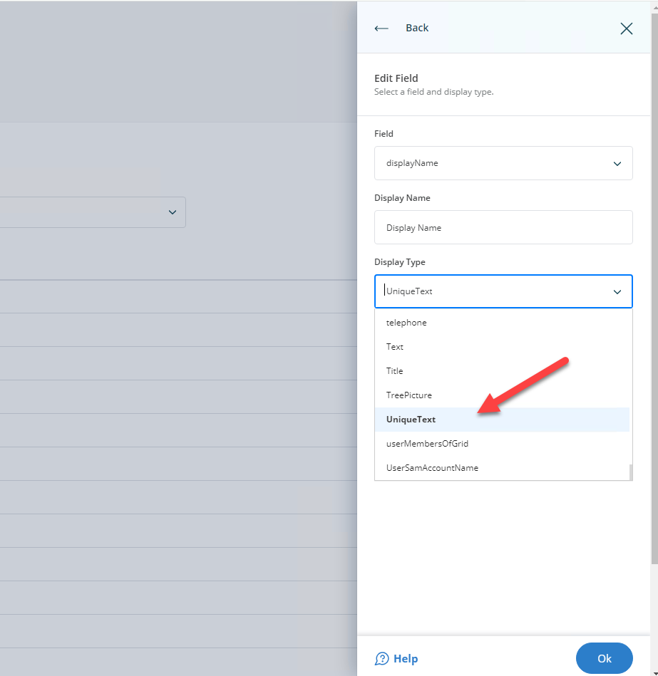

---
description: >-
  Explains how to configure Netwrix Directory Manager to require unique group
  `displayName` values in the Application portal so users cannot create groups
  with duplicate display names.
keywords:
  - Netwrix Directory Manager
  - unique display name
  - displayName
  - group display names
  - portal settings
  - Admin Center
  - UniqueText
  - Self-Service portal
products:
  - directory-manager
sidebar_label: Require Unique Group Display Names in Portal
tags:
  - group-management-and-operations
title: "Require Unique Group Display Names in Portal"
knowledge_article_id: kA0Qk0000002IIbKAM
---

# Require Unique Group Display Names in Portal

## Applies To
Netwrix Directory Manager 11

## Overview
To prevent duplicate group names, you can configure Netwrix Directory Manager to require that each group’s `displayName` attribute is unique. Directory Manager contains a setting in the Application portal that enforces this uniqueness. When enabled, users will not be able to create a new group if the display name matches an existing group. This article explains how to configure this setting in the portal to require unique group display names.

## Instructions

### Configure the Portal to Require Unique Group Display Names
1. In the Netwrix Directory Manager Admin Center, navigate to **Applications > [Your Portal] > Settings**.  
   
2. Click the identity store name under the **Design Settings** section.  
   
3. On the **Properties** tab, select **Group** as the directory object then select **General** and click **Edit**.  
   
4. In the **Edit Design Category** box, select **Display name** and click **Edit**.  
   
5. In the **Edit Field** dialog box, ensure `displayName` is selected in the **Field** box. For **Display Type**, select `UniqueText`.  
   
6. Click **OK** then click **Save** in the outer window.
7. If you want to apply this setting to Smart Groups, select **Smart Group** as the directory object in step 3 and repeat the same steps.
8. After this configuration, when a user tries to create a group from the Self-Service portal with a display name that already exists, the portal will not allow it.

> **NOTE:** If you have multiple portals, you must configure the unique display name setting separately for each portal.
