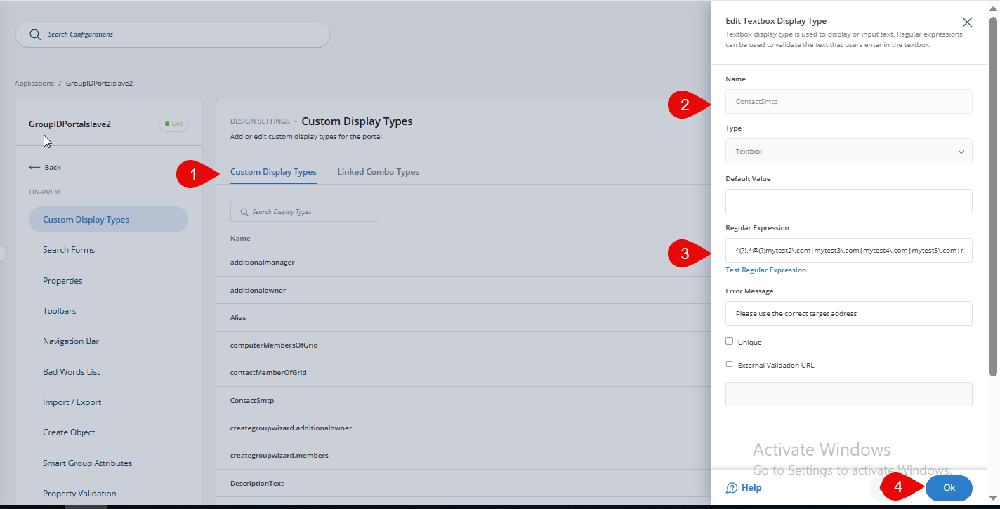
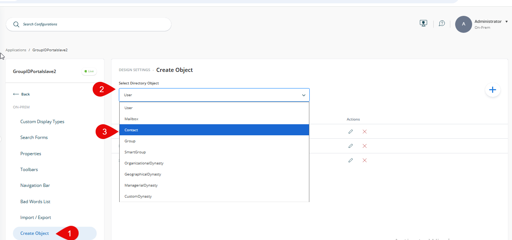
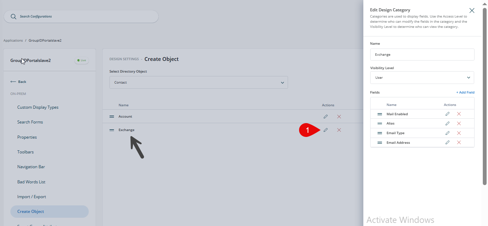
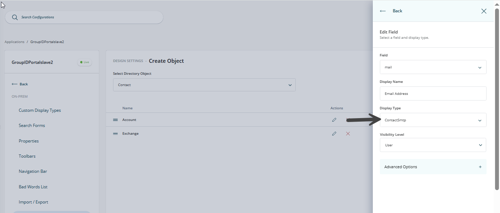

---
description: >-
  This article explains how to restrict users from creating contacts with target addresses belonging to specific trusted inbound domains in Netwrix Directory Manager.
keywords:
  - Directory Manager
  - contact creation
  - trusted inbound domains
sidebar_label: Restrict Users from Creating Contacts
tags:
  - group-management-and-operations
title: "Restrict Users from Creating Contacts with Target Addresses of Trusted Inbound Domains"
knowledge_article_id: kA0Qk0000002lMDKAY
products:
  - directory-manager
---

# Restrict Users from Creating Contacts with Target Addresses of Trusted Inbound Domains

## Overview

This article explains how to restrict users from creating contacts with target addresses belonging to specific trusted inbound domains in Netwrix Directory Manager (formerly GroupID). This is achieved by creating a custom display type with a regular expression to enforce the restriction.

## Instructions

1. Log in to the admin center of Directory Manager 11 and click **Applications**.
2. Go to the settings of your application portal and click **Design settings**.
3. Click the **Custom Display Type** tab and create a new custom display type.
4. For the new custom display type, set the type as **Textbox** and set the default value to empty.
5. In the regular expression field, use the following pattern:

   ```plaintext
   ^(?!.*@(?:mytest2\.com|mytest3\.com|mytest4\.com|mytest5\.com|mytest6\.com|mytest7\.com)$)([a-zA-Z0-9_\-\.]+)@((\[[0-9]+\.[0-9]+\.[0-9]+\.)|(([a-zA-Z0-9\-]+\.)+))([a-zA-Z]+|[0-9]+)(\]?)$
   ```

6. You can also set an error message, for example, "Please use the correct target address".

   

7. Save the settings for the custom display type.
8. While in the design node of the application portal, click the **Create Object** tab.
9. On the **Create Object** tab, click the drop-down for **Select Directory Object** and select **Contact**.

   

10. Edit the **Exchange** category.

    

11. In the Edit Design category of Exchange, edit **EmailAddress**.
12. Change the display type for **EmailAddress**.

    

13. Save the changes in the design node.
14. Reset IIS and refresh your application portal. Now when you create a contact, the new contact cannot be created with any of the specified target addresses.

    

> **NOTE:** Contact Name can be any name for the newly created contact.