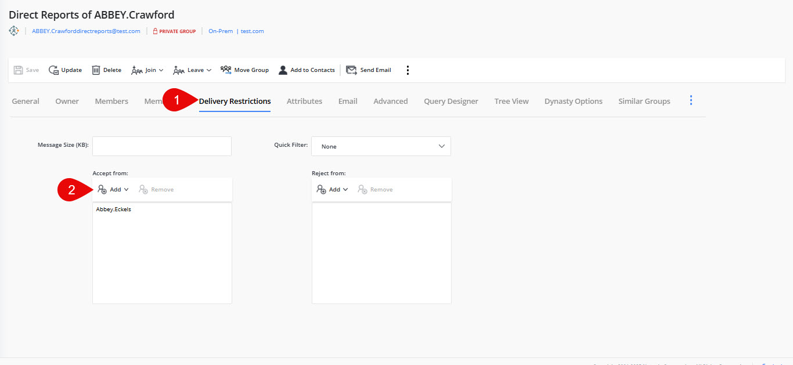

---
description: >-
  This article provides step-by-step instructions on setting delivery restrictions on Dynasty groups in Netwrix Directory Manager.
keywords:
  - delivery restrictions
  - Dynasty groups
  - Netwrix Directory Manager
sidebar_label: Set Delivery Restrictions
tags:
  - group-management-and-operations
title: "Set Delivery Restrictions on Dynasty Groups"
knowledge_article_id: kA0Qk0000002QknKAE
products:
  - directory-manager
---

# Set Delivery Restrictions on Dynasty Groups

## Applies To

Directory Manager 11

## Overview

Netwrix Directory Manager (formerly GroupID) allows you to set delivery restrictions on Dynasty groups, which are Smart Groups that create and manage other Smart Groups using directory information. Dynasties help manage large distribution lists by creating hierarchical group structures. You can restrict or allow specific users or groups to send emails to a Dynasty by configuring delivery restrictions in the group properties.

## Instructions

### Prerequisite Settings to Enable

1. On the Dynasty **Properties**, click the **Dynasty Options** tab.
2. In **Dynasty Options**, make sure the **Always Inherit** option is selected.

   

3. Go to the Admin Center and open the settings of the identity store.
4. Click the **Configurations** tab, then click the **Dynasties** tab.
5. Make sure **authOrig** and **unauthOrig** are present under **Selected Attributes**. These attributes control authentication and are required to apply restrictions or rules to Dynasties.

   

### Set Delivery Restrictions on a Dynasty Group

1. In the Directory Manager application, expand **Groups > All Groups > Dynasties**.

   

2. Select the Dynasty group you want to set delivery restrictions for (for example, "Direct Reports of Abbey.Crawford") and go to its **Properties**.
3. Click the **Delivery Restriction** tab. You will see three types of filters that control who can and cannot send email messages to the group:
   - Quick Filter (default filter)
   - Accept Messages (to allow all or specific users/groups to send emails to the Dynasty)
   - Reject Messages (to restrict specific users/groups from sending emails to the Dynasty)
4. In the **Accept Messages** section, click **Add** and add any user or group who should be allowed to send emails to the Dynasty.

   

5. After adding the user or group, click **Save**.