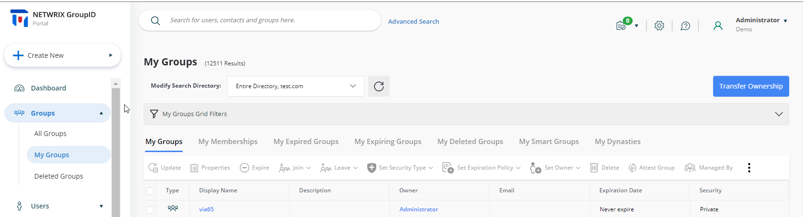
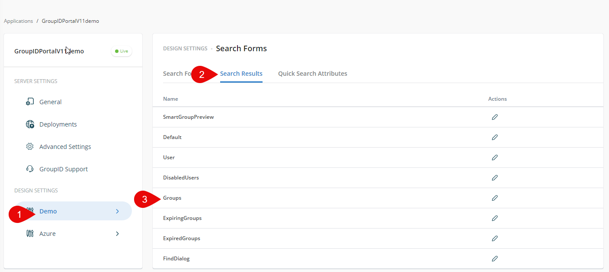
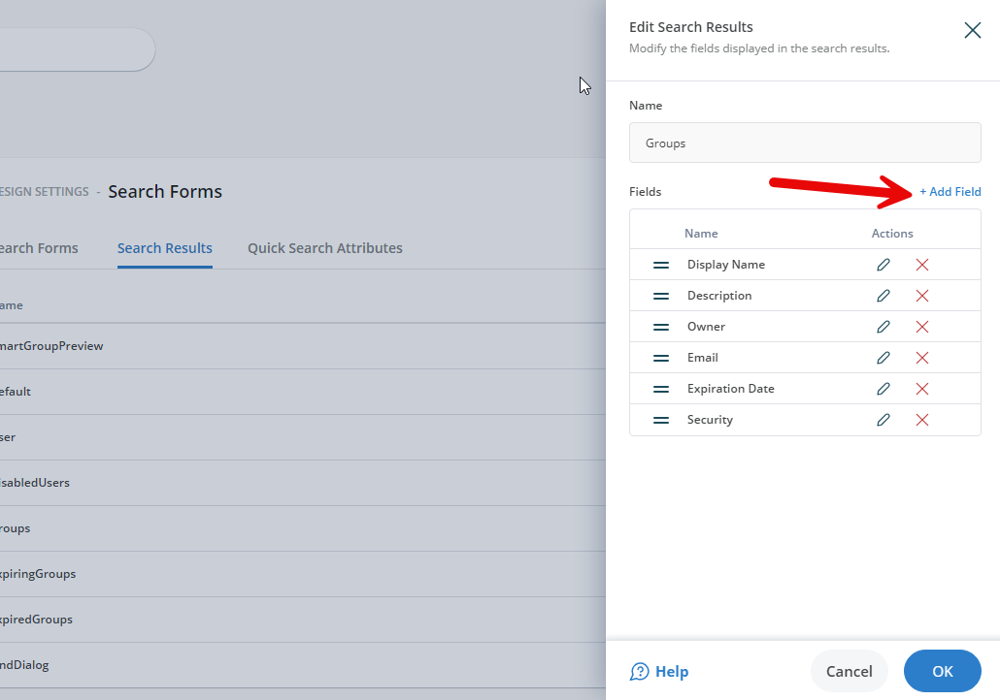
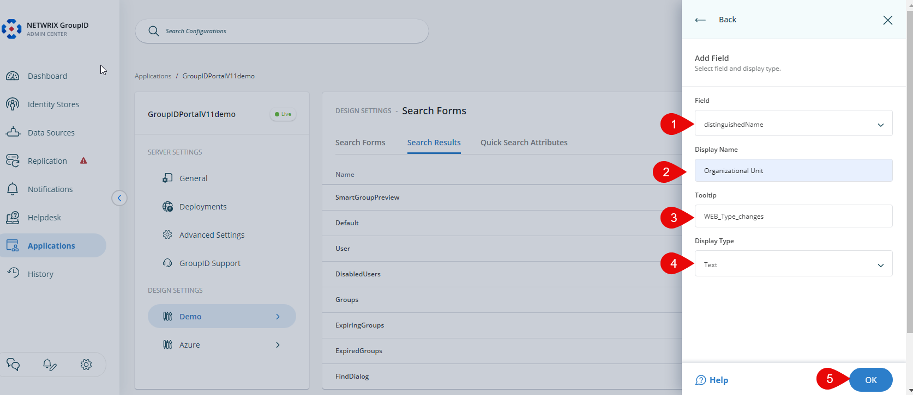
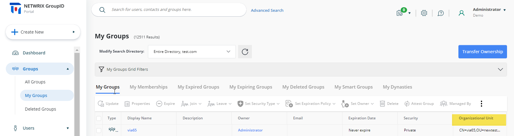

---
description: >-
  This article explains how to add the Organizational Unit (OU) field as a column on the My Groups page in Netwrix Directory Manager.
keywords:
  - Organizational Unit
  - Directory Manager
  - My Groups page
sidebar_label: Add OU Field to My Groups Page
tags:
  - portal-customization-and-ux
title: "Add the Organizational Unit Field to the My Groups Page"
knowledge_article_id: kA0Qk0000002Du1KAE
products:
  - directory-manager
---

# Add the Organizational Unit Field to the My Groups Page

## Applies To

Netwrix Directory Manager 11

## Overview

Netwrix Directory Manager (formerly GroupID) allows you to customize the portal to meet your organization's needs. You can add additional fields, such as the Organizational Unit (OU), to the My Groups page. The My Groups page displays the groups owned by the logged-in user and search results for group queries. This article explains how to add the Organizational Unit field as a column on the My Groups page.

## Instructions

### Add the Organizational Unit Column to the My Groups Page

1. In the **Directory Manager Admin Console**, select **Application > Directory Manager Portals > [required portal]**.
2. Click the three-dot icon and go to **Settings > Design Settings**.
3. Select the identity store, then go to the **Search Forms** tab and select **Search Results**.
4. In the **Name** list, select **Groups** and click **Edit**.

   

5. On the **Edit Search Results** dialog, click **Add Field**.

   

6. In the Add Field dialog box, enter the following:
   - From the **Field** list, select *DistinguishedName*.
   - In the **Display Name** box, enter *Organizational Unit* or *OU*. This text will appear as the field name in the portal.
   - In the **Tooltip** box, keep the default text (for example, *WEB_Type_changes*).
   - From the **Display Type** list, select *Text*.

7. Click **OK**.

   

8. On the Edit Search Results dialog, drag the fields to change their order if needed and click **OK**.
9. Click **Save** in the design settings.

   

10. Refresh your Directory Manager portal page. The Organizational Unit column will now be displayed on the My Groups page.

    