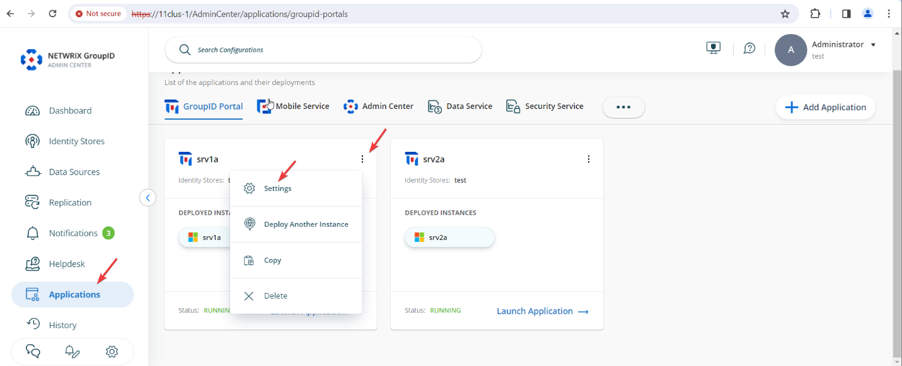
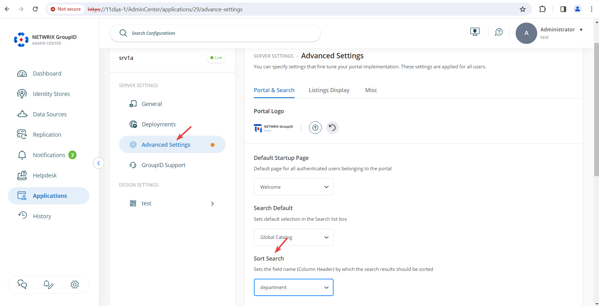

---
description: >-
  Explain how to change the default sort attribute for search results in the
  Netwrix Directory Manager User Portal; by default results sort by
  `displayName` but you can choose another attribute such as `department`.
keywords:
  - sort attribute
  - search results
  - displayName
  - department
  - Netwrix Directory Manager
  - user portal
  - Advanced Settings
products:
  - directory-manager
sidebar_label: Change the Default Sort Attribute for Search Resul
tags:
  - portal-customization-and-ux
title: "Change the Default Sort Attribute for Search Results"
knowledge_article_id: kA0Qk0000002CgDKAU
---

# Change the Default Sort Attribute for Search Results

## Applies To
Netwrix Directory Manager 11

## Overview
This article explains how to configure the default sort attribute for search results in the Netwrix Directory Manager User Portal. By default, search results are sorted by the `displayName` attribute, but you can change this to another attribute, such as `department`, to better suit your business requirements.

## Instructions
1. In the Netwrix Directory Manager Admin Center, go to **Applications**. For the application or portal where you want to change the setting, click the three dots and select **Settings**.

   

2. Click **Advanced Settings**. In the right pane, find the **Sort Search** option and select your desired sort attribute from the drop-down menu.

   

3. Scroll down and click **Save** to apply your changes.

## Impact
This setting applies to listings on the All Groups, My Groups, and Users pages, as well as searches performed using Advanced Search and the Find dialog box. After applying the setting, results are sorted by the specified attribute in ascending order.

> **NOTE:** If the attribute you select for sorting is not available as a column header in the listing or search results, Netwrix Directory Manager will default to sorting by `displayName`.
