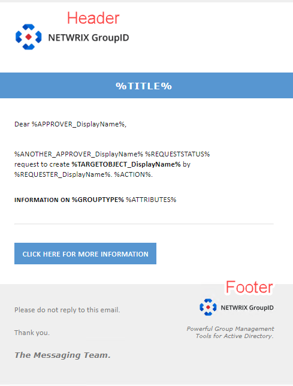

---
description: >-
  You can change the header and footer logos used in Netwrix Directory Manager
  notification emails by updating the NotificationResources table in the
  database. This article explains where the images are stored and provides the
  SQL to replace them.
keywords:
  - notification logo
  - header logo
  - footer logo
  - Netwrix Directory Manager
  - NotificationResources
  - ResourceImage
  - SQL
  - OPENROWSET
  - database
  - replace image
products:
  - directory-manager
sidebar_label: Change the Header and Footer Logo in Notifications
tags:
  - portal-customization-and-ux
title: "Change the Header and Footer Logo in Notifications"
knowledge_article_id: kA0Qk00000015iPKAQ
---

# Change the Header and Footer Logo in Notifications

## Question

Can you change the logo in the header and footer of Netwrix Directory Manager notifications?



## Answer

Yes, it is possible to change the logos in the header and footer of notifications. However, you cannot do this through the Directory Manager Admin Center. Instead, you must update the image files directly in the database.

### Before You Begin

Notification logos are stored in the `GroupID.NotificationResources` database table as binary data. The relevant column is `ResourceImage`, which includes the following entries:

- `ID 1` – Header logo
- `ID 2` – Footer logo
- `ID 3` – Title image

The image ID located at the end of the query specifies which image will be replaced.

### How to Replace an Image

1. Run the SQL query below, updating `PathToUpdatedImage.jpg` and the `WHERE id =` value with the image and ID you want to replace:

```sql
UPDATE [DB Name].[GroupID].[NotificationResources]
SET ResourceImage = (
    SELECT BulkColumn 
    FROM OPENROWSET(BULK 'PathToUpdatedImage.jpg', SINGLE_BLOB) AS x
)
WHERE id = 1;
```

After executing the query, all future notifications will display the updated image.
