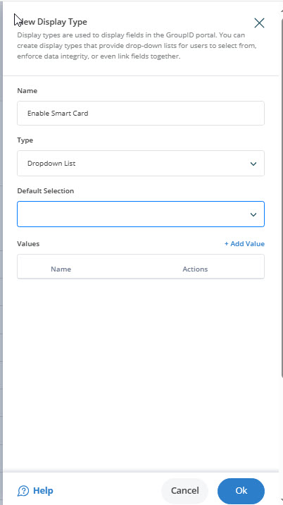

---
description: >-
  This article explains how to enable or disable user login via Smart Card in Netwrix Directory Manager by adding a custom field to the portal.
keywords:
  - Smart Card login
  - userAccountControl
  - Directory Manager
sidebar_label: Enable or Disable User Login via Smart Card
tags:
  - portal-customization-and-ux
title: "Enable or Disable User Login via Smart Card Using Custom Display Types"
knowledge_article_id: kA0Qk0000002TE1KAM
products:
  - directory-manager
---

# Enable or Disable User Login via Smart Card Using Custom Display Types

## Applies To

Netwrix Directory Manager 11

## Overview

Netwrix Directory Manager (formerly GroupID) allows you to enable or disable user login via Smart Card by adding a custom field to the portal. Helpdesk users can use this field to control the **userAccountControl** attribute for each user. When the *Smart card is required for interactive logon* option is enabled, the **userAccountControl** attribute is set to `328192`; when disabled, it is set to `66048`. This article explains how to configure this functionality using custom display types.

## Instructions

### Create a Custom Display Type for Smart Card Login

1. In the Admin Center, go to **Application > Portals > [Required portal] > Designs > [Required portal]**.
2. On the **Custom Display Types** tab, click **Add**.
   
3. In the **New Display Type** dialog box, provide a name for the display type and select its type (for example, *Dropdown List*). Click **Add Value**.
   
4. Create two values for the drop-down list:
   - **Disabled**: Value `66048`, set visibility to Helpdesk.
   - **Enabled**: Value `328192`, set visibility to Helpdesk.
5. Click **OK** and save the settings.

### Add the Smart Card Field to the User Properties

1. Go to the **Properties** tab and select **User** from the **Select Directory Object** list. Click **Add**.
2. In the **Name** field, enter a name for the new tab (for example, *Smart Card*). Select a visibility level and access level, then click **Add Fields**.
   
3. Select the **userAccountControl** attribute from the **Field** list. Enter a display name and select the custom display type you created. Click **OK**.
   
4. Click **OK** and **Save** the changes.
   

### Test the Results

1. Log in to the Directory Manager Portal and open the properties of a user object.
2. You will see a new tab named *Smart Card*. Use the **Smart Card** drop-down list to select *Enabled* or *Disabled*.
3. This sets the corresponding value for the **userAccountControl** attribute in Active Directory.
   