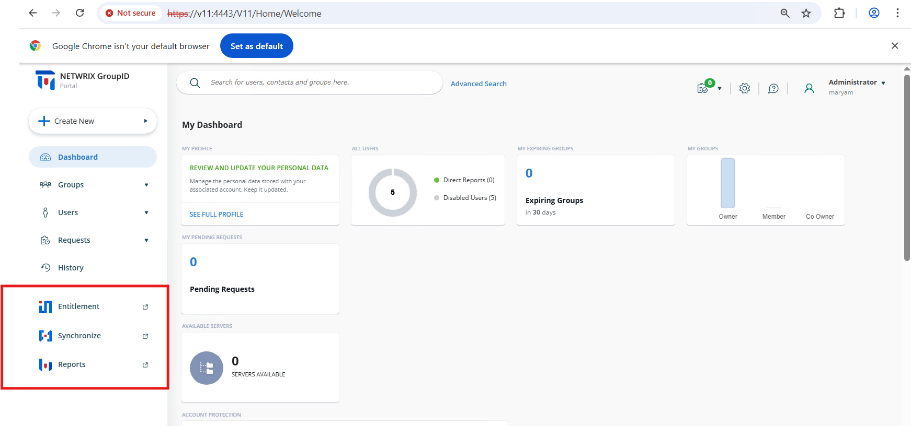
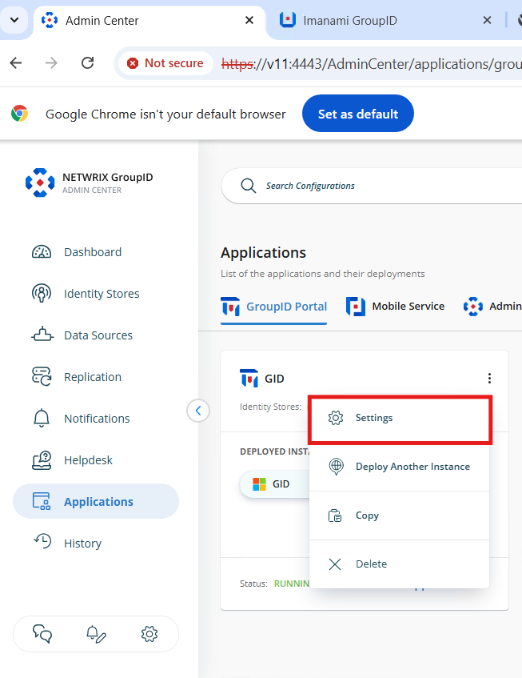
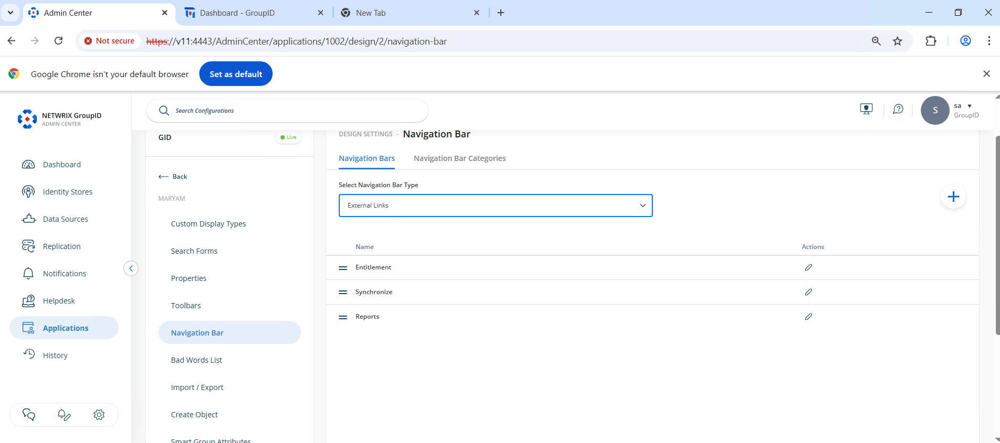
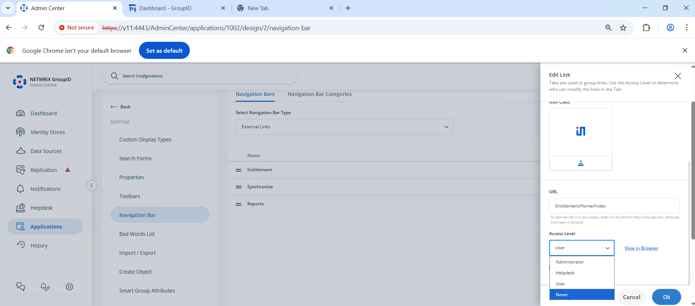
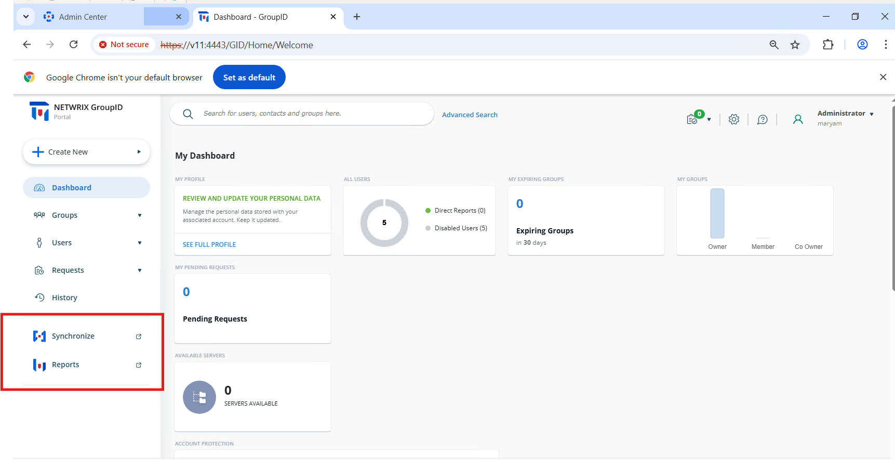
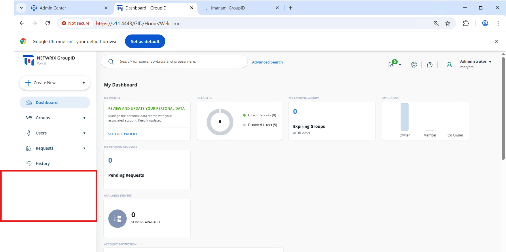

---
description: >-
  Show how to hide the Synchronize, Reports, and Entitlements tabs in the
  Netwrix Directory Manager User Portal by configuring access levels in the
  Admin Center.
keywords:
  - directory manager
  - user portal
  - navigation bar
  - entitlements
  - reports
  - synchronize
  - access level
  - admin center
  - portal settings
products:
  - directory-manager
sidebar_label: 'Hide Reports, Entitlements, and Synchronize Tabs i'
tags:
  - portal-customization-and-ux
title: 'Hide Reports, Entitlements, and Synchronize Tabs in the User Portal'
knowledge_article_id: kA0Qk0000002F2zKAE
---

# Hide Reports, Entitlements, and Synchronize Tabs in the User Portal

## Applies To
Netwrix Directory Manager 11

## Overview
By default, the **Synchronize**, **Reports**, and **Entitlements** tabs appear on the navigation bar in the Netwrix Directory Manager User Portal. You can control which users see these tabs by adjusting their access level settings. Restricting access ensures that only users with the appropriate roles can view or use these options.

## Instructions

### Hide the Reports, Entitlements, and Synchronize Tabs
1. Go to the **Admin Center**.  
2. Navigate to **Applications**.  
3. Open the **Settings** for the portal you want to apply the changes to.  
   
4. Go to **Design Settings** and expand **Identity Store**.  
5. Select **Navigation Bar**.  
6. Click the **Dropdown List** and select **External Links**.  
   
7. Edit **Entitlements**.  
8. In the **Access Level** list, select a security role:
   - The **Entitlements** link will be visible to users of this role and any roles with a higher priority.
   - To hide the link from all users, select **Never**.
   - To allow only **Administrators** to see it, select **Administrator** (users in roles below Administrator will not have access).  
   
9. Click **OK** to save the changes.  
10. Log in to the **Netwrix Directory Manager Portal** to verify the changes.  
    
11. Repeat these steps for the **Reports** and **Synchronize** tabs. Edit each tab individually and set the **Access Level** as required.  
12. Once configured, users without the required access level will no longer see the **Reports**, **Entitlements**, and **Synchronize** tabs in the portal.

