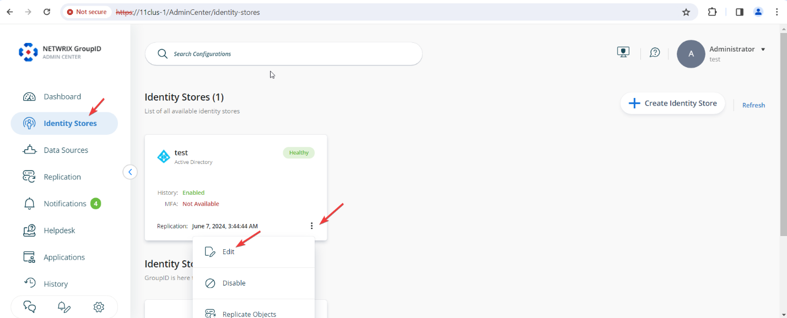
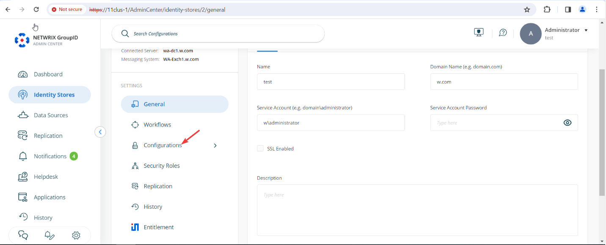
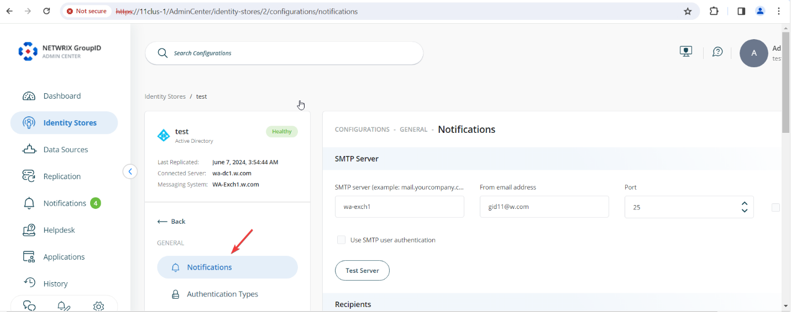
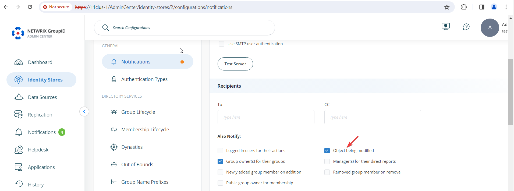
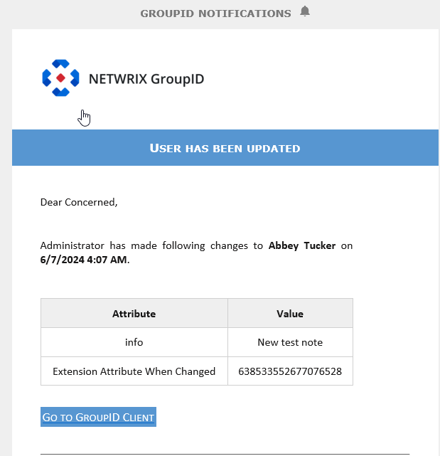

---
description: >-
  Shows how to enable the Object being modified notification in Netwrix
  Directory Manager 11 so groups, users, or contacts receive an email when their
  profile is changed.
keywords:
  - Netwrix Directory Manager
  - Directory Manager 11
  - identity store
  - notifications
  - email notification
  - Object being modified
  - profile modification
products:
  - directory-manager
sidebar_label: How to Notify Objects When a Profile is Modified
tags:
  - portal-customization-and-ux
title: "How to Notify Objects When a Profile is Modified"
knowledge_article_id: kA0Qk0000002IP3KAM
---

# How to Notify Objects When a Profile is Modified

## Applies To

Netwrix Directory Manager 11

## Overview

You can configure Netwrix Directory Manager 11 to automatically send an email notification to a group, user, or contact whenever their profile is modified through the portal. To enable this feature, update the notification settings in the identity store.

When the **Object being modified** option is enabled, the following occurs:

- For a group, group members are notified of changes.
- For a user or contact, the individual is notified about changes to their profile.

Notifications are generated for events such as group renewal, expiry policy changes, membership changes, property or attribute modifications, and updates made by scheduled jobs.

> **NOTE:** An SMTP server must be configured for the identity store for notifications to be sent.

## Instructions

1. In Netwrix Directory Manager Admin Center, select **Identity Stores**. For your identity store, click the three dots (**...**) and select **Edit**.  
   
2. On the next page, click **Configurations**.  
   
3. Click **Notifications**.  
   
4. Under the **Also Notify** option, select the checkbox for **Object being modified**.  
   
5. Scroll down and click the **Save** button.

## Impact

For example, if an administrator changes the **Notes** field of a user account in Active Directory, the user whose account was modified will receive an email notification about the change.

