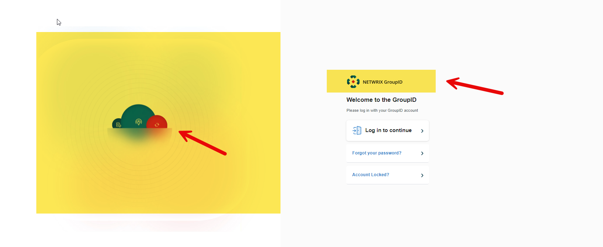
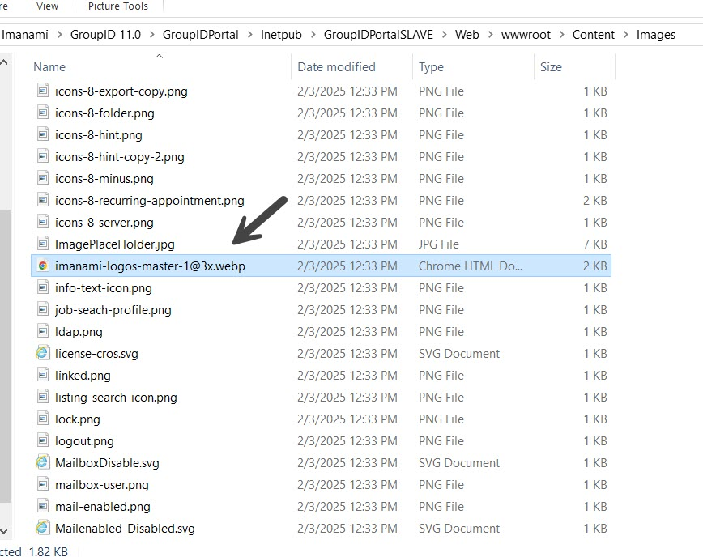
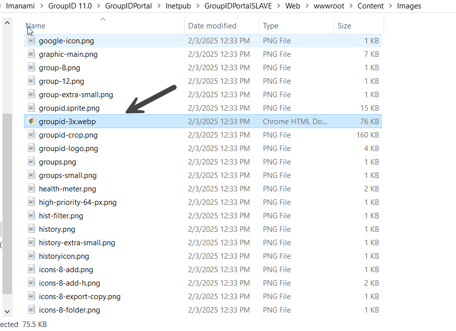
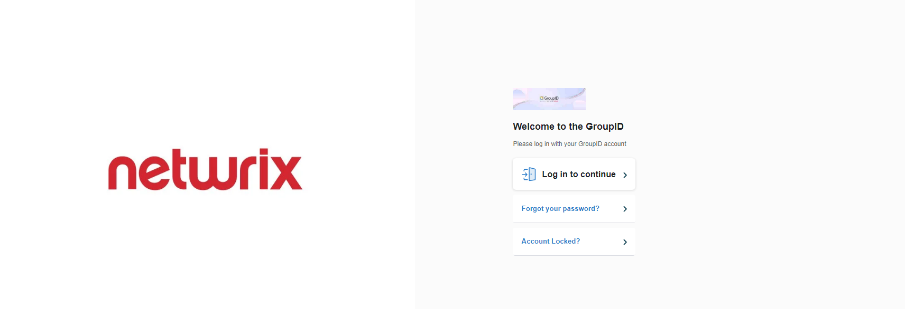

---
description: >-
  Shows how to replace the logo and landing page image for Netwrix Directory
  Manager portal by replacing specific image files in the portal Content\Images
  directory.
keywords:
  - Netwrix Directory Manager
  - logo
  - landing page
  - GroupID
  - portal
  - replace image
  - Imanami
  - Content Images
products:
  - directory-manager
sidebar_label: How to Replace Logo on Landing Page
tags:
  - portal-customization-and-ux
title: "How to Replace Logo on Landing Page"
knowledge_article_id: kA0Qk00000015wvKAA
---

# How to Replace Logo on Landing Page

## Applies To

Netwrix Directory Manager 11 – Directory Manager Portal

## Question

Can you replace the logo and picture on the landing page of the Netwrix Directory Manager portal?

## Answer

Yes, you are able to replace the logo and picture. This can be acheived by following the steps below.

### Replace the Logo

1. Go to the following directory:  
   `C:\Program Files\Imanami\GroupID 11.0\GroupIDPortal\Inetpub\Select your portal\Web\wwwroot\Content\Images`
2. Replace the file named `imanami-logos-master-1@3x.webp`.  
   **IMPORTANT:** The new file must have the same name, size, and extension as the original.

> **IMPORTANT:** Take a backup of the original file before replacing it.

### Replace the Landing Page Image

1. Go to the following directory:  
   `C:\Program Files\Imanami\GroupID 11.0\GroupIDPortal\Inetpub\Select your portal\Web\wwwroot\Content\Images`
2. Replace the file named `groupid-3x.webp`.  
   **IMPORTANT:** The new file must have the same name, size, and extension as the original.

> **IMPORTANT:** Take a backup of the original file before replacing it.

### Verify the Changes

1. Open the landing page of the Directory Manager portal in incognito mode to verify that the logo and image have been updated.

