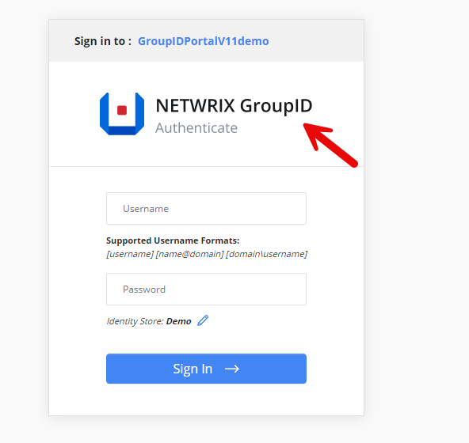
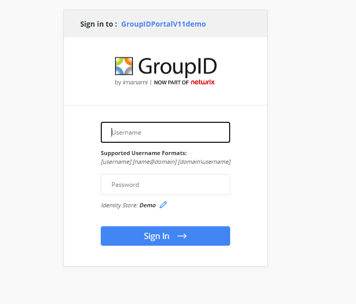

---
description: >-
  Shows how to replace the logo on the Netwrix Directory Manager sign-in page by
  replacing the image file in the product folder.
keywords:
  - logo
  - sign-in
  - vector-smart-object.png
  - Directory Manager
  - GroupID
  - images
  - Netwrix
products:
  - directory-manager
sidebar_label: How to Replace Logo on Sign-in Page
tags:
  - portal-customization-and-ux
title: "How to Replace Logo on Sign-in Page"
knowledge_article_id: kA0Qk00000015yXKAQ
---

# How to Replace Logo on Sign-in Page

## Question

Can you replace the logo on the sign-in page of the Netwrix Directory Manager (formerly Netwrix GroupID) portal?

## Answer

Yes, this can be done by replacing the image file in the Netwrix Directory Manager 11 folder. Follow the steps below to complete this:

1. Navigate to `C:\Program Files\Imanami\GroupID 11.0\GroupIDSecurityService\Inetpub\GroupIDSecurityService\Web\wwwroot\Content\Images`
2. Replace the image file named `vector-smart-object.png`, ensuring the file name, size, and extension remain the same.

> **NOTE:** Take a backup of the original file.

