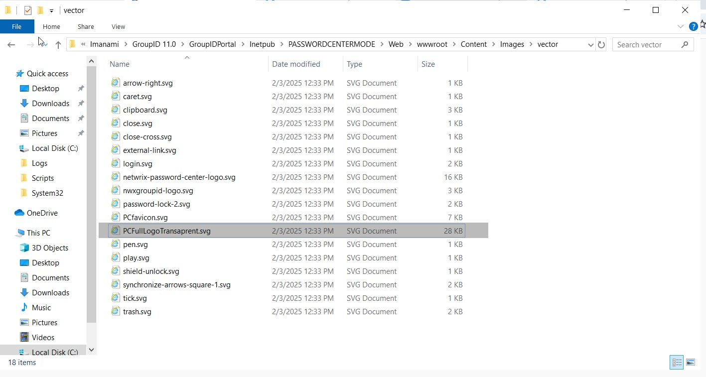
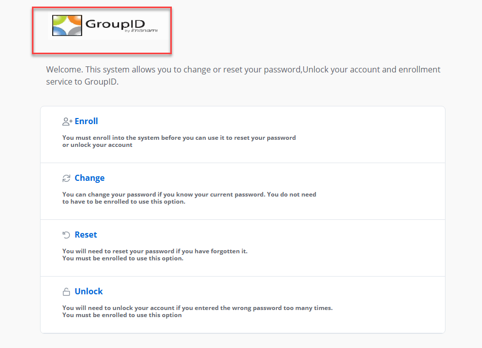

---
description: >-
  Shows how to replace the Password Center portal logo in Netwrix Directory
  Manager by replacing the PCFullLogoTransaprent.svg file in the portal content
  folder.
keywords:
  - password center
  - logo
  - SVG
  - Netwrix Directory Manager
  - GroupID
  - portal
  - PCFullLogoTransaprent
  - replace logo
  - instructions
products:
  - directory-manager
sidebar_label: How to Replace the Password Center Portal Logo
tags:
  - portal-customization-and-ux
title: "How to Replace the Password Center Portal Logo"
knowledge_article_id: kA0Qk00000025GXKAY
---

# How to Replace the Password Center Portal Logo

## Applies To
Netwrix Directory Manager 11.1 – Directory Manager Portal

## Question
Can you replace the logo on the Password Center portal in Netwrix Directory Manager (formerly GroupID)?

## Answer
Yes, you can replace the Password Center logo. Follow the steps below.

### Replace the Logo on the Password Center Portal
1. Go to the following directory:  
   `C:\Program Files\Imanami\GroupID 11.0\GroupIDPortal\Inetpub\<Your Portal Name>\Web\wwwroot\Content\Images\vector`
2. Locate the file named `PCFullLogoTransaprent.svg`. This file is used to render the logo on the portal.

   

3. Convert your logo to the `.svg` format and copy it to the same directory.
4. Rename the existing `PCFullLogoTransaprent.svg` file to `PCFullLogoTransaprentbackup.svg` for backup purposes.
5. Rename your new logo file to `PCFullLogoTransaprent.svg`.
6. Open the Password Center portal in incognito mode to verify that the new logo appears.

> **NOTE:** Adjust the dimensions of your logo as needed to fit the portal layout.
