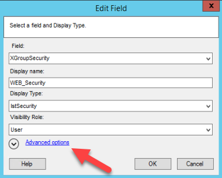
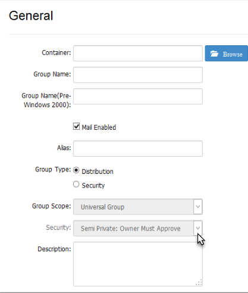

# How to Set 'Semi-Private' as the Default Security Type in v10

## Applies To

Netwrix Directory Manager 10 – Self-Service

## Overview

By default, users can select from multiple security types when creating a group in the Self-Service portal. You may want to set `Semi Private: Owner Must Approve` as the default security type in the **Create Group** wizard, while still allowing users to choose another option or enforce the default for all users.

## Instructions

1. In the Directory Manager Management Console, navigate to **Self-Service > Portals > [Required portal] > Designs > [Required identity store]**.
2. On the **Create Object** tab, select **Group** from the **Select Directory Object** drop-down list.
3. In the **Name** list, select **General** and click **Edit**.
4. In the **Edit Design Category** dialog box, select **Security** and click **Edit**.

   

5. In the **Edit Field** dialog box, click the **Advanced options** link.

   

6. Select `Semi Private: Owner Must Approve` from the **Default Value** drop-down list.

   

7. Optional: To enforce the semi-private security type, select the **Is Read-Only** check box. This will disable the **Security** drop-down list in the **Create Group** wizard, displaying only the default value.

   

8. Optional: To hide the **Security** drop-down list from a specific role, select the desired role (such as **Administrator** or **Helpdesk**) from the **Visibility Role** drop-down list. The **Security** drop-down list will be visible to users of the selected role and roles with a higher priority value, and hidden from all roles with a lower priority value.

   

9. Click **OK** to close the dialog boxes and save your changes.
